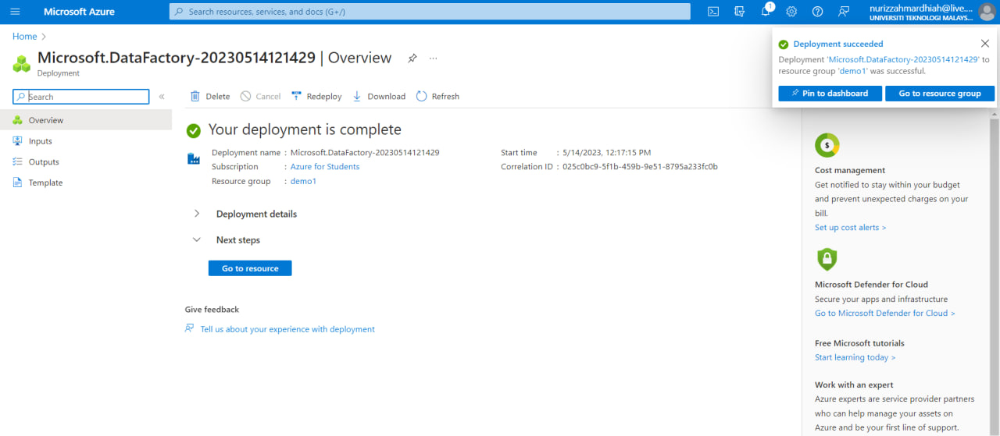
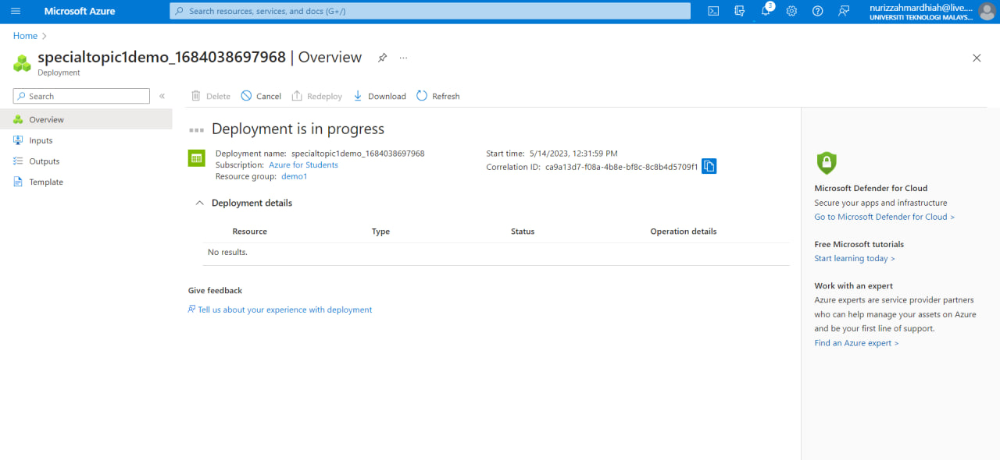
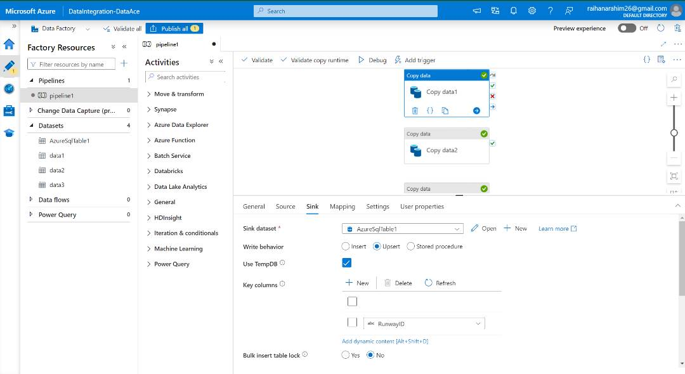
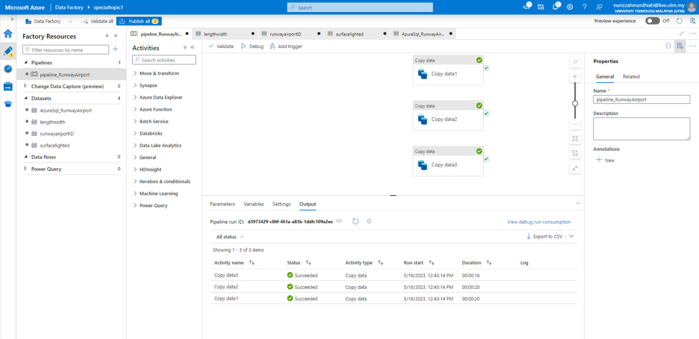

# Report: Data Integration Using Azure Data Factory 🏭

This report will describe how our group performs data integration using Azure Data Factory step-by-step. We were guided by the general ADF pipeline which described in readme.md. For this task, we are required to integrate 3 different data sources into a single table in Azure SQL Databases. 

## Steps:

### 1. Identify 3 different data sources
For this assignment, we would like to integrate and combine 3 data sources related to Airport Runway. These data sources share one common attribute which are RunwayID. This way, it allows us to establish relationships and link related data points across different datasets. With a common attribute, we can easily merge or join data from multiple sources based on this shared attribute. The data sources are:-
- data1.csv
- data2.csv
- data3.csv

### 2. Set up the Azure Data Factory
Purpose: Create an instance of Azure Data Factory, which will serve as the orchestrator for our data integration processes.

Create a new Azure Data Factory resource in Azure Portal. Provide a name, select the subscription, resource group, and region for our Data Factory. Click on the "Create" button to create the Azure Data Factory.
<p align="center">
  
</p>

### 3. Create A Storage Account
Purpose: Establish a connection to the Azure Blob Storage, which will act as the data source for our data integration.
Create a new storage accoynt via the portal. Enter the required details. Then, create 3 Containers and upload blobs. 
<p align="center">
  
</p>

### 4. Create an Azure SQL Database
Purpose: Create a target database in Azure SQL Database, which will serve as the destination for our integrated data.

Click on the "Create a resource" button (+) and search for "Azure SQL Database". Select "Azure SQL Database" from the search results and click on the "Create" button. Provide the required details such as subscription, resource group, database name, server, and credentials. Click on the "Review + Create" button and then "Create" to create the Azure SQL Database. Then, go to the "Query Editor" to create a table. For our case, we named the table as "Airport" and specify the column name and datatypes. 
<p align="center">
  
  
</p>

### 5. Create Linked Service
Purpose: Establish a connection to the Azure SQL Database, enabling data movement between the Data Factory pipeline and the database.

In the Data Factory Authoring UI, click on "Connections" and then "New". Select "Azure SQL Database" as the connection type and provide a name for the connection. Configure the connection settings by providing the Azure SQL Database server name, database name, and authentication method. Click on "Create" to create the connection. Repeat this with other 3 Azure Blob Storage.
<p align="center">
  
</p>

### 6. Create Datasets
Purpose: Define the structure and location of the data sources (Blob Storage containers) and the destination (Azure SQL Database table). Datasets provide the necessary metadata for the data integration process.

Click the Dataset section and add the 3 blobs including our destination, Azure SQL Database. 

### 7. Create Pipeline Canvas and Drag Copy Data Activities
Purpose: Build the data integration pipeline by connecting the datasets and activities. 

In the Data Factory Authoring UI, click on "Author" and then "New pipeline". There are a lot of activities that could be useful. For now, search for "Copy data" and drag it. Click on the "Source" tab and create a new dataset for the Blob Storage container by selecting the appropriate connection and container name. Click on the "Sink" tab and create a new dataset for the Azure SQL Database table by selecting the appropriate connection and table name. Specify the source and destination attributes by Import Schema in Mapping tab. Remember to specify the Write Behaviour to be 'Upsert', which means to update existing data or append. 
<p align="center">
  
</p>

This is the successfully executed pipeline.
<p align="center"> 
  
  
</p>

### The Result
Since our destination is the Azure SQL Database, we can observe the final result from the integration in specified database table. Right click on the table and select Select Top 200 Rows. 
<p align="center">
  
</p>

### Issues Faced

This is because we faced an issue on our first run of the pipeline.

Issues faced :
* The data only merged on the last copy data activity which is data3.
* The data overwrite other copy data activity before it.
* The final result do not display all data from the 3 sources.
* Data integration : failed.
 
Due to the issues, we configure the write behaviour on all the copy data activity to upsert. Upsert allow appending all the data from sources and destination instead of overwriting it. All the data type need to be set correctly to prevent any error and to ensure data inserted into database in correct format. After we made some changes, we finally managed to integrate our data from 3 different sources. Below are the source code on each copy data activity in our pipeline labelled as ; data1, data2 and data 3.

* Activity 1 -Copy Data(data1)
```
{
    "name": "Copy data1",
    "type": "Copy",
    "dependsOn": [],
    "policy": {
        "timeout": "0.12:00:00",
        "retry": 0,
        "retryIntervalInSeconds": 30,
        "secureOutput": false,
        "secureInput": false
    },
    "userProperties": [],
    "typeProperties": {
        "source": {
            "type": "ExcelSource",
            "storeSettings": {
                "type": "AzureBlobStorageReadSettings",
                "recursive": true,
                "enablePartitionDiscovery": false
            }
        },
        "sink": {
            "type": "AzureSqlSink",
            "writeBehavior": "insert",
            "sqlWriterUseTableLock": false
        },
        "enableStaging": false,
        "translator": {
            "type": "TabularTranslator",
            "mappings": [
                {
                    "source": {
                        "name": "RunwayID",
                        "type": "String",
                        "physicalType": "String"
                    },
                    "sink": {
                        "name": "RunwayID",
                        "type": "String",
                        "physicalType": "varchar"
                    }
                },
                {
                    "source": {
                        "name": "Airport ID",
                        "type": "String",
                        "physicalType": "String"
                    },
                    "sink": {
                        "name": "AirportID",
                        "type": "String",
                        "physicalType": "varchar"
                    }
                }
            ],
            "typeConversion": true,
            "typeConversionSettings": {
                "allowDataTruncation": true,
                "treatBooleanAsNumber": false
            }
        }
    },
    "inputs": [
        {
            "referenceName": "data1",
            "type": "DatasetReference"
        }
    ],
    "outputs": [
        {
            "referenceName": "AzureSqlTable1",
            "type": "DatasetReference"
        }
    ]
}


```
* Activity 2 -Copy Data(data2)
```
{
    "name": "Copy data2",
    "type": "Copy",
    "dependsOn": [],
    "policy": {
        "timeout": "0.12:00:00",
        "retry": 0,
        "retryIntervalInSeconds": 30,
        "secureOutput": false,
        "secureInput": false
    },
    "userProperties": [],
    "typeProperties": {
        "source": {
            "type": "ExcelSource",
            "storeSettings": {
                "type": "AzureBlobStorageReadSettings",
                "recursive": true,
                "enablePartitionDiscovery": false
            }
        },
        "sink": {
            "type": "AzureSqlSink",
            "writeBehavior": "insert",
            "sqlWriterUseTableLock": false
        },
        "enableStaging": false,
        "translator": {
            "type": "TabularTranslator",
            "mappings": [
                {
                    "source": {
                        "name": "RunwayID",
                        "type": "String",
                        "physicalType": "String"
                    },
                    "sink": {
                        "name": "RunwayID",
                        "type": "String",
                        "physicalType": "varchar"
                    }
                },
                {
                    "source": {
                        "name": "Length ft",
                        "type": "String",
                        "physicalType": "String"
                    },
                    "sink": {
                        "name": "Lengthft",
                        "type": "Int32",
                        "physicalType": "int"
                    }
                },
                {
                    "source": {
                        "name": "Width ft",
                        "type": "String",
                        "physicalType": "String"
                    },
                    "sink": {
                        "name": "Widthft",
                        "type": "Int32",
                        "physicalType": "int"
                    }
                }
            ],
            "typeConversion": true,
            "typeConversionSettings": {
                "allowDataTruncation": true,
                "treatBooleanAsNumber": false
            }
        }
    },
    "inputs": [
        {
            "referenceName": "data2",
            "type": "DatasetReference"
        }
    ],
    "outputs": [
        {
            "referenceName": "AzureSqlTable1",
            "type": "DatasetReference"
        }
    ]
}

```
* Activity 2 -Copy Data(data2)
```
{
    "name": "Copy data3",
    "type": "Copy",
    "dependsOn": [],
    "policy": {
        "timeout": "0.12:00:00",
        "retry": 0,
        "retryIntervalInSeconds": 30,
        "secureOutput": false,
        "secureInput": false
    },
    "userProperties": [],
    "typeProperties": {
        "source": {
            "type": "ExcelSource",
            "storeSettings": {
                "type": "AzureBlobStorageReadSettings",
                "recursive": true,
                "enablePartitionDiscovery": false
            }
        },
        "sink": {
            "type": "AzureSqlSink",
            "writeBehavior": "insert",
            "sqlWriterUseTableLock": false
        },
        "enableStaging": false,
        "translator": {
            "type": "TabularTranslator",
            "mappings": [
                {
                    "source": {
                        "name": "RunwayID",
                        "type": "String",
                        "physicalType": "String"
                    },
                    "sink": {
                        "name": "RunwayID",
                        "type": "String",
                        "physicalType": "varchar"
                    }
                },
                {
                    "source": {
                        "name": "Surface",
                        "type": "String",
                        "physicalType": "String"
                    },
                    "sink": {
                        "name": "Surface",
                        "type": "String",
                        "physicalType": "varchar"
                    }
                },
                {

```
