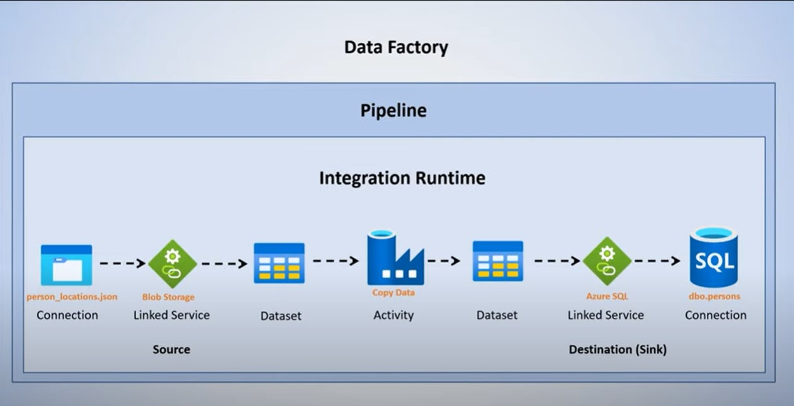

<h1 align="center">Data Integration using Azure Data Factory (ADF)</h1>

  

<h2 align='center'>Group Members</h2>
<table align='center'>
  <tr>
    <th>Name</th>
    <th>Matric No</th>
  </tr>
  <tr>
    <td>Myza Nazifa binti Nazry</td>
    <td>A20EC0219</td>
  </tr>
  <tr>
    <td>Nur Izzah Mardhiah binti Rashidi</td>
    <td>A20EC0116</td>
  </tr>
    <tr>
    <td>Amirah Raihanah binti Abdul Rahim</td>
    <td>A20EC0182</td>
  </tr>
    <tr>
    <td>Radin Dafina binti Radin Zulkar Nain</td>
    <td>A20EC0135</td>
  </tr>
</table>

<h3 align='center'>Data Factory Pipeline</h3>

  

