

  <h1> Report </h1>
  <h2>Data Integration Using Microsoft Azure Data Factory</h2>

 As a group of five people working on a data integration assignment using Microsoft Azure Data Factory, you would collaborate to design and implement an end-to-end data integration solution that brings together data from various sources and loads it into a target destination. 

## 📏Steps by step:

### 1. Identify 3 different data sources
In this assignment we will use three different csv data sources which are about 'clouds' image data in Flickr. In these data sources, there will be a common column which is **pic_id**. We aim to integrate or merged these files into one and store it into sql database in azure data factory. The datasets are as follows:
- clouds_id.csv (contains picture id and its total views)
- clouds_exif.csv (contains picture id and image description about camera used)
- clouds_geo.csv (contains picture id and its geographical information)

### 2. Setup Azure data factory
Search 'Data Factories' in azure services, click create, insert resource group, data factory name, choose region, etc. Upon created, the data factory will appear as shown:

  

### 3. Setup SQL Database
Search 'SQL Database' in azure services, click create, insert resource group, database name, create server, etc. Upon created, the database will display with its server name as below:

  

### 4. Setup storage account
Search 'Storage Account' in azure services, click create, insert storage account name, region, etc. Upon created, the storage will be recorded as below:

  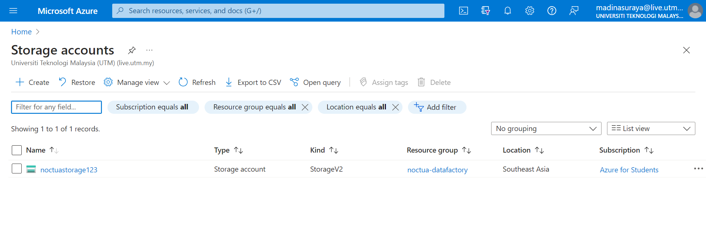

### 5. Insert data sources into blob storage
To insert the data sources, firstly we need to open storage account that has been created. Choose 'blob services and add container name 'input'.

  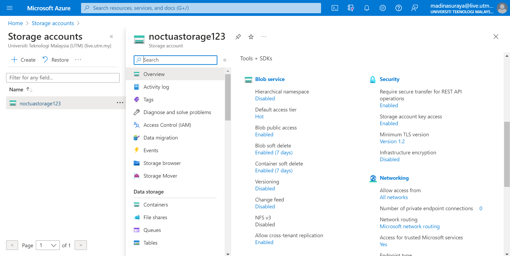  
  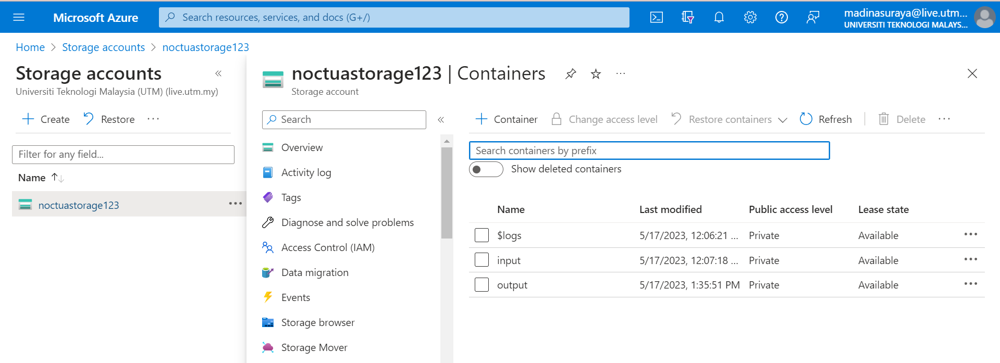

Next, inside input container, click 'Upload' to upload the data sources.

  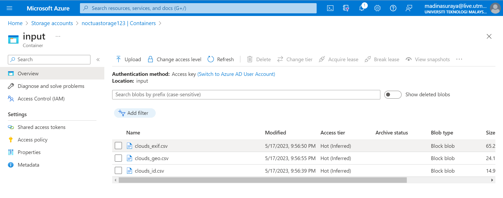

The data sources contains data as follows:

  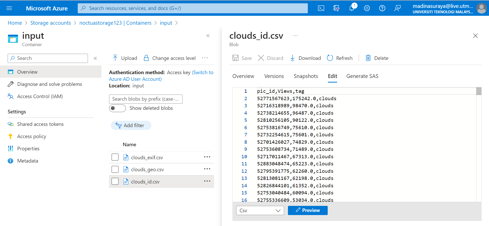  
  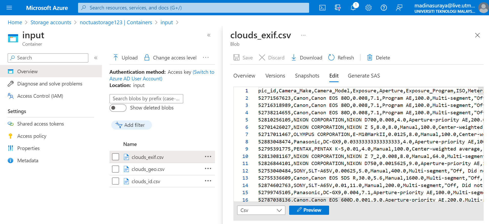  
  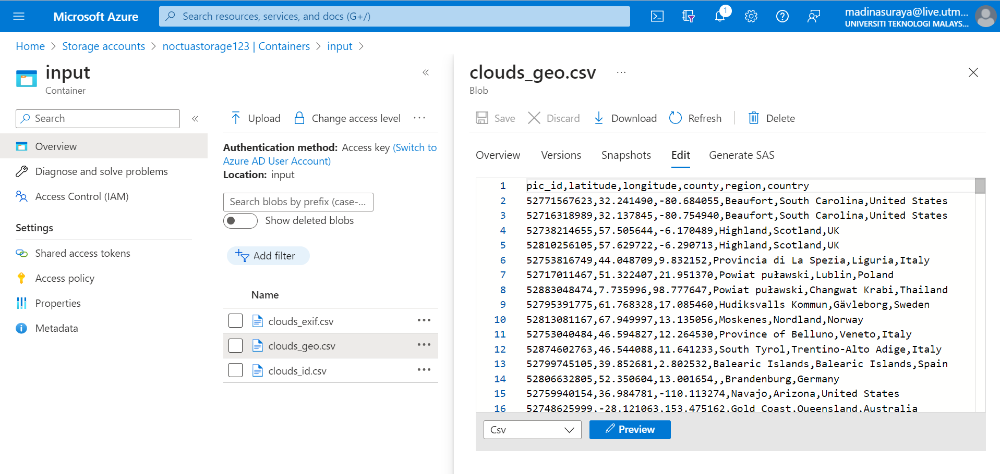  

### 6. Create output table in sql database 
Open sql database that has been created, choose 'Query editor (preview)', login to sql server authentication and create new query for creating output table. Upon creating sql query, the name and columns of the table will be listed as follows.

  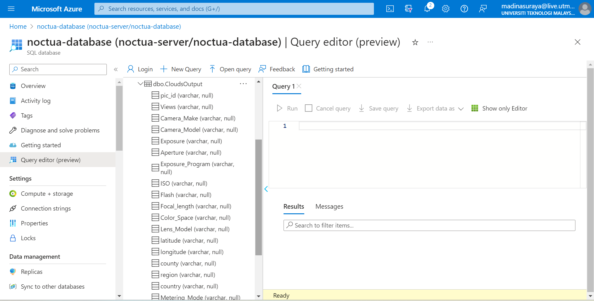

### 7. Launch Azure Data Factory Studio and link services
Open all resources and click 'Launch Studio'. A new tab will be open and from here, we will build flows and pipeline but firstly we need to choose 'Manage' to link services which are 'blob storage' from input container and 'sql database' table created before.

    
  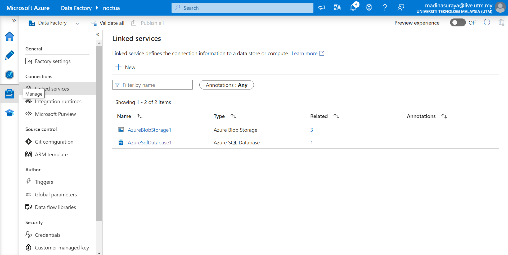

### 8. Insert datasets into factory resources
Above 'Manage' button, there is a button with a pencil icon named 'author'. Choose it and we will be accessing 'Factory Resources'. Right-click 'Datasets' and choose 'New dataset' to insert data from blob storage and sql database. Below is the datasets inserted. The above three are the csv files while the last one is sql database.

  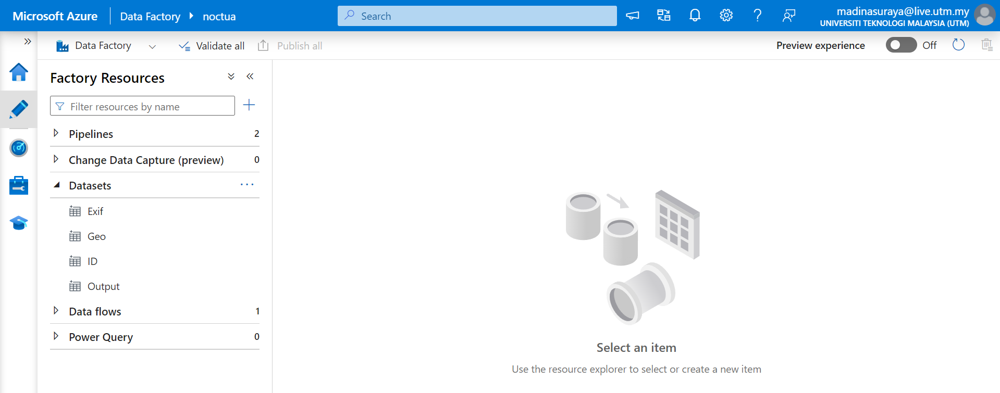

### 9. Create data flow
Our aim is to merged the csv datasets into one output table of sql database. There are two ways on doing this, either mapping directly in pipeline by copying data, or make a flow and add it into a pipeline to run it. We choose to firstly make a data flows, then run it in a pipeline.

  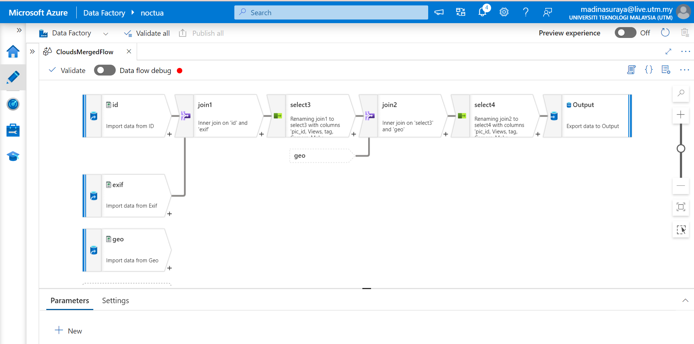

Inside the data flows, these are the steps:
1. **Add** csv sources from 'Datasets' (ID, Exif and Geo).
2. **Join** ID with Exif. Make sure to set the 'Join Conditions' (pic_id@ID == pic_id@Exif).
3. **Select** only columns needed. Delete pic_id from ID or Exif.
4. **Join** with geo. Make sure to set the 'Join Conditions' (pic_id@select1 == pic_id@geo).
5. **Select** only columns needed. Delete pic_id from select1 or geo.
6. **Sink** or make an output into sql database. Check mapping to make sure the joined datasets are compatible with the created table in sql database.

  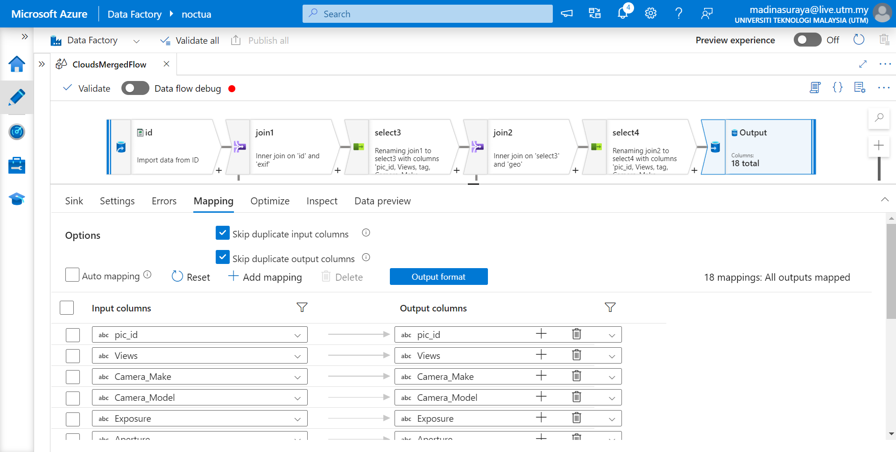

### 10. Run data flow in pipeline
Create new pipeline, from 'Activities', open 'Move & transform', drag and drop the data flow. Lastly, debug it.

  

If no error, output will display the status to 'Succeeded', as follows.

  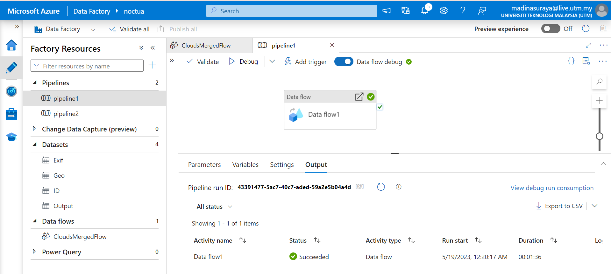

### 11. Check the success of data integration plan
We can check if our data integration plan are success by viewing the data table created as an output in sql database. We need to insert query and view it at 'Result' panel.

  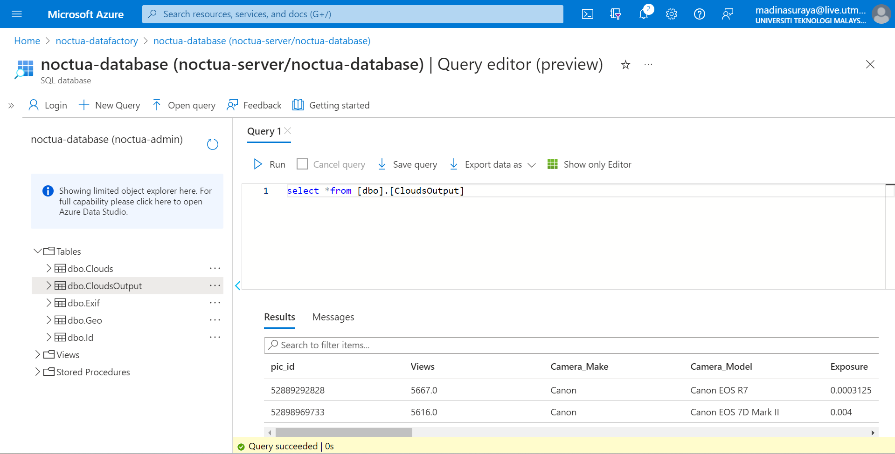

We will then export the data in either csv, json or xml file. We choose to export in csv file. 

  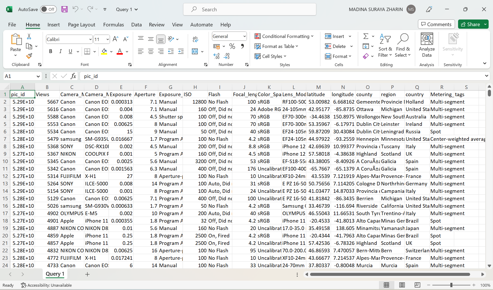

