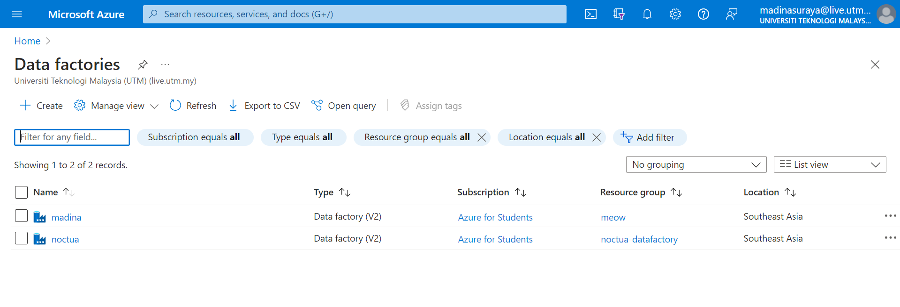

  <h1> Report </h1>
  <h2>Data Integration Using Microsoft Azure Data Factory</h2>

 As a group of five people working on a data integration assignment using Microsoft Azure Data Factory, you would collaborate to design and implement an end-to-end data integration solution that brings together data from various sources and loads it into a target destination. 

## 📏Steps by step:

### 1. Identify 3 different data sources.
In this assignment we will use three different csv data sources which are about 'clouds' image data in Flickr. In these data sources, there will be a common column which is **pic_id**. We aim to integrate or merged these files into one and store it into sql database in azure data factory. The datasets are as follows:
- clouds_id.csv (contains picture id and its total views)
- clouds_exif.csv (contains picture id and image description about camera used)
- clouds_geo.csv (contains picture id and its geographical information)

### 2. Setup Azure data factory.
Search 'Data Factories' in azure services, click create, insert resources group, data factory name, choose region, etc. Upon created the data factory will appear as shown

  

