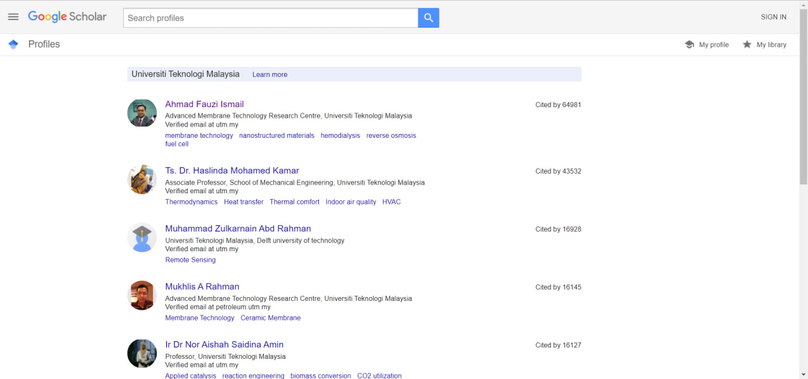

<h2 align='center'>Web Scraping - UTM User Profiles in Google Scholar</h2>

  

<h3 align='center'>Group Members</h3>
<table align='center'>
  <tr>
    <th>Name</th>
    <th>Matric No</th>
  </tr>
  <tr>
    <td>Myza Nazifa binti Nazry</td>
    <td>A20EC0219</td>
  </tr>
  <tr>
    <td>Nur Izzah Mardhiah binti Rashidi</td>
    <td>A20EC0116</td>
  </tr>
    <tr>
    <td>Amirah Raihanah binti Abdul Rahim</td>
    <td>A20EC0182</td>
  </tr>
    <tr>
    <td>Radin Dafina binti Radin Zulkar Nain</td>
    <td>A20EC0135</td>
  </tr>
</table>

## Table of Content
- [Introduction](#introduction)
- [Choosing library - BeautifulSoup](#choosing-library---beautifulsoup)
- [Storing Data in MongoDB](#storing-data-in-mongodb)
- [Conclusion](#conclusion)

## Introduction 

Web scraping has become an increasingly popular technique for extracting useful information from the internet. With the rise of big data and the need for data-driven decision making, web scraping has become an essential tool for many businesses and organizations. One area where web scraping has proven particularly useful is in academic research. Google Scholar is a powerful resource for academics, but the sheer amount of data can make it difficult to extract the information you need.

In this context, web scraping can be used to automatically extract data from Google Scholar. Therefore, for this project we will explore the topic of web scraping Google Scholar for Universiti Teknologi Malaysia user profiles from search result.

## Choosing library - BeautifulSoup

Beautiful Soup is a popular web scraping library that can be used to extract data from HTML and XML files. When it comes to scraping Google Scholar for research data from Universiti Teknologi Malaysia (UTM), Beautiful Soup offers several benefits such as:

**Integration with other Python libraries:** Beautiful Soup can be easily integrated with other Python libraries, such as requests and pandas, for more advanced web scraping and data analysis tasks.

**Simplified parsing:** Beautiful Soup simplifies the process of parsing HTML and XML documents, making it easy to extract the data you need without getting bogged down in the details.

**Robust error handling:** Beautiful Soup can handle poorly formatted HTML and XML documents and can gracefully recover from errors, making it more reliable for web scraping projects.

## Result

The webpage that we scraped is the search result from 'Universiti Teknologi Malaysia' user profiles. 

The metadata that we successfully scrape are:
- User Name
- User Description
- User Verified Email
- User's Publication Being Cited Frequency
- User Expertise
- User Profile URL

The full result is saved into a CSV file which can be obtained from <b>'ds_gs.csv'</b>

## Potential Analysis

With the scraped data from Google Scholar user profiles, we can perform various analyses to gain insights and understand the academic landscape of our university.

1. Publication Analysis: Analyze the frequency of citations for each user's publication. Identify the most highly cited publications and authors within UTM. This analysis can help identify influential researchers and their areas of expertise.

2. Expertise Mapping: Analyze the user expertise information to identify research areas and domains where UTM has significant contributions. This analysis can provide insights into the strengths and focus areas of UTM's research community.

3. Profile Comparison: Compare user profiles based on various factors such as the number of publications, citations, and expertise. Identify top researchers or rising stars within UTM based on these metrics.

4. Network Analysis: Construct a network of researchers based on co-authorship or common research interests. Analyze the network to identify influential individuals, research clusters, or potential collaboration opportunities within UTM.

## Conclusion

In conclusion, web scraping has proven to be a powerful tool for collecting and analyzing data from various sources, including Google Scholar. By leveraging tools like Beautiful Soup, researchers can quickly extract large amounts of data for academic research purposes, such as evaluating the research output of specific institutions or identifying trends in research fields. Overall, the project demonstrates the usefulness of web scraping in collecting large amounts of data quickly and efficiently. The data collected can be used for various purposes, including academic research, market analysis, or trend analysis. However, it is important to note that web scraping must be done ethically and within legal boundaries, respecting the privacy and intellectual property rights of the source website and its users.
