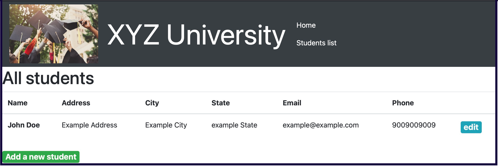

# Lab: Building a Highly Available, Scalable Web Application

## Overview and objectives
Throughout various AWS Academy courses, you have completed hands-on labs. You have used different AWS services and features to create compute instances, install operating systems (OSs) and software, deploy code, and secure resources. You practiced how to enable load balancing and automatic scaling, and how to architect for high availability to build simple, lab-specific applications.

In this project, you’re challenged to use familiar AWS services to build a solution without step-by-step guidance. Specific sections of the assignment are meant to challenge you on skills that you have acquired throughout the learning process.

By the end of this project, you should be able to do the following:
- Create an architectural diagram to depict various AWS services and their interactions with each other.
- Estimate the cost of using services by using the AWS Pricing Calculator.
- Deploy a functional web application that runs on a single virtual machine and is backed by a relational database.
- Architect a web application to separate layers of the application, such as the web server and database.
- Create a virtual network that is configured appropriately to host a web application that is publicly accessible and secure.
- Deploy a web application with the load distributed across multiple web servers.
- Configure the appropriate network security settings for the web servers and database.
- Implement high availability and scalability in the deployed solution.
- Configure access permissions between AWS services.

## The lab environment and monitoring your budget
This environment is long-lived. When the session timer runs to 0:00, the session will end, but any data and resources that you created in the AWS account will be retained. If you later launch a new session (for example, the next day), you will find that your work is still in the lab environment. Also, at any point before the session timer reaches 0:00, you can choose Start Lab again to extend the lab session time.

**Important:** Monitor your lab budget in the lab interface. When you have an active lab session, the latest known remaining budget information displays at the top of this screen. This data comes from AWS Budgets, which typically updates every 8–12 hours. Therefore, the remaining budget that you see might not reflect your most recent account activity. If you exceed your lab budget, your lab account will be disabled, and all progress and resources will be lost. Therefore, it’s important for you to manage your spending.

## AWS service restrictions
In this lab environment, access to AWS services and service actions might be restricted to the ones that are needed to complete the lab instructions. You might encounter errors if you attempt to access other services or perform actions beyond the ones that are described in this lab.

## Scenario
Example University is preparing for the new school year. The admissions department has received complaints that their web application for student records is slow or not available during the peak admissions period because of the high number of inquiries.

You are a cloud engineer. Your manager has asked you to create a proof of concept (POC) to host the web application in the AWS Cloud. Your manager would like you to design and implement a new hosting architecture that will improve the experience for users of the web application. You’re responsible for building the infrastructure to host the student records web application in the cloud.

Your challenge is to plan, design, build, and deploy the web application to the AWS Cloud in a way that is consistent with best practices of the AWS Well-Architected Framework. During the peak admissions period, the application must support thousands of users and be highly available, scalable, load balanced, secure, and high performing.

## Solution requirements
The solution must meet the following requirements:

**Functional**: The solution meets the functional requirements, such as the ability to view, add, delete, or modify the student records, without any perceivable delay.

**Load Balanced**: The solution can properly balance user traffic to avoid overloaded or underutilized resources.

**Scalable**: The solution is designed to scale to meet the demands that are placed on the application.

**Highly Available**: The solution is designed to have limited downtime when a web server becomes unavailable.

**Secure**:
- The database is secured and can’t be accessed directly from public networks.
- The web servers and database can be accessed only over the appropriate ports.
- The web application is accessible over the internet.
- The database credentials aren’t hardcoded into the web application.

**Cost Optimized**: The solution is designed to keep costs low.

**High Performing**: The routine operations (viewing, adding, deleting, or modifying records) are performed without a perceivable delay under normal, variable, and peak loads.

## Assumptions

This project will be built in a controlled lab environment that has restrictions on services, features, and budget. Consider the following assumptions for the project:

- The application is deployed in one AWS Region (the solution does not need to be multi-Regional).
- The website does not need to be available over HTTPS or a custom domain.
- The solution is deployed on Ubuntu machines by using the JavaScript code that is provided.
- Use the JavaScript code as written unless the instructions specifically direct you to change the code.
- The solution uses services and features within the restrictions of the lab environment.
- The database is hosted only in a single Availability Zone.
- The website is publicly accessible without authentication.
- Estimation of cost is approximate.

**Disclaimer**: A security best practice is to allow access to the website through the university network and authentication. However, because you are building this application as a POC, those features are beyond the scope of this project. You are encouraged to implement this additional functionality.

## Approach

**Recommendation**: Develop your project solution in phases. This will help you ensure that basic functionality is working before the architecture becomes more complex. After the application is working, you are encouraged to enhance the solution with additional requirements.

## Phase 1: Planning the Design and Estimating Cost

In this phase, you will plan the design of your architecture. First, you will create an architecture diagram.

Next, you will estimate the cost of the proposed solution and present the estimate to your educator. An important first step for any solution is to plan the design and estimate the cost. As necessary, review the various components in the architecture to adjust the estimated cost. Cost is an important factor when building a solution because cost can help determine the components and architecture pattern to use.

**Task 1: Creating an Architectural Diagram**

Create an architectural diagram to illustrate what you plan to build. Consider how you will accomplish each requirement in the solution.

**References:**
- [AWS Architecture Icons](https://aws.amazon.com/architecture/icons/)
- [AWS Reference Architecture Diagrams](https://aws.amazon.com/architecture/)

**Task 2: Developing a Cost Estimate**

Develop a cost estimate that shows the cost to run the solution in the `us-east-1` Region for 12 months. Use the AWS Pricing Calculator for this estimate.

If required by your instructor, add your architectural diagram and cost estimate to presentation slides. Your educator might want to evaluate this information as part of assessing your work on this project. A presentation template is provided.

**References:**
- [What Is AWS Pricing Calculator?](https://aws.amazon.com/aws-cost-management/aws-roi-calculator/)
- PowerPoint presentation template

## Phase 2: Creating a Basic Functional Web Application

In this phase, you will start to build the solution. The objective of this phase is to have a functional web application that works on a single virtual machine in a virtual network that you create. By the end of this phase, you will have a POC to demonstrate hosting the application on the AWS Cloud. You can then build upon your work in later phases.

**Task 1: Creating a Virtual Network**

Create a virtual network to host the web application.

- **Tip:** Create networking resources such as a virtual private cloud (VPC) and subnets.

**Reference:**
- [AWS Academy Cloud Architecting – Lab: Creating a Virtual Private Cloud](https://awsacademy.instructure.com/courses/168/pages/lab-creating-a-virtual-private-cloud)

**Task 2: Creating a Virtual Machine**

Create a virtual machine in the cloud to host the web application.

- To install the required web application and database on the virtual machine, use the JavaScript code from the following link: [SolutionCodePOC](https://example.com/solutioncodepoc)

**Tips:**
- Use a compute service such as Amazon Elastic Compute Cloud (Amazon EC2).
- Use the latest Ubuntu Amazon Machine Image (AMI).

**Task 3: Testing the Deployment**

Test the deployment of the web application to ensure it is accessible from the internet and functional. Perform a few tasks, such as viewing, adding, deleting, or modifying records.

- **Tip:** To access the web application, use the IPv4 address of the virtual machine.

## Phase 3: Decoupling the Application Components

In this phase, you will continue building. The objective is to separate the database and the web server infrastructure so that they run independently. The web application should run on a separate virtual machine, and the database should run on the managed service infrastructure.

**Task 1: Changing the VPC Configuration**

Update or re-create the virtual network components that are necessary to support hosting the database separately from the application.

- **Note:** You need private subnets in a minimum of two Availability Zones.

**Reference:**
- [AWS Academy Cloud Architecting – Lab: Creating a Virtual Private Cloud](https://awsacademy.instructure.com/courses/168/pages/lab-creating-a-virtual-private-cloud)

**Task 2: Creating and Configuring the Amazon RDS Database**

Create an Amazon Relational Database Service (Amazon RDS) database that runs a MySQL engine. You can choose to create a provisioned instance or run it serverlessly.

- **Notes:**
  - Allow only the web application to access the database.
  - Don't enable enhanced monitoring.

**Reference:**
- [AWS Academy Cloud Foundations – Lab: Build Your DB Server and Interact With Your DB Using an App](https://awsacademy.instructure.com/courses/112/pages/lab-build-your-db-server-and-interact-with-your-db-using-an-app)

**Task 3: Configuring the Development Environment**

Provision an AWS Cloud9 environment to run AWS Command Line Interface (AWS CLI) commands in later tasks.

- **Notes:**
  - Use a t3.micro instance for the AWS Cloud9 environment.
  - Use Secure Shell (SSH) to connect to the environment.

**Reference:**
- [Creating Cloud9 Environment](https://aws.amazon.com/cloud9/getting-started/)

**Task 4: Provisioning Secrets Manager**

Use AWS Secrets Manager to create a secret to store the database credentials and configure the web application to use Secrets Manager.

- Use Script-1 from the following link to create a secret in Secrets Manager using the AWS CLI: [AWS Cloud9 Scripts](https://example.com/awscloud9scripts)

**Reference:**
- [create-secret in

 the AWS CLI Command Reference for AWS Secrets Manager](https://docs.aws.amazon.com/cli/latest/reference/secretsmanager/create-secret.html)

**Task 5: Provisioning a New Instance for the Web Server**

Create a new virtual machine to host the web application.

- To install the required web application on the virtual machine, use the JavaScript code from the following link: [Solution Code for the App Server](https://example.com/solutioncodeappserver)

- For the AWS Identity and Access Management (IAM) profile on the EC2 instance, attach the existing LabInstanceProfile profile. This profile attaches an IAM role called LabRole to the instance so that it can fetch the secret securely.

**Reference:**
- [AWS Academy Cloud Foundations – Lab: Build Your DB Server and Interact With Your DB Using an App](https://awsacademy.instructure.com/courses/112/pages/lab-build-your-db-server-and-interact-with-your-db-using-an-app)

**Task 6: Migrating the Database**

Migrate the data from the original database, which is on an EC2 instance, to the new Amazon RDS database.

- Use Script-3 from the AWS Cloud9 Scripts file (cloud9-scripts.yml) to migrate the original data into the Amazon RDS database. Recall that you used a script from this file earlier to create the secret in Secrets Manager.

**Reference:**
- [AWS Academy Cloud Architecting – Lab: Migrating a Database to Amazon RDS](https://awsacademy.instructure.com/courses/168/pages/lab-migrating-a-database-to-amazon-rds)

**Task 7: Testing the Application**

Access the application and perform a few tasks to test it. For example, view, add, delete, and modify student records.

## Phase 4: Implementing High Availability and Scalability

In this phase, you will complete the design and fulfill the remaining solution requirements. The objective is to use the key components that you created in earlier phases to build a scalable and highly available architecture.

**Task 1: Creating an Application Load Balancer**

Launch a load balancer. The endpoint will be used to access your web application.

- **Tip:** Use a minimum of two Availability Zones.

**Reference:**
- [AWS Academy Cloud Architecting – Lab: Creating a Highly Available Environment](https://awsacademy.instructure.com/courses/168/pages/lab-creating-a-highly-available-environment)

**Task 2: Implementing Amazon EC2 Auto Scaling**

Create a new launch template and use an Auto Scaling group to launch the EC2 instances that host the web application.

- To accomplish this, you can create an AMI from the running instance or create a new AMI and install the necessary packages and application code. Then, configure an Auto Scaling group to use the load balancer.

**Tips:**
- Use a Target tracking policy.
- Set the Auto Scaling group size according to your estimated requirements.
- You can use the default values (e.g., for group size and CPU utilization) initially and then adjust them later as needed.

**Reference:**
- [AWS Academy Cloud Architecting – Lab: Creating a Highly Available Environment](https://awsacademy.instructure.com/courses/168/pages/lab-creating-a-highly-available-environment)

**Task 3: Accessing the Application**

Access the application and perform a few tasks to test it. For example, view, add, delete, and modify student records.

**Task 4: Load Testing the Application**

Perform a load test on the application to monitor scaling.

- Use Script-2 from the AWS Cloud9 Scripts file (cloud9-scripts.yml) to perform the load test. Recall that you used scripts from this file in previous tasks.

**Notes:**

- Access the web application from the browser by using the load balancer URL.
- Use AWS Cloud9 to run the load testing scripts against the load balancer.

**Reference:**

- [loadtest Tool Repository on GitHub](https://github.com/alexfernandez/loadtest)

## Ending your session

Reminder: This is a long-lived lab environment. Data is retained until you either use the allocated budget or the course end date is reached (whichever occurs first).

To preserve your budget when you are finished for the day, or when you are finished actively working on the assignment for the time being, do the following:

1. At the top of this page, choose "End Lab," and then choose "Yes" to confirm that you want to end the lab.
2. A message panel indicates that the lab is terminating.
   - Note: Choosing "End lab" in this lab environment will not delete the resources you have created. They will still be there the next time you choose "Start lab" (for example, on another day).
3. To close the panel, choose "Close" in the upper-right corner.

© 2023, Amazon Web Services, Inc. or its affiliates. All rights reserved.
