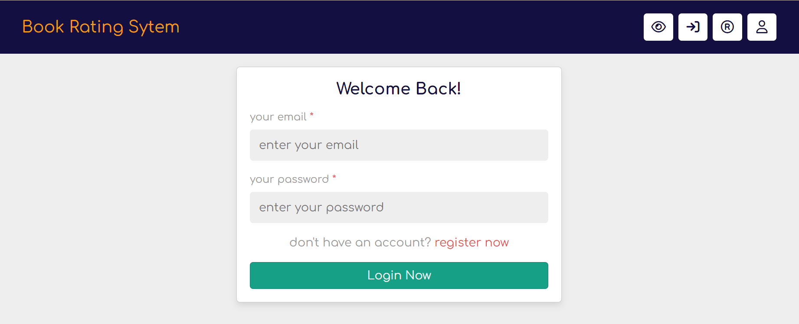
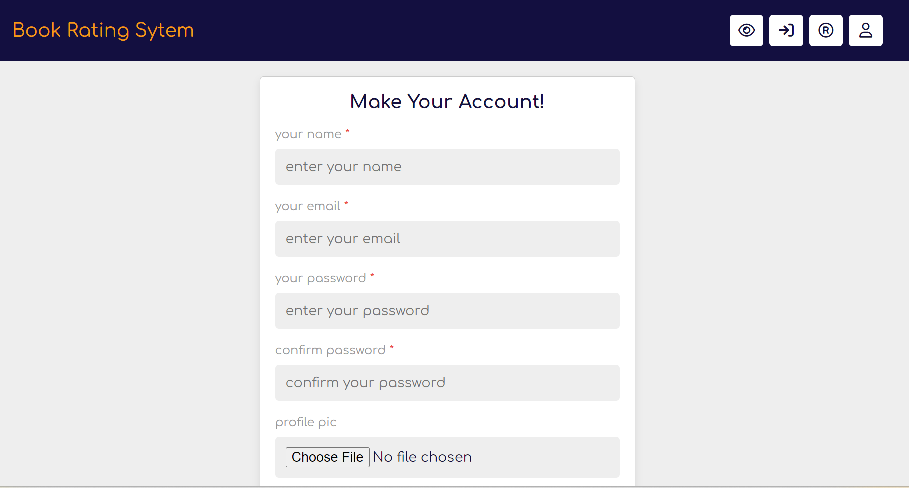
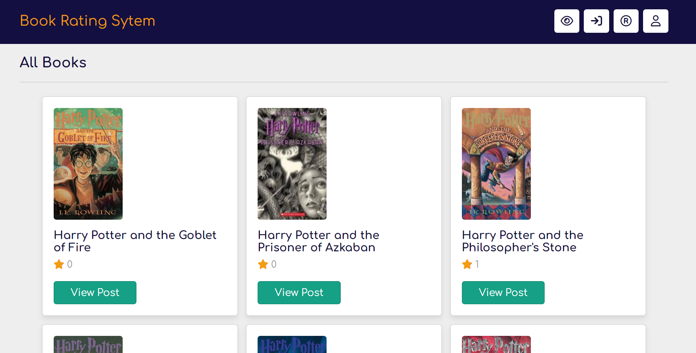
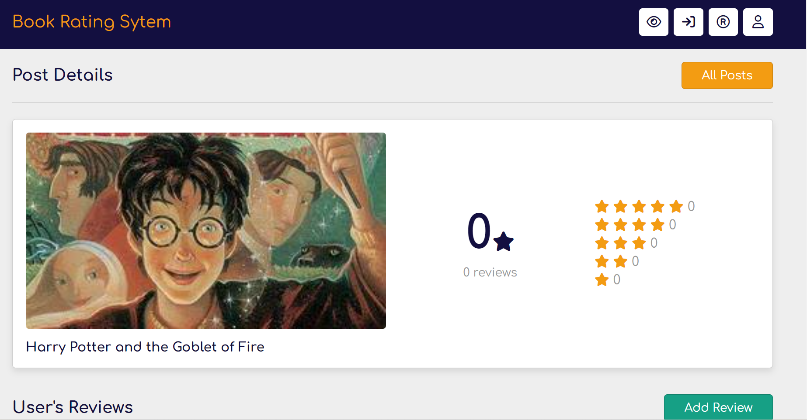
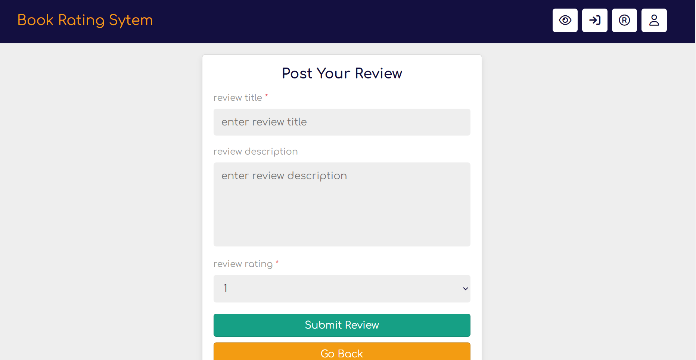
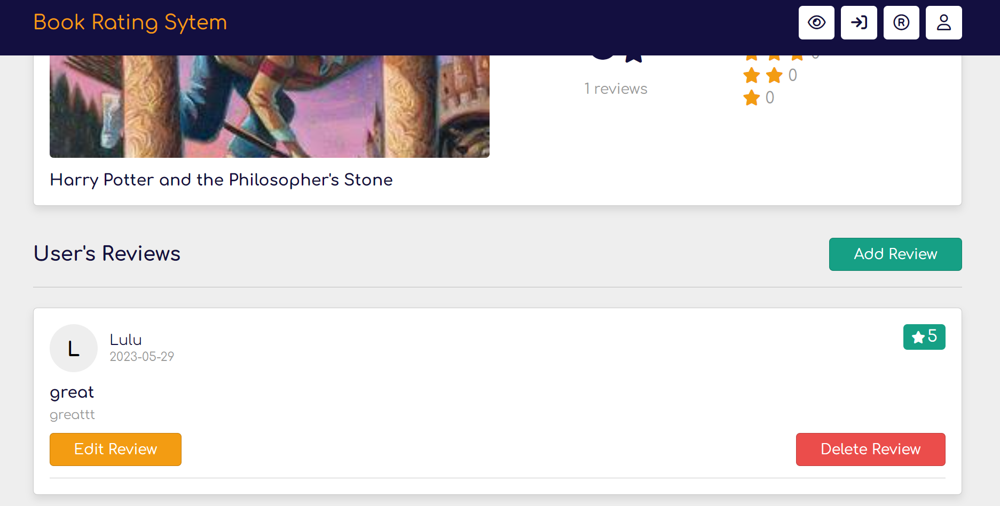
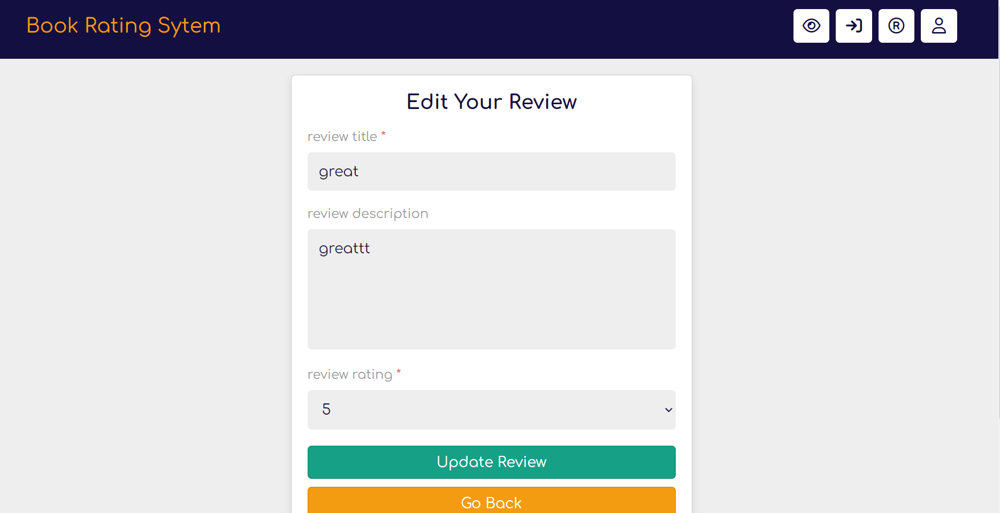
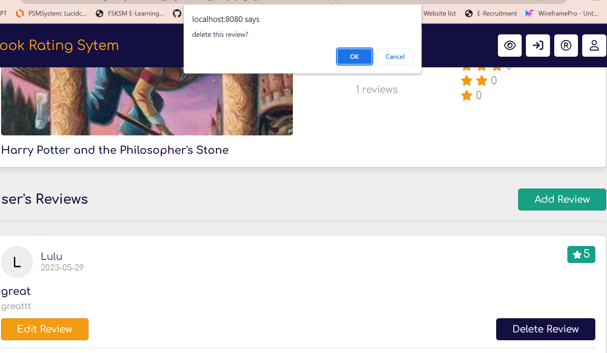
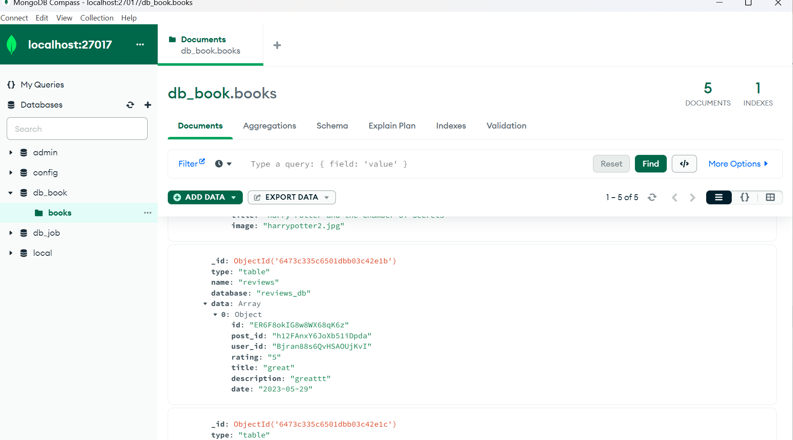

<h1 align='center'>Book Rating System</h1>
<div align="center"></div>

<br />

## Introduction: 

In today's digital age, book rating system can play a role in shaping readers' choices, influencing book sales, and contributing to the overall book ecosystem. Our group is excited to embark on a collaborative assignment to develop a book rating system using MongoDB as the database and PHP as the backend scripting language. Leveraging the powerful capabilities of Visual Studio Code, we aim to create a robust and user-friendly platform that streamlines the book rating with readers satisfaction.

The primary objective of our assignment is to provide a standardized and accessible way for readers to evaluate and compare books. By integrating MongoDB as the database and PHP for backend development, we will leverage the flexibility, scalability, and real-time data handling capabilities of these technologies. Our goal is to create a reliable and efficient platform that collect books rating with different reader's perspective and empowers authors to provide better ideas and improve their writing skills.

## System Design: 
*Describe the system architecture, data requirements, and functionalities.*

### Data Requirements

The data requirements include storing and managing books data. Some of the essential data fields are as follows:

<div align="center">
  
| Field               | Description                                                  |
|---------------------|--------------------------------------------------------------|
| User ID             | A unique identifier for each user.                           |
| Name                | The user's name.                                             |
| Email               | The user's email address.                                    |
| Image               | The user's image (optional).                                 |
| Post ID             | A unique identifier for each book posted                     |
| Book Title          | The book's title.                                            |
| Book Image          | The book's image.                                            | 
| Review ID           | A unique identifier for each review.                         | 
| Rating              | User rating with at most 5 stars.                            | 
| Date                | Timestamp the review added.                                  | 
  
</div>

### Functionalities

The key functionalities of the system are as follows:
1. **Create user, book and reviews**: Users can register and login into the system, admin add books into the system and users add book reviews with ratings.
2. **Read book reviews**: Users can read the reviews added for specific books.
3. **Update reviews**: Users can update their particular reviews added.
4. **Delete reviews**: Users can delete their reviews.

## Implementation: 
*Explain the step-by-step process of developing the system, including the CRUD operations, data preprocessing, and analysis.*

### Required Software
Some of the software that need to be install are as follows:

1. [XAMPP](https://www.apachefriends.org/download.html): Open localhost and SQL database.<br>
2. [MongoDB](https://www.mongodb.com/try/download/community): Store data locally. <br>
3. [MongoDB PHP Driver](https://pecl.php.net/package/mongodb): Connect with mongodb database. Download driver that are compatible with your php version. <br>
4. [Composer](https://getcomposer.org/download/): Dependency management in PHP.

### Steps
1.  Open downloaded mongodb php driver and copy 'php_mongodb.dll' file into *C:\xampp\php\ext* folder.

2.  Add the following line in *C:\xampp\php\php.ini*
```
extension=php_mongodb.dll
```

3. Open directory in command prompt or powershell, then install the PHP Library with Composer.
```
composer require mongodb/mongodb
```

4. Open local host and phpmyadmin (MySQL) to create a database with table user, posts and reviews.
<p align="center">
  
  
  
</p>

5. Create database and collection in mongodb compass of localhost: 27017.
<p align="center">
  
</p>

6. Run MongoDB server by running the code below in command prompt run as administrator.
```
net start MongoDB
```

7. Create new file in your directory to connect to **MySQL**.
```
<?php 

   $db_name = 'mysql:host=localhost;dbname=reviews_db';
   $db_user_name = 'root';
   $db_user_pass = '';

   $conn = new PDO($db_name, $db_user_name, $db_user_pass);

   function create_unique_id(){
      $characters = '0123456789abcdefghijklmnopqrstuvwxyzABCDEFGHIJKLMNOPQRSTUVWXYZ';
      $characters_lenght = strlen($characters);
      $random_string = '';
      for($i = 0; $i < 20; $i++){
         $random_string .= $characters[mt_rand(0, $characters_lenght - 1)];
      }
      return $random_string;
   }

   if(isset($_COOKIE['user_id'])){
      $user_id = $_COOKIE['user_id'];
   }else{
      $user_id = '';
   }

?>
```

8. Create new file in your directory to connect to **MongoDB**.
```
<?php
      require 'vendor/autoload.php'; // Include the MongoDB PHP driver

      // Connect to MongoDB
      $mongoClient = new MongoDB\Client("mongodb://localhost:27017");

      // Select a database
      $database = $mongoClient->selectDatabase('db_book');
      $collection = $database->selectCollection('books');
  ?>
```

### CRUD operations
1. **Create user, posts and reviews**: tb_user need id, name, email, password and image (optional).tb_posts need id, title and image, tb_reviews need id, post id, user id, rating, title, description and date (timestamp).
2. **Read posts and reviews**: Any type of user can see both posts and reviews.
3. **Update posts and reviews**: Admin can update posts, all user can update reviews.
4. **Delete posts and reviews**: Admin can delete posts, all user can delete reviews.

## Web Interface: 
1. This is the login page where user can login and create review.
<p align="center">
  
</p>

2. This is the register page where user can create their account.
<p align="center">
  
</p>

3. This is the list page where user can view all post.
<p align="center">
  
</p>

4. This is the details about a particular book.
<p align="center">
  
</p>

## Testing and Validation: 
1. **Create** - Add review for a particular book.
<p align="center">
  
</p>

2. **Read** - Read reviews from the readers.
<p align="center">
  
</p>

3. **Update** - Edit own's review.
<p align="center">
  
</p>

4. **Delete** - Delete own's review.
<p align="center">
  
</p>

4. **Validation** - Successfully store data in MongoDB.
<p align="center">
  
</p>

## Conclusion: 
In conclusion, our group is enthusiastic about the opportunity to create a book review system using MongoDB and PHP in Visual Studio Code. By harnessing the strength of MongoDB's flexible document-based database and integrating it seamlessly with PHP, we can build a powerful and scalable system that meets the needs of both readers and authors. By delivering a high-quality book review portal, our group aims to make a positive impact on the reading books, helping users find the best book that they should try. 

We are committed to implementing best practices, ensuring data security, and optimizing the performance of the system to provide a reliable and user-friendly experience.Through the integration of MongoDB and PHP in Visual Studio Code, our group is determined to develop a dynamic book reviews portal that revolutionizes the way readers and authors connect. 

Overall, our project has successfully addressed the challenges of building a dynamic book review portal by leveraging the strength of MongoDB and PHP integration. By creating a user-friendly platform that connects readers with authors, we have made a significant impact on the book market, improving the overall efficiency of the book search and reviewing process. We are proud of our achievement and look forward to further enhancing the book review system based on user feedback and evolving market needs.

## References: 
1. [How to use MongoDB with PHP](https://www.youtube.com/watch?v=WFrZB1Zr6lo)

2. [CRUD MongoDB with PHP](https://www.youtube.com/watch?v=zogIgFz3NWg&t=277s)

