<h1 align ='center'>Student Result Analysis System</h1>

## Table Content
- [Introduction](#introduction)
- [System Design](#system-design)
- [Implementation](#implementation)
- [Web Interface](#web-interface)
- [Testing and Validation](#testing-and-validation)
- [Conclusion](#conclusion)
- [References](#references)

## Introduction
The Student Result Analysis System has revolutionized the way assessments are conducted, replacing traditional paper-based methods with efficient and easily accessible alternatives. This system offers flexibility, allowing exams to be scheduled and completed remotely. Additionally, it ensures reliable results through enhanced security measures and authentication mechanisms. Although there may be challenges regarding technical requirements and data security, these obstacles can be overcome with careful planning. By utilizing the Student Result Analysis System, educators gain access to analytics and personalized assessments that empower them in their teaching practices. Simultaneously, students and professionals benefit from the convenience and flexibility of self-paced learning. Embracing the potential of this system enables us to envision a future where assessments seamlessly integrate into the digital landscape, empowering individuals and organizations to thrive in an interconnected world.

For this assignment, we will develop a Student Result Analysis System that caters to three user types: students, teachers, and admins. Teachers will have the ability to create questionnaires, manage preboard exams, and view students' results. Students will be able to take examinations and view their own results. Admins will have full access to the system, allowing them to manage questionnaires, preboard exams, and students' results. This report will delve into the system's architecture, data requirements, functionalities, development steps, user interface, and testing in detail.

## System Design
The student result analysis system is developed by using two different type of database which are MongoDB and PhpMyAdmin. As the student result analysis system is specifically created to replace the way of conducting the physical written examination, the user interface is developed to effectively present the information ensuring that users are provided with a clear overview of the questionnaire and students' results. The system consists of several components, such as data storage, data manipulation and processing and a web interface. Below is the diagram to illustrate the system design:

### System Architecture
<p align="center">

</p>

### Data Requirements
The main data requirements (student result table) for the systems are as follows:
  <table>
  <tr>
    <th>Field</th>
    <th>Description</th>
  </tr>
  <tr>
    <td>id</td>
    <td>A unique identifier for result</td>
  </tr>
  <tr>
    <td>student_id</td>
    <td>A unique identifier for student</td>
  </tr>
    <tr>
    <td>test_id</td>
    <td>A unique identifier for test/exam</td>
  </tr>
    <tr>
    <td>score</td>
    <td>Number of correct questions in a test</td>
  </tr>
  <tr>
    <td>percentage</td>
    <td>Percentage of correct answers in a test</td>
  </tr>
    <tr>
    <td>remarks</td>
    <td>Status of test either passed or failed</td>
  </tr>
    <tr>
    <td>date_taken</td>
    <td>Date the test was taken</td>
  </tr>
</table>

### Functionalities
The key functionalities of the system are as follows:

#### Admin
The admin can manage the questionnaire and exams by adding questions, subject, multiple options, choosing difficulties, and attachment files as well as viewing students' results. The admin also has the permission of managing the users in the system.

#### Student
The student can take the examinations and view their own results.

## Implementation
### Step 1: Dowload necessary tools and software
1. Install all tools and software that are needed:
  - [XAMPP](https://www.apachefriends.org/download.html)
  - [MongoDB](https://www.mongodb.com/try/download/community)
  - [Composer](https://getcomposer.org/download/)
2. Make sure that the MongoDB is running and accessible.
3. In the command prompt, go to your project directory. Run the command to install the MongoDB PHP driver.
   ```
   composer require mongodb/mongodb
   ```
### Step 2: Create Database in MySQL
1. Create a database and table in mysql to store the data. 
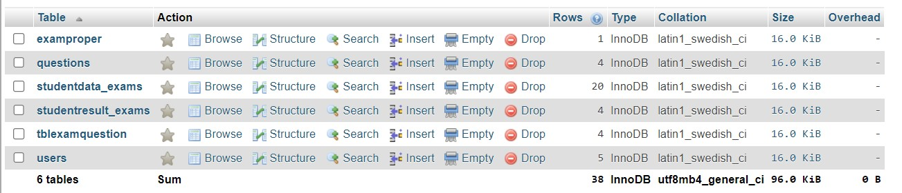</img><br>

### Step 3: Connect to Database
1. MySQL
   
   ```php
    <?php
    //Set db parameters
    $servername = "localhost";
    $username = "root";
    $password = "";
    $dbname = "db_song";

    //Create connection
    $con = mysqli_connect($servername, $username, $password, $dbname);
    ?>
    ```

2. MongoDB
   
     ```php
     <?php
     require 'vendor/autoload.php'; // Include the MongoDB PHP driver

     // Connect to MongoDB
     $mongoClient = new MongoDB\Client("mongodb://localhost:27017");

     // Select a database
     $database = $mongoClient->selectDatabase('song');
     ?>
     ```
   
### Step 4: Implement CRUD Operations with MySQL
Develop PHP scripts to perform CRUD operations on the MySQL database:
1. ```Create```: Implement functionality to insert new data records into MySQL.
2. ```Read```: Retrieve and display data from MySQL.
3. ```Update```: Allow updating existing data records in MySQL.
4. ```Delete```: Provide the ability to remove unwanted data entries from MySQL.

### Step 5: Implement CRUD Operations with MongoDB
Develop PHP scripts to perform CRUD operations on the MongoDB database:
1. ```Create```:: Implement functionality to insert new data records into MongoDB.
2. ```Read```: Retrieve and display data from MongoDB.
3. ```Update```: Allow for updating existing data records in MongoDB.
4. ```Delete```: Provide the ability to remove unwanted data entries from MongoDB.

### Step 6: Preprocessing and Analysis of Data
It has been found that all of the data does not consist of any missing value, and we have applied statistical analysis and visualized the data to gain insight into it. 

### Step 7: Develop a Web Application

## Web Interface
- Landing page
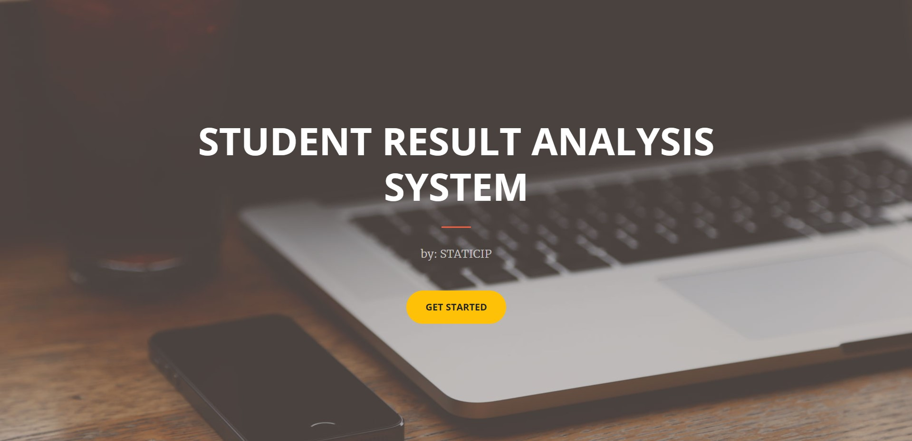</img><br>

- Login Page
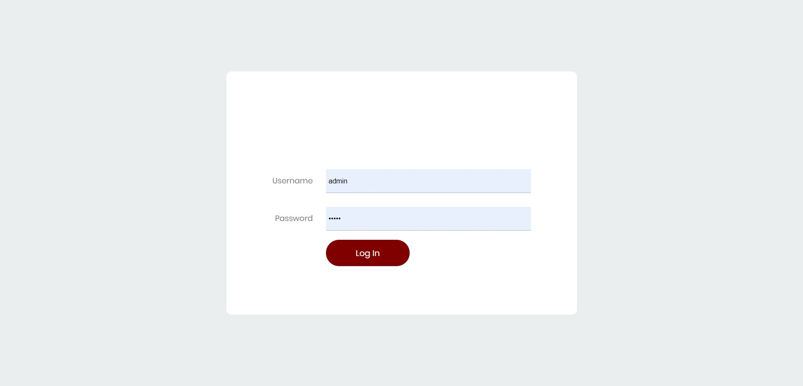</img><br>

### Admin
- Home Page (Student results)
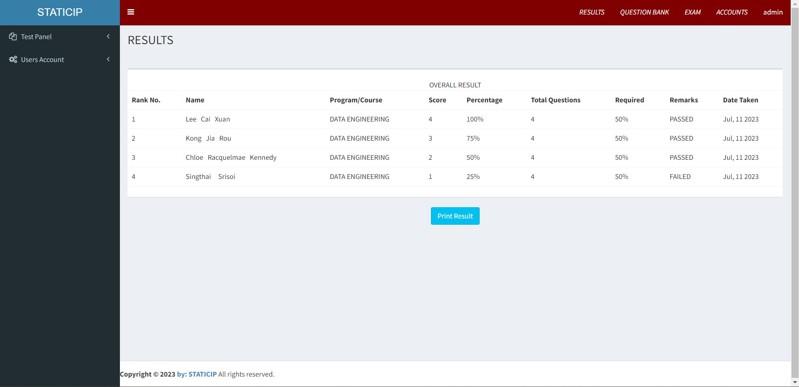</img><br>

- Print Result
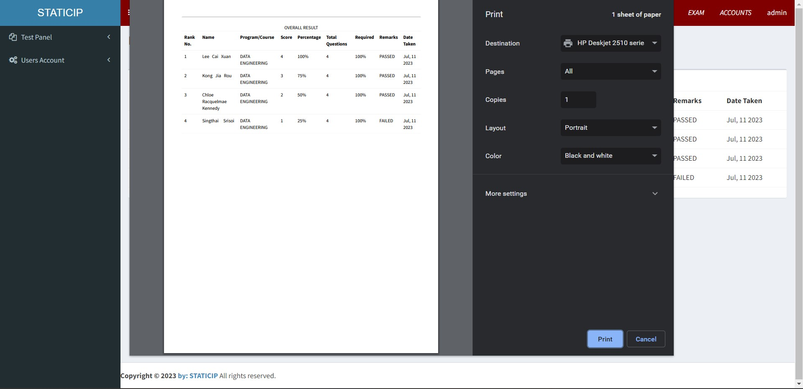</img><br>

- Question Bank
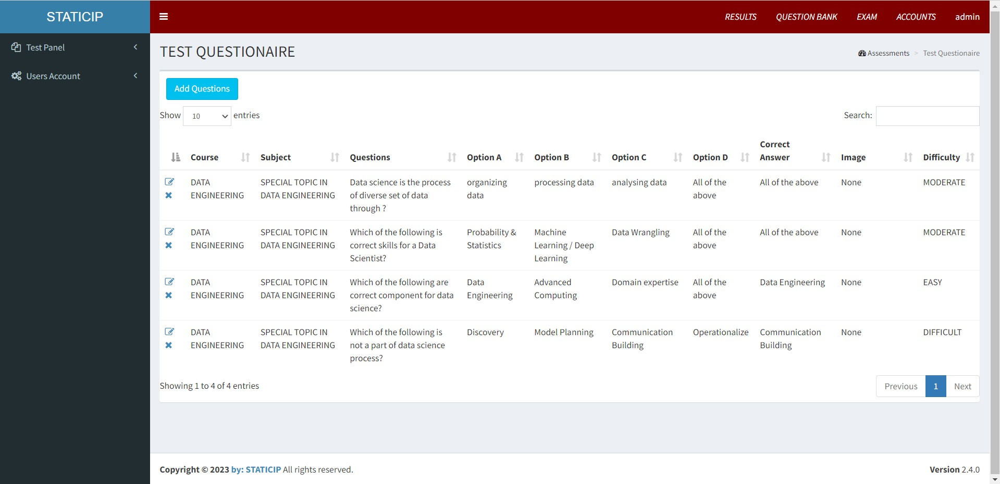</img><br>

- Create Question
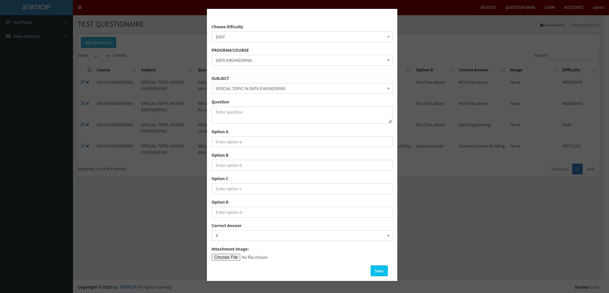</img><br>

- Exam List
</img><br>

- Create Exam
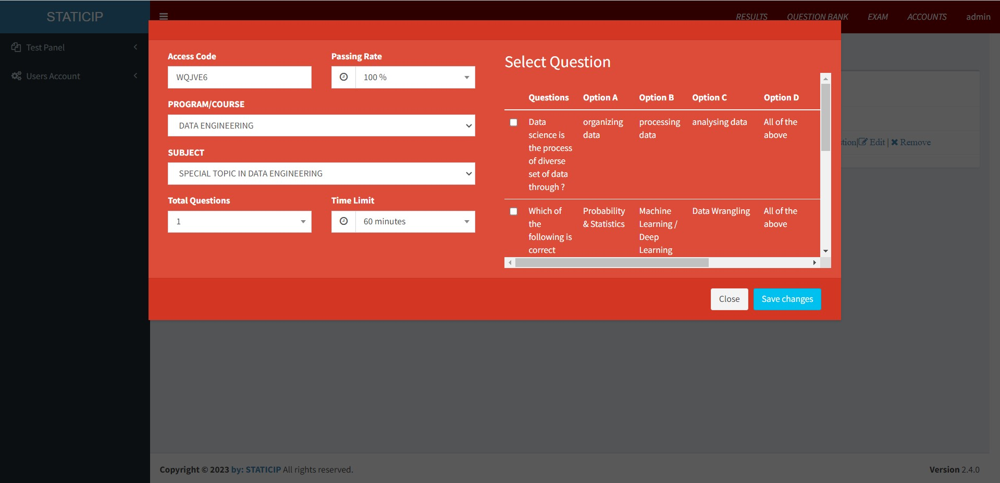</img><br>

- User List
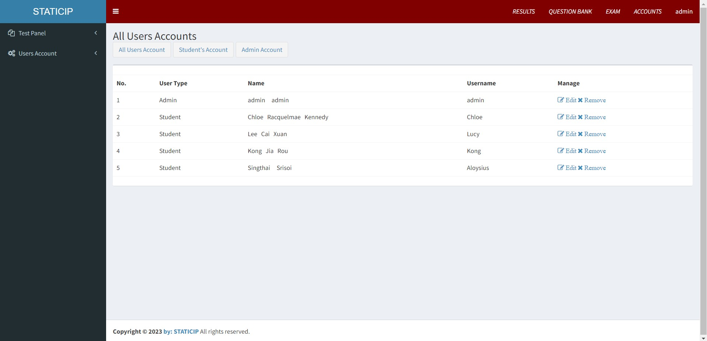</img><br>

- Student List
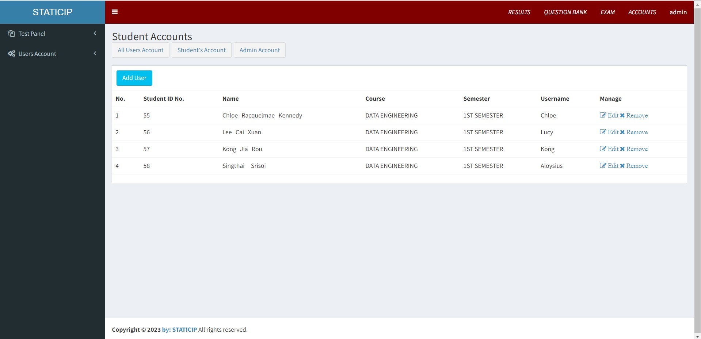</img><br>

- Create Student
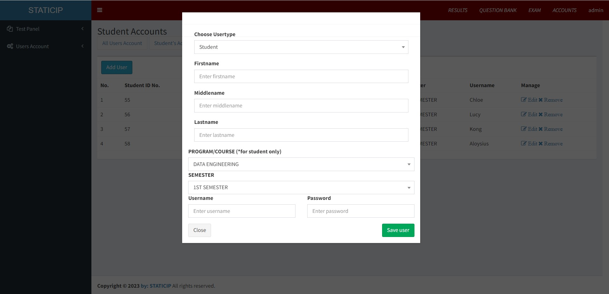</img><br>

- Admin List
</img><br>

- Create Admin
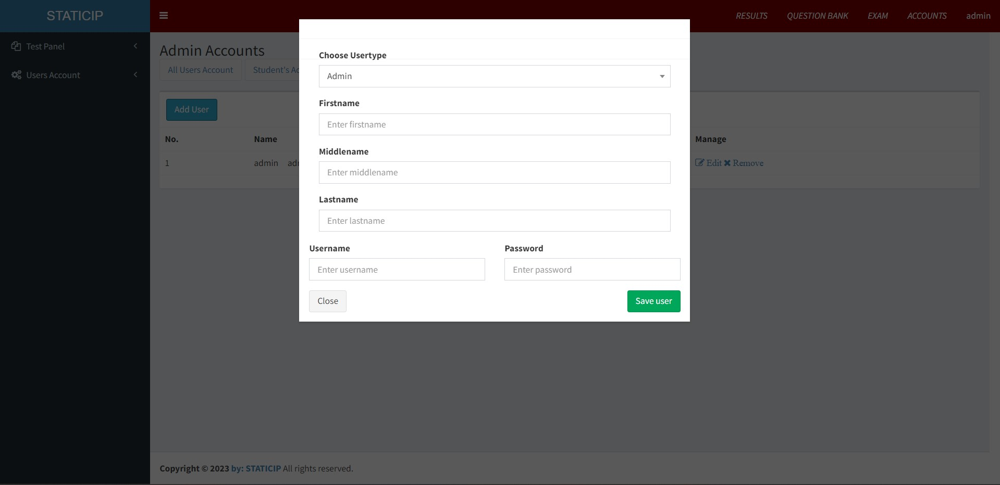</img><br>

### Student
- Home Page (Exam List)
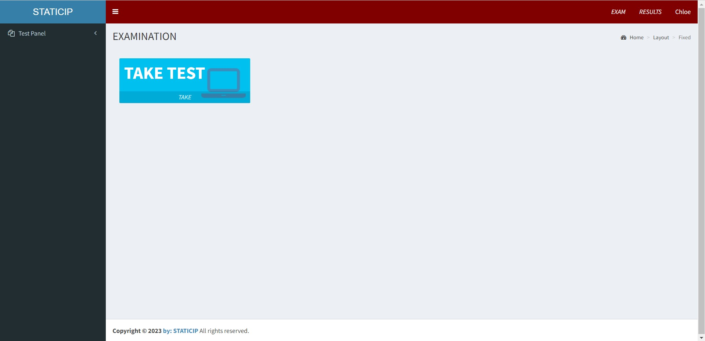</img><br>

- Take Exam
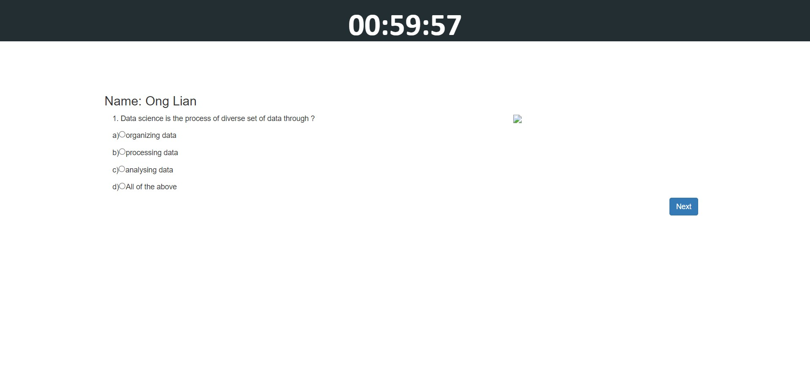</img><br>

- View Result
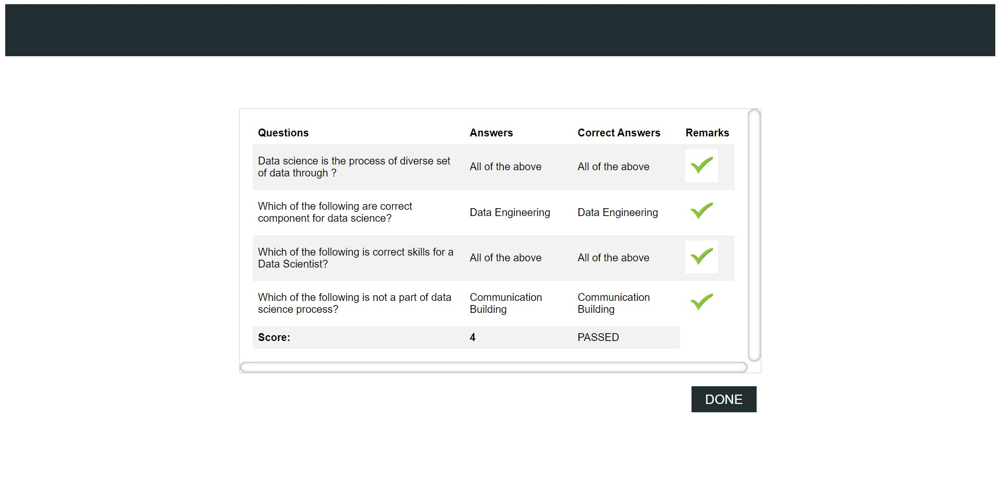</img><br>

## Testing and Validation
1. Create Operation Testing

  Insert song information and click the "Add Song" button
  

  Check the data in MongoDB and Mysql
  - Mysql
  
  
  - MongoDB
  

2. View Operation Testing
 
 
3. Update Operation Testing

  Update song information and click "Update Song" button
  
  
  Check the data in MongoDB and Mysql
  - Mysql
  
  
  - MongoDB
  

4. Delete Operation Testing

  Delete song information and click the "OK" button
  

  Check the data in MongoDB and Mysql
  - Mysql
  

  - MongoDB
  

## Conclusion
This Student Result Analysis System developed using PHP, MySQL and MongoDB presents valuable insights on students understanding based on examination results. By meeting its goals of data collection, storage, CRUD operations and data analysis, the system proved to be effective. The successful implementation of CRUD operations on MongoDB and MySQL ensured streamlined data management.

#### Key Findings:
Based on the overall results of students, 75% of students have good understanding on the topic learned as the majority of students got PASSED in the examination. This shows that, the students are able to cope with the teaching methods in class. Besides, students are able to 
notice the learning gaps and focus more on those areas. Furthermore, lecturers are able to identify strengths and weaknesses of each individual student to provide personalized guidance and support to help students maximize their strengths and address areas that need improvement. 

#### Challenges Faced:
- Data consistency and integrity were hard to maintain when using two databases.
- Debugging and testing were complex and time-consuming.
- Scalability was a challenge when using multiple technologies.

#### Potential Improvements:
- Display visualization that shows students performance and improvement which enables lecturer to quickly identify areas where students are struggling.
- Predictive analysis to identify at-risk students early and take corrective actions by analyzing patterns in students' data.
- Providing mobile access to the student result analysis system to allow easy access.

## References
1. [MongoDB and PHP](https://github.com/drshahizan/special-topic-data-engineering/blob/main/materials/mongodb/mongophp.md) <br>
2. [PHP + MongoDB EP 01 CRUD Connect, Update, Delete, Select, Insert](https://www.youtube.com/watch?v=zogIgFz3NWg)
