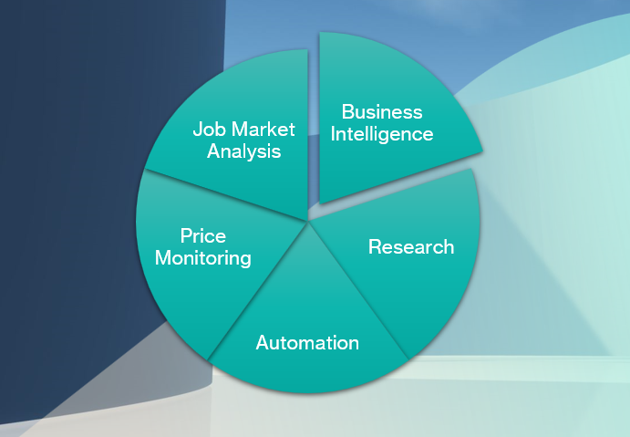

Don't forget to hit the :star: if you like this repo.

# Module 3: Data Scraping

<h3>
Group Members
</h3>

 <table align='center'>
   <tr>
     <th>Name</th>
     <th>Matrix Number</th>
   </tr>
 
   <tr>
     <td>AFIF HAZMIE ARSYAD BIN AGUS</td>
     <td>A20EC0176</td>
   </tr>
 
   <tr>
     <td>AHMAD AIMAN HAFIZI BIN MUHAMMAD</td>
     <td>A20EC0177</td>
   </tr>
 
   <tr>
     <td>LUQMAN ARIFF BIN NOOR AZHAR</td>
     <td>A20EC0202</td>
   </tr>
 
   <tr>
     <td>MADINA SURAYA BINTI ZHARIN</td>
     <td>A20EC0203</td>
   </tr>
 
   <tr>
     <td>MUHAMMAD IMRAN HAKIMI BIN MOHD SHUKRI</td>
     <td>A20EC0213</td>
   </tr>
 
</table>

### Contents:
- [Definition](#what-is-data-scraping)
- [The Importance](#why-is-data-scraping-important)
- [Tools](#data-scraping-tools)
- [Real World Case Studies](#real-world-case-studies-or-examples)
- [Conclusion](#conclusion)

## What is Data Scraping?

 

Data scraping, also known as `web scraping`, is a technique of `extracting data from websites` using automated software programs. It involves writing code that sends automated requests to a website, parses the HTML or XML content, and extracts the desired information. In simple terms, data scraping is the process of `collecting information` from the internet and transforming it into structured data that can be used for various purposes such as analysis, research, or business intelligence.

Data scraping tools are commonly used for this purpose, as they can automate the process and provide a range of features and capabilities to extract data from different types of web pages, handle complex data structures, and schedule and automate scraping tasks. However, it is important to note that data scraping must be done in compliance with applicable laws and regulations, and with respect for the privacy of individuals. Overall, data scraping is a useful technique that can help businesses and researchers collect and analyze large amounts of data quickly and efficiently.

## Why is Data Scraping important?

 

Data Scraping provides businesses, researchers, and individuals with a powerful tool to `collect and analyze large amounts of data` quickly and efficiently. By `automating repetitive tasks`, data scraping can help businesses save time and money, while also providing valuable insights that can improve decision-making.

1. `Business intelligence` : Data scraping can help businesses gather valuable information about competitors, customers, and market trends. This information can be used to develop new products and services, optimize marketing strategies, and improve business operations.

2. `Research` : Data scraping can be used in academic research to collect large amounts of data for analysis. This can help researchers identify patterns, trends, and correlations that can be used to draw meaningful conclusions.

3. `Automation` : Data scraping can automate repetitive tasks, such as gathering data from websites, which can save time and reduce the risk of errors. This can be especially useful in industries that rely on large amounts of data, such as finance, healthcare, and e-commerce.

4. `Price monitoring` : Data scraping can be used to monitor prices of products and services in real-time. This can help businesses adjust their prices to remain competitive, and also provide consumers with up-to-date pricing information.

5. `Job market analysis` : Data scraping can be used to collect job postings from various sources, such as job boards and company websites. This information can be used to analyze job market trends, identify skill gaps, and provide insights to job seekers.

## Data Scraping Tools

 

Overall, data scraping tools can help businesses and researchers to collect and analyze data quickly and efficiently. These tools can save time and resources, and provide insights that might not be possible through manual data collection. However, it is important to ensure that data scraping is done in compliance with applicable laws and regulations, and with respect for the privacy of individuals.

<table>
  <tr>
    <th>Tools</th>
    <th>Description</th>
  </tr>
  <tr>
    <td>
     BeautifulSoup
     

      
     

    </td>
    <td>Beautiful Soup is a Python package that is commonly used for web scraping purposes. It provides an easy-to-use API for parsing HTML and XML documents. Beautiful Soup is capable of handling poorly formatted HTML and can parse nested HTML tags.</td>
  </tr>
  <tr>
    <td>
     Scrapy
      

       
      

    </td>
    <td>Scrapy is a Python-based web crawling framework that provides a high-level API for web scraping. Scrapy is scalable, fast, and easy to use. It can extract data from websites, transform the data into structured formats, and store the data in various data stores such as databases, CSV files, or JSON files.</td>
  </tr>
  <tr>
    <td>
     Octoparse
      

       
      

    </td>
    <td>Octoparse is a powerful web scraping tool that is designed to extract data from websites without coding. It is easy to use and can extract data from a wide range of websites, including e-commerce sites, social media platforms, and news sites. Octoparse also provides a range of features, such as the ability to handle complex data structures, schedule and automate scraping tasks, and export data in various formats.</td>
  </tr>
  <tr>
    <td>
     Parsehub
      

       
      

    </td>
    <td>Parsehub is a web scraping tool that provides a range of features for data extraction, such as point-and-click UI, scheduled extraction, cloud-based data storage, and automatic IP rotation. Parsehub can handle dynamic websites and can extract data from JavaScript and AJAX-based websites.</td>
  </tr>
  <tr>
    <td>WebHarvy
     

       
   </td>
    <td>WebHarvy is a web scraping software that can extract data from various websites, such as e-commerce sites, job portals, and classifieds sites. It can extract data from multiple pages and supports regular expressions and XPath for advanced data extraction.</td>
  </tr>
</table>

## Real World Case Studies or Examples
There are 5 successful web scraping case studies from different industries and their business outcomes. This will help and inspired us to achieve the maximum value from the technology.
<table>
  <tr>
    <th>Scope</th>
    <th>Case Study</th>
    <th>Challenge</th>
    <th>Solution</th>
   <th>Impact to Business</th>
  </tr>
  <tr>
    <td>
     Web data extraction
    </td>
    <td>
     <b>Advantage Solutions</b> 
     Advantage Solutions offers sales, marketing, and retailer services to help brands and retailers increase sales in-store and online. Canopy, a brand of Advantage  Solutions, extracts and merges data from various sources to provide customers with a comprehensive view of their data.
   </td>
   <td>
    To prevent malicious activity from accessing their web data, websites use a variety of anti-scraping strategies. Canopy was identified and restricted from web sites after collecting openly accessible web data from numerous sources without changing the IP address. To get around IP restrictions, Canopy started collaborating with a proxy server provider. To reduce the risk of being discovered, companies using proxy servers must constantly change their IP addresses for each new connection request. Canopy eventually exhausted all of the IP addresses provided by the proxy server's IP pool and encountered the same problem.
   </td>
   <td>
    Canopy used Bright Data’s Residential Proxies and Datacenter IPs to collect required data for their customers.
   </td>
   <td>
    Canopy was able to access and collect online customer data across multiple retail portals by using residential and datacenter proxies. This helped the company to provide a one-stop-shop eCommerce data where customers could access all the information they needed.
   </td>
  </tr>
 
   <tr>
    <td>
     Recruitment
    </td>
    <td>
     <b>Mathison</b> 
     Mathison is an all-in-one DEI (diversity, equity, and inclusion) platform that assists businesses with their hiring processes.
   </td>
   <td>
   In order to build a uniform talent pool that aids recruiters in managing their varied hiring efforts, Mathison collects candidate information from several web sources, including social media platforms like LinkedIn, recruitment websites like Glassdoor or Salary.com, and salary.com. The organisation encountered challenges getting beyond website anti-scraping safeguards like IP blockers, CAPTCHA blockers, and honeypots in order to get region-specific data.
   </td>
   <td>
    Mathison used Bright Data’s Data Collector to collect massive amounts of candidate public data from targeted platforms.
   </td>
   <td>
    The company was able to simplify the data collection process, and reduce the time spent manually collecting candidate profile data, automate the building and maintaining datasets processes, match candidates in appropriate positions, and enable data-driven decision-making strategy of hiring.
   </td>
  </tr>
 
 <tr>
    <td>
     Marketing
    </td>
    <td>
     <b>Reddico</b> 
     Reddico is an SEO agency that offers consultancy and SEO technology to their clients in different industries to solve technical challenges and automate labor-intensive tasks.
   </td>
   <td>
    33 percent of all search traffic goes to the first result on a Google search. Businesses use SEO to monitor the effectiveness of their content and improve their Google Search visibility. For varied commercial reasons, such as backlink tracking and providing localised content, SEO tools comb through a variety of enormous volumes of webpages. However, it can be challenging to access and scrape a lot of web data.
   </td>
   <td>
   Reddico leveraged a data collector solution to collect web data on a large scale without geo-restrictions.
   </td>
   <td>
    Reddico was able to collect large-scale web data from any region in the world, get more accurate data from search engines much faster, and get real-time SERP data and provide up-to-date SEO insights to their customers.
   </td>
  </tr>
 
 <tr>
    <td>
     Sales
    </td>
    <td>
     <b>e.fundamentals</b> 
    e.fundamentals is a CommerceIQ company that helps Consumer Packaged Goods (CPG) brands analyze, measure, and optimize their eCommerce performance.
   </td>
   <td>
    The company gathers information from hundreds of merchants and transforms it into useful insights to help businesses improve the effectiveness of their digital shelves and increase sales. Access to open web data on more than 1.5 million products from hundreds of stores was required by e.fundamentals. It was difficult for the business to access and compile the internet information it required.
   <td>
  e.fundamentals leveraged Bright Data Residential IPs and Bright Data Web Unlocker to collect necessary public online data from various sources.
   </td>
   <td>
    The company could gather vast amounts of public web data to feed its analytics pipelines, accelerate the data collection process and Bright Data’s data collection products helped e.fundamentals triple in size last year.
   </td>
  </tr>
 
 <tr>
    <td>
     Travel
    </td>
    <td>
     <b>Railofy</b> 
     Railofy is a travel tech start-up that offers passengers solutions such as online food delivery service to train seats, ticket booking, and travel guarantee for the waitlist. 
   </td>
   <td>
    Railofy notifies waitlisted train passengers of available seats and ensures they reach their destinations at the lowest price. However, the company needed help to collect a vast amount of online passenger data to optimize its prices and offer personalized pricing. 
   <td>
  Railofy used Bright Data’s Datacenter IPs and Residential IPs to collect required  online travel data such as flight dates, number of seats left, ticket prices, etc. Extracted data enabled the company to offer flight options to waitlisted passengers at a similar railway ticket cost. 
   </td>
   <td>
    The company was able to access public online travel data, adjust ticket prices based on the current market situation, formulate data-driven strategies, and predict India’s railway and airline networks.
   </td>
  </tr>
</table>

## Conclusion
In conclusion, data scraping is a powerful tool for extracting data from websites for research, analysis, or business intelligence purposes. It can save time and effort in data collection and help gain insights that may not be possible through manual methods. However, it is important to use data scraping tools responsibly and ethically, while complying with applicable laws and regulations, and with respect for the privacy of individuals. It is also important to choose the right data scraping tools based on the specific requirements and features needed, and to stay updated with the latest developments in the field. With responsible and ethical data scraping practices, it can be a valuable asset for any organization.

## Contribution 🛠️
Please create an [Issue](https://github.com/drshahizan/special-topic-data-engineering/issues) for any improvements, suggestions or errors in the content.

You can also contact me using [Linkedin](https://www.linkedin.com/in/drshahizan/) for any other queries or feedback.

