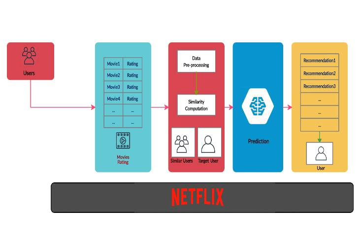

<h1 align='center'>Recommendation Engine: Netflix Shows/Movie Reccomendation 🔍</h1>

<p align="center">

</p> 

## Table of Contents
<!---
<li><a href="#section1">Section 1</a></li>
--->
- [Table of Contents](#table-of-contents)
- [1. Executive Summary](#1-executive-summary)
- [2. Background](#2-background)
- [3. Goals and Objective](#3-goals-and-objective)
- [4. Scope](#4-scope)
- [5. Methodology](#5-methodology)
- [6. System Architecture](#6-system-architecture)
- [7. Risks and Limitation](#7-risks-and-limitation)
- [8. Deliverables and Milestones](#8-deliverables-and-milestones)
- [9. Resources](#9-resources)
- [10. Technical Specifications](#10-technical-specifications)
- [11. Timeline and Deliverables](#11-timeline-and-deliverables)
- [12. Conclusion](#12-conclusion)

## 1. Executive Summary
Netflix, YouTube, Spotify and many more streaming platforms have been introduced to the world as the technologies are advancing rapidly nowadays. With this being said, users are prone to use it almost everyday whenever they wanted to watch movies or tv shows and stream any music. In this project, our group will focused on the collaborative filtering recommendation engine, which is implemented by Netflix. The objective of this project is to create a system (dashboard) that display the best suggestion of tv shows on streaming platform. The system we proposed will use a database that can keep track on the user behavioral data which will then be processed using machine learning to recognize streaming patterns of each user so that the most relevant suggestion can be presented to the users to increase the users satisfactory.


## 2. Background
Netflix is a global streaming service that provides a vast selection of TV shows, movies, and documentaries. It has over 200 million subscribers worldwide and is available in over 190 countries. One of the key features that set Netflix apart from other streaming services is its personalized recommendation system, which uses data science and machine learning algorithms to provide personalized content recommendations to its users. The Netflix recommendation system is based on a complex algorithm that takes into account a wide range of factors, such as the user's viewing history, search history, ratings, time of day, and device used, among others. The system continuously learns from the user's behavior and adjusts the recommendations to provide more relevant content over time.

The recommendation system has been a critical factor in Netflix's success and has helped the company retain and attract new subscribers. As a result, the development and improvement of the recommendation system have been a key focus for Netflix's data science and engineering teams. In recent years, Netflix has also made its recommendation system available to the research community through various data science challenges, such as the Netflix Prize, which aimed to improve the accuracy of the recommendation system by at least 10%. The challenge resulted in significant improvements to the recommendation system and led to the adoption of several new algorithms and techniques.

As a result of its success, the Netflix recommendation system has become a benchmark for personalized recommendation systems across various industries, and its algorithms and techniques have been adopted by other companies, such as Amazon, Spotify, and YouTube.

## 3. Goals and Objective
1) Implement the usage of MongoDB to create recommendation engine
2) Be able to understand steps of using MongoDB to create recommendation engine, which are Data Collection , Data Cleaning, Data Transformation , Data Loading , Model Training and Recommedation Generation based on study case (Netflix)
3) Improve the user experience: One of the primary goals of a data-driven project may be to improve the user experience. For example, in a recommendation system like Netflix, the goal may be to provide personalized and relevant content recommendations to improve user satisfaction and engagement.
4) Enhance data quality: A key objective of a data-driven project may be to enhance data quality. This includes ensuring data accuracy, completeness, and consistency to improve the reliability and usefulness of the data for analysis and modeling.
5) Develop predictive models: Another objective may be to develop predictive models to forecast future trends and outcomes. For example, in a financial institution, the goal may be to build predictive models to identify potential fraud or assess credit risk.
6) Ensure data security: One of the critical objectives of a data-driven project may be to ensure data security. This includes implementing appropriate security measures to protect sensitive data from unauthorized access, data breaches, and cyber threats.
7) Improve operational efficiency: A data-driven project may aim to improve operational efficiency by automating tasks, reducing manual intervention, and streamlining processes. For example, in a manufacturing industry, the goal may be to optimize production processes and reduce waste by using predictive maintenance techniques.

## 4. Scope
- The scope of this project is to create Netflix recommedation engine based on few factors. These factors will create personalized recommendation.
- This project requires dataset scraped from Netflix websites using Phyton.
- The main tool will be used in this project is MongoDB to store Netflix viewing history , Netflix search queries , user ratings and reviews and Netflix content    metadata.
- Matplotlib, Seaborn and Tableau will be used to create visualizations of the recommendation system's performance.


## 5. Methodology
| Components | Description |
|--|--|
| Data Collection | collect data from sources such as Netflix Recommendation Algorithm (NRA). This data will be used to train the reccomendation model  |
| Data Cleaning| clean the collected data to removed irrelevant data or incomplete data such as null in user watching video period. |
| Data Transforming| Transform the cleaned data used by MongoDB |
| Data Loading| Load transformed data into MongoDB collections |
| Model Training | Trains the recommendatiob model using machne learning algorithm based on data collected in steps 1 |
| Reccomendation Generator | Generate recommendations for users based on their previous interaction with the system. |

Below is an overview example of how the system will be programmed:
<p align="center">

</p> 

## 6. System Architecture

The system will consist of the following components:

| No. | Components | Description |
| ------------- | ------------- | ------------- |
| 1. | Data Collection| We will collect the Netflix data from Rapid API, the data contains about the search titles for the series, the actors for the series and also the deleted titles by country. The data will collected in JSON format.|
| 2. | Data Storage | The data collected will be stored in MongoDB. |
| 3. | Data preprocessing | We will clean and preprocess the data before evaluating it. To normalize the text data, we will remove stop words, punctuation, and URLs, as well as perform stemming and lemmatization. Not only that, we also planed to change the data format from JSON to CSV, so the data is easier to execute.|
| 4. | Data analysis and modeling | The preprocessed data will be analysis using **k-nearest neighbors algorithm (KNN)** |
| 5. | Model deployment |**Django**, a Python-based web framework, will be used by the model deployment component to deploy machine learning models to a web server. The algorithm will deploy the trained data after machine learning. This will help a lot to see the end result and also for data visulization |
| 6. | Visualization and reporting | We will use **Matplotlib**, a Python visulization library to visualize the data. We will also use **Power BI** to create reports and dashboards that can be shared with stakeholders. |

<p align="center">

</p> 

## 7. Risks and Limitation
Netflix's show recommendation system has been widely praised for its ability to personalize recommendations to individual users based on their viewing history, ratings, and preferences. However, here are some potential risks and limitations associated with Netflix's recommendation system, along with potential strategies to mitigate them:
1. Technical Risk
- `Cold Start Problem:` When a new user signs up for Netflix, the recommendation algorithm has no data about their preferences or viewing history, making it difficult to provide personalized recommendations. This "cold start" problem can be challenging to overcome and may require alternative approaches to recommendation.
2. Financial Risk
- `Cost of Developing and Maintaining the Algorithm:` Developing and maintaining a sophisticated recommendation algorithm like Netflix's requires significant investment in data science, machine learning, and software development. This can be a substantial financial burden for companies looking to implement similar systems.
3. Legal Risk
- `Privacy and Data Protection:` Netflix collects a lot of personal data from users to improve the recommendation system, such as viewing history, ratings, and user profiles. This data is subject to data protection laws and regulations, and Netflix must ensure that it is collecting and processing this data in compliance with applicable laws.

Potential Strategies to Mitigate the Risks & Limitation:

1. Technical Risk
- `Cold Start Problem:` To address the cold start problem, Netflix can use hybrid recommendation approaches that combine collaborative filtering (based on user behavior) with content-based filtering (based on content metadata). This can help to provide relevant recommendations to new users even when they have no viewing history.
2. Financial Risk
- `Cost of Developing and Maintaining the Algorithm:` The maintenance cost of the recommendation system includes the cost of updating and retraining machine learning models, improving data quality, and enhancing the algorithm. To mitigate this risk, Netflix can use automated processes and tools to streamline the maintenance process and reduce manual intervention.
3. Legal Risk
- `Privacy and Data Protection:` To mitigate the risk of data protection and privacy breaches, Netflix should ensure that it complies with applicable privacy laws and regulations. This includes implementing adequate data protection measures, obtaining user consent for data collection and processing, and providing users with transparency and control over their data.

Overall, while Netflix's recommendation system is generally effective, it is important to recognize its limitations and potential risks, and to be mindful of how the algorithm is shaping our viewing habits and preferences.

## 8. Deliverables and Milestones

<table border="1" align="center">
  <tr>
    <th>Deliverables and Milestones</th>
    <th>Timeframe</th>
  </tr>
  <tr>
    <td>Project Drafting and Planning</td>
    <td>Week 1-2</td>
  </tr>
  <tr>
    <td>Data Collection and Preprocessing</td>
    <td>Week 3-4</td>
  </tr>
  <tr>
    <td>Data Modeling</td>
    <td>Week 5-6</td>
  </tr>
  <tr>
    <td>User Interface</td>
    <td>Week 7-10</td>
  </tr>
  <tr>
    <td>Deployment and Testing</td>
    <td>Week 11</td>
  </tr>
  <tr>
    <td>Maintenance and Monitoring</td>
    <td>Week 12-13</td>
  </tr>
  <tr>
    <td>Project Final Presentation</td>
    <td>Week 14</td>
  </tr>
</table>


## 9. Resources
1. Staff
- Project Managers
- Data Engineers
- Software Developers
- UX/UI Designers

2. Equipment
- MongoDB database
- Server
- Programming languages

3. software
- Python Libraries

4. Other expenses
- Software costs

## 10. Technical Specifications

<table>
  <tr>
    <th align= "left">Data sources</th>
    <td>
		<ul>
	        <li>Netflix viewing history</li>
	        <li>Netflix search queries</li>
	        <li>User ratings and reviews</li>
	        <li>Netflix content metadata (e.g., movie and TV show titles, actors, directors, genres)</li>
        </ul>    
   </td>
  </tr>
  <tr>
    <th align= "left">Data schema</th>
    <td>
	    <ul>
		    <li>Item data: Movie and TV show ID, title, cast, crew, genre, release date, rating, reviews, duration, country, language</li>
		    <li>Interaction data: User ID, item ID, interaction type (e.g., watched, searched, rated), timestamp</li>
	   </ul>
   </td>
  </tr>
  <tr>
    <th align= "left">Data transformations</th>
    <td>
      <ul>
        <li>Data cleaning: Remove duplicates, handle missing values, standardize data formats</li>
        <li>Data extraction</li>
        <li>Data normalisation: Normalize and scale numerical features to ensure they have similar ranges</li>
        <li>Text processing: Tokenization, stemming/lemmatization, stop word removal</li>
      </ul>
    </td>
  </tr>
  <tr>
    <th align= "left">Machine learning algorithms</th>
    <td>
      <ul>
	<li>Collaborative filtering</li>
	<li>Content-based filtering</li>
	<li>Deep learning: CNNs, RNNs</li>
      </ul>
    </td>
  </tr>
  <tr>
    <th align= "left">Data visualization tools</th>
    <td>
      <ul>
        <li>Tableau</li>
        <li>PowerBI</li>
        <li>Plotly</li>
        <li>D3.js</li>
        <li>Matplotlib</li>
      </ul>
    </td>
  </tr>
  <tr>
    <th align= "left">Hardware Requirements</th>
    <td>
	   <ul>
			<li>Processing power: multicore processor</li>
		    <li>Memory (RAM): >16GB of RAM</li>
		    <li>Storage: SSD</li>
	    </ul>
    </td>
  </tr>
  <tr>
    <th align= "left">Software Requirements</th>
    <td>
	    <ul>
			<li>Operating system: Windows, Linux or MacOS</li>
		    <li>Programming language: Python</li>
		    <li>Frameworks and Libraries: PyTorch, Scikit-learn, Keras, Pandas, and NumPy </li>
		    <li>Database: MongoDB</li>
		    <li>Web Framework: FlaskAPI/rapidAPI</li>
		</ul>
	</td>
  </tr>
    <tr>
    <th align= "left">Data Security</th>
    <td>
	    <ul>
			<li>Encryption: AES/SSL/TLS</li>
		    <li>Access control: RBAC/ABAC</li>
		    <li>Authentication and Authorisation:  password authentication, 2FA, biometric authentication</li>
		    <li>Data backup and recovery: regular backups of sensitive data, data should be stored in a secure and encrypted location.</li>
		    <li>Regular security audits: to identify vulnerabilities, address security concerns, and ensure that security policies and procedures are being followed.</li>
		</ul>
	</td>
  </tr>
</table>

## 11. Timeline and Deliverables

Timeline

  ```mermaid
gantt
    title Netflix Recommendation System
    dateFormat  YYYY-MM-DD
    axisFormat %W
  
    section Data Collection and Preprocessing
    Data Searching   :active, 2023-04-01 , 7d
    Data Cleaning    :2023-04-08 , 7d
    EDA              :2023-04-15 , 14d
    
  
    section Data Modeling
    Data analyzing           :2023-04-29 , 7d
    Preparing data model     :2023-05-06 , 7d
  
    section User Interface Design
    Identify system needs     :2023-05-13 , 3d
    Develop user interface    :2023-05-16 , 18d
  
    section Deployment & Testing
    System testing    :2023-06-03 , 13d
    Refine design     :2023-06-03 , 13d
    System launching  :2023-06-16 , 1d
    
    section Maintenance
    System monitoring & optimization    :2023-06-17 , 14d
  
  ```


- WEEK 1 - 4 : `Project Drafting, Data Collection and Processing`
	
  > Design the project planning which includes objectives, methodology and deliverables.
  > Collect user and item data and store it in a MongoDB database.
  > Preprocess the data to remove any inconsistencies or anomalies.
- WEEK 5 - 6 : `Data Modeling`

  > Choose a recommendation algorithm that suits your use case, such as collaborative filtering or content-based filtering.
- WEEK 7 - 10 : `User Interface`

  > Build a user interface that enables users to interact with the recommendation engine and view the recommendations.
- WEEK 11 - 12 : `Deployment and Testing`

  > Deploy the recommendation engine and database on a cloud platform such as AWS or Heroku.
  > Test the recommendation engine to ensure that it is functioning correctly and providing accurate recommendations.
- WEEK 13 - 14 : `Maintenance`

  > Maintain and update the recommendation engine as needed to ensure that it continues to meet the requirements of the project.

Deliverables and Resources

- Data Collection and Processing
  > - `Deliverables` : Cleaned and structured data
  > - `Resources` : Data cleaning tools such as Python's Pandas library
- Data Modeling
  > - `Deliverables` : A recommendation algorithm
  > - `Resources` : Collaborative / Content-based / Hybrid filtering algorithms
- User Interface Design
  > - `Deliverables` : User-friendly interface and personalized recommendation
  > - `Resources` : HTML, CSS, Javascript
- Deployment and Testing
  > - `Deliverables` : A deployed recommendation system and testing results
- Maintenance
  > - `Deliverables` : Performance monitoring and user feedback analysis

Quality Assurance and Testing Procedures

1. Quality Assurance
  - Validate the data used by the recommendation system. The data should be accurate, up-to-date, and relevant to the user.
  - Collect feedback from users. The system can ask the users to rate the recommendations they receive and use the feedback to enhance the system.
2. Testing Procedures
  - Functional testing verifying that the system is working as intended that includes the system's ability to produce recommendations based on user history, preference and ratings.
  - Performance testing verifying that the system able to handle a high volume of requests and provide recommendations in a timely manner.
  - User Acceptance testing is to test the system with the actual users to verify that the system is providing relevant recommendations that meet their needs.

## 12. Conclusion
In conclusion, the proposed system will provide shows/movies reccomendation based on user's favourite genre, director, actors, and many more. Users will be able to create content-based filtering to provide personalised reccomendation. However, the recommendation system is not perfect, and there have been cases where users have reported getting irrelevant or inappropriate recommendations. This can be due to various factors, such as limited data or biases in the algorithm. While there is still room for improvement, the system will be a game-changer in the entertainment industry and will help to shape the way we consume media today.
