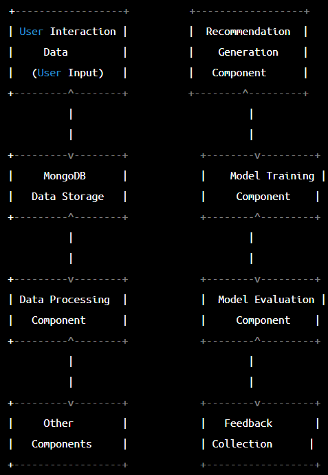

<h1 align='center'>Recommendation Engine: Netflix Shows/Movie Reccomendation 🔍</h1>

 

## Table of Contents
<!---
<li><a href="#section1">Section 1</a></li>
--->
- [Table of Contents](#table-of-contents)
- [1. Executive Summary](#1-executive-summary)
- [2. Background](#2-background)
- [3. Goals and Objective](#3-goals-and-objective)
- [4. Scope](#4-scope)
- [5. Methodology](#5-methodology)
- [6. System Architecture](#6-system-architecture)
- [7. Risks and Limitation](#7-risks-and-limitation)
- [8. Deliverables and Milestones](#8-deliverables-and-milestones)
- [9. Resources](#9-resources)
- [10. Technical Specifications](#10-technical-specifications)
- [11. Timeline and Deliverables](#11-timeline-and-deliverables)
- [12. Conclusion](#12-conclusion)

## 1. Executive Summary
Netflix, YouTube, Spotify and many more streaming platforms have been introduced to the world as the technologies are advancing rapidly nowadays. With this being said, users are prone to use it almost everyday whenever they wanted to watch movies or tv shows and stream any music. In this project, our group will focused on the recommendation engine implemented in Netflix. The objective of this project is to create a system that display the best suggestion of tv shows on streaming platform. The system we proposed will implement the usage of MongoDB as a database that can keep track on the user behavioral data which will then be processed using machine learning to recognize streaming patterns of each user so that the most relevant suggestion can be presented to the users to increase the users satisfactory.

## 2. Background
Netflix is a global streaming service that provides a vast selection of TV shows, movies, and documentaries. It has over 200 million subscribers worldwide and is available in over 190 countries. One of the key features that set Netflix apart from other streaming services is its personalized recommendation system, which uses data science and machine learning algorithms to provide personalized content recommendations to its users. The Netflix recommendation system is based on a complex algorithm that takes into account a wide range of factors, such as the user's viewing history, search history, ratings, time of day, and device used, among others. The system continuously learns from the user's behavior and adjusts the recommendations to provide more relevant content over time.

The recommendation system has been a critical factor in Netflix's success and has helped the company retain and attract new subscribers. As a result, the development and improvement of the recommendation system have been a key focus for Netflix's data science and engineering teams. In recent years, Netflix has also made its recommendation system available to the research community through various data science challenges, such as the Netflix Prize, which aimed to improve the accuracy of the recommendation system by at least 10%. The challenge resulted in significant improvements to the recommendation system and led to the adoption of several new algorithms and techniques.

As a result of its success, the Netflix recommendation system has become a benchmark for personalized recommendation systems across various industries, and its algorithms and techniques have been adopted by other companies, such as Amazon, Spotify, and YouTube.

## 3. Goals and Objective
1) Implement the usage of MongoDB to create recommendation engine
2) Be able to understand steps of using MongoDB to create recommendation engine, which are Data Collection , Data Cleaning, Data Transformation , Data Loading , Model Training and Recommedation Generation based on study case (Netflix)
3) Improve the user experience: One of the primary goals of a data-driven project may be to improve the user experience. For example, in a recommendation system like Netflix, the goal may be to provide personalized and relevant content recommendations to improve user satisfaction and engagement.
4) Enhance data quality: A key objective of a data-driven project may be to enhance data quality. This includes ensuring data accuracy, completeness, and consistency to improve the reliability and usefulness of the data for analysis and modeling.
5) Develop predictive models: Another objective may be to develop predictive models to forecast future trends and outcomes. For example, in a financial institution, the goal may be to build predictive models to identify potential fraud or assess credit risk.
6) Ensure data security: One of the critical objectives of a data-driven project may be to ensure data security. This includes implementing appropriate security measures to protect sensitive data from unauthorized access, data breaches, and cyber threats.
7) Improve operational efficiency: A data-driven project may aim to improve operational efficiency by automating tasks, reducing manual intervention, and streamlining processes. For example, in a manufacturing industry, the goal may be to optimize production processes and reduce waste by using predictive maintenance techniques.

## 4. Scope
- The scope of this project is to create Netflix recommedation engine based on few factors. These factors will create personalized recommendation.
- This project requires dataset scraped from Netflix websites using Phyton.
- The main tool will be used in this project is MongoDB to store Netflix viewing history , Netflix search queries , user ratings and reviews and Netflix content    metadata.
- Matplotlib, Seaborn and Tableau will be used to create visualizations of the recommendation system's performance.

## 5. Methodology
| Components | Description |
|--|--|
| Data Collection | collect data from sources such as Netflix Recommendation Algorithm (NRA). This data will be used to train the reccomendation model  |
| Data Cleaning| clean the collected data to removed irrelevant data or incomplete data such as null in user watching video period. |
| Data Transforming| Transform the cleaned data used by MongoDB |
| Data Loading| Load transformed data into MongoDB collections |
| Model Training | Trains the recommendatiob model using machne learning algorithm based on data collected in steps 1 |
| Reccomendation Generator | Generate recommendations for users based on their previous interaction with the system. |

Below is an overview example of how the system will be programmed:

 

## 6. System Architecture
| Components | Tools and Technologies|
|--|--|
|Data Ingestion | Ingest data from Kaggle, including user and item data, ratings, and interactions. The data can be stored in MongoDB|
|Data Preprocessing | The data will be processed to ensure consistency. The tolls will be used are Pandas, NumPy, and Scikit-learn.|
|Recommendation Algorithms | The algorithm will generate recommendations based on user preferences and item features.|
|Model Training | The recommendation algorithm will be trained using historical data to learn the patterns and realationsjip between users and Amazon.|
|Model Deployment| The deployed model will be able to generate real-time recommendations for users.|
|Data Visualization and Analytics| By using Matplotlib, Seaborn and Tableau, to visualize and analyze the recommendation data.| 

1) Matplotlib: Matplotlib is a Python library for creating static, animated, and interactive visualizations in Python. It provides a wide range of charts and graphs, including line charts, bar charts, scatter plots, and heat maps.

2) Seaborn: Seaborn is a Python library based on Matplotlib that provides a high-level interface for creating beautiful and informative statistical graphics. It includes various visualization types, such as heat maps, categorical plots, and distribution plots.

3) Plotly: Plotly is an open-source data visualization library that allows users to create interactive plots and charts. It supports a wide range of chart types, including scatter plots, line charts, bar charts, and heat maps.

4) D3.js: D3.js is a JavaScript library for creating dynamic, interactive data visualizations in web browsers. It provides a wide range of chart types and customization options and is widely used for creating complex and interactive visualizations.

5) Tableau: Tableau is a data visualization and business intelligence tool that allows users to create interactive dashboards and reports. It provides a drag-and-drop interface for creating visualizations and supports a wide range of data sources.

6) Power BI: Power BI is a business analytics service by Microsoft that allows users to create interactive dashboards and reports. It provides a range of visualization types, including charts, maps, and tables.

7) MongoDB: MongoDB will store the data in MongoDB collections, if there is a large volumes of data, MongoDB also can handle using sharding. It provides tools and features for managing data, including data modeling, backup and recovery, security, and monitoring. We can also do aggregation, map-reduce, and text search to analyst the data and extract insights from the recommendation data.

Below are the flowchart for the system architecture:

## 7. Risks and Limitation
Netflix's show recommendation system has been widely praised for its ability to personalize recommendations to individual users based on their viewing history, ratings, and preferences. However, here are some potential risks and limitations associated with Netflix's recommendation system, along with potential strategies to mitigate them:
1. Technical Risk
- `Cold Start Problem:` When a new user signs up for Netflix, the recommendation algorithm has no data about their preferences or viewing history, making it difficult to provide personalized recommendations. This "cold start" problem can be challenging to overcome and may require alternative approaches to recommendation.
2. Financial Risk
- `Cost of Developing and Maintaining the Algorithm:` Developing and maintaining a sophisticated recommendation algorithm like Netflix's requires significant investment in data science, machine learning, and software development. This can be a substantial financial burden for companies looking to implement similar systems.
3. Legal Risk
- `Privacy and Data Protection:` Netflix collects a lot of personal data from users to improve the recommendation system, such as viewing history, ratings, and user profiles. This data is subject to data protection laws and regulations, and Netflix must ensure that it is collecting and processing this data in compliance with applicable laws.

Potential Strategies to Mitigate the Risks & Limitation:

1. Technical Risk
- `Cold Start Problem:` To address the cold start problem, Netflix can use hybrid recommendation approaches that combine collaborative filtering (based on user behavior) with content-based filtering (based on content metadata). This can help to provide relevant recommendations to new users even when they have no viewing history.
2. Financial Risk
- `Cost of Developing and Maintaining the Algorithm:` The maintenance cost of the recommendation system includes the cost of updating and retraining machine learning models, improving data quality, and enhancing the algorithm. To mitigate this risk, Netflix can use automated processes and tools to streamline the maintenance process and reduce manual intervention.
3. Legal Risk
- `Privacy and Data Protection:` To mitigate the risk of data protection and privacy breaches, Netflix should ensure that it complies with applicable privacy laws and regulations. This includes implementing adequate data protection measures, obtaining user consent for data collection and processing, and providing users with transparency and control over their data.

Overall, while Netflix's recommendation system is generally effective, it is important to recognize its limitations and potential risks, and to be mindful of how the algorithm is shaping our viewing habits and preferences.

## 8. Deliverables and Milestones
- Provide a list of the key deliverables and milestones of the proposed data science project, including timelines and deadlines.

<table border="1" align="center">
  <tr>
    <th>Deliverables and Milestones</th>
    <th>Timeframe</th>
  </tr>
  <tr>
    <td>Data Collection and Preprocessing</td>
    <td>Week 1-4</td>
  </tr>
  <tr>
    <td>Data Modeling</td>
    <td>Week 5-6</td>
  </tr>
  <tr>
    <td>User Interface</td>
    <td>Week 7-10</td>
  </tr>
  <tr>
    <td>Deployment and Testing</td>
    <td>Week 11</td>
  </tr>
  <tr>
    <td>Maintenance</td>
    <td>Week 12-14</td>
  </tr>
</table>

<table border="1" align="center">
  <tr>
    <th>Deliverable</th>
    <th>Description</th>
    <th>Milestone</th>
  </tr>
  <tr>
    <td>Data Collection</td>
    <td>Collection of data from the target source (Netflix)</td>
    <td>Milestone 1: Data collected from legit source</td>
  </tr>
  <tr>
    <td>Data Cleaning and Preprocessing</td>
    <td>Perform all the data cleaning and preprocessing steps to the data collected before since the data are raw</td>
    <td>Milestone 2: Data is cleaned so it can be used for the next milestones</td>
  </tr>
  <tr>
    <td>Exploratory Data Analysis (EDA)</td>
    <td>A step used to summarize the datasets according to their characteristics as well as identify the relationship, patterns and anamolies</td>
    <td>Milestone 3: Data is summarized according to its similarities</td>
  </tr>
  <tr>
    <td>Build Model</td>
    <td>Creation of website structure and functionality using HTML, CSS, and JavaScript</td>
    <td>Milestone 4: Create a website with dashboard</td>
  </tr>
  <tr>
    <td>Evaluate Model</td>
    <td>Testing of website usability, functionality, and user experience</td>
    <td>Milestone 5: User testing completed and feedback incorporated</td>
  </tr>
  <tr>
    <td>Deploy Model</td>
    <td>Website made live and available to the public</td>
    <td>Milestone 6: Website launched and operational</td>
  </tr>
  <tr>
    <td>Maintenance</td>
    <td>Ongoing support and maintenance of website</td>
    <td>Milestone 7: Post-launch support and maintenance for the users</td>
  </tr>
</table>

## 9. Resources
1. Staff
- Project Managers
- Data Engineers
- Software Developers
- UX/UI Designers

2. Equipment
- MongoDB database
- Server
- Programming languages

3. software
- Python Libraries

4. Other expenses
- Software costs

## 10. Technical Specifications
Data Sources:
- Netflix viewing history
- Netflix search queries
- User ratings and reviews
- Netflix content metadata (e.g., movie and TV show titles, actors, directors, genres)

Data Schema:
- User data: User ID, viewing history, search queries, ratings, reviews, demographics (age, gender, location, etc.)
- Item data: Movie and TV show ID, title, cast, crew, genre, release date, rating, reviews, duration, country, language
- Interaction data: User ID, item ID, interaction type (e.g., watched, searched, rated), timestamp

Data Transformations:
- Data cleaning: Remove duplicates, handle missing values, standardize data formats, etc.
- Feature engineering: Create new features from existing data, such as average rating per genre, popularity score, etc.
- Data normalization and scaling: Normalize and scale numerical features to ensure they have similar ranges.
- Text preprocessing: Tokenization, stemming/lemmatization, stop word removal, and other techniques to process text data.
- Dimensionality reduction: Reduce the dimensionality of the data using techniques like PCA or t-SNE to improve model performance.

Machine Learning Algorithms:
- Collaborative filtering: Recommends items to users based on their past behavior and preferences.
- Content-based filtering: Recommends items to users based on the similarity of their attributes to items they have liked before.
- Hybrid approaches: Combines collaborative and content-based filtering techniques to improve recommendations.
- Matrix factorization: Factorizes the user-item interaction matrix into low-rank matrices to capture latent features.

Data Visualization Tools:
- Tableau, PowerBI, Altryx and other business intelligence tools can be used to create visualizations of the recommendation system's performance.
- Python visualization libraries like Matplotlib, Seaborn, and Plotly can be used to create interactive visualizations of the data and model results.

Hardware Requirements:
- Processing power: The system will require a powerful CPU for training machine learning models and processing large datasets. A multi-core processor is recommended for better performance.
- Memory (RAM): The system will require a large amount of RAM for handling big data sets and training complex machine learning models. At least 16GB of RAM is recommended for a small-scale system, but larger systems will require more memory.
- Storage: The system will require a large amount of storage to store the Netflix viewing history, search queries, user ratings and reviews, content metadata, and machine learning models. A high-performance storage system, such as a solid-state drive (SSD), is recommended for better performance.

Software Requirements:
- Operating System: The recommended operating system for the system is Windows, Linux or MacOS, as they are both reliable and support many of the required software tools.
- Programming Language: The system will use Python as the primary programming language for building machine learning models and data processing pipelines.
- Frameworks and Libraries: The system will use a variety of machine learning frameworks and libraries such as Apache Spark, TensorFlow, PyTorch, Scikit-learn, Keras, Pandas, and NumPy. These libraries can be installed using the pip package manager in Python.
- Database: The system will use a distributed NoSQL database such as Apache Cassandra to store and manage large-scale data sets.
- Web Framework: The system may use a lightweight web framework such as Flask to provide a user interface for the recommendation system. 

**Data Security**
- Encryption: Encryption is the process of encoding information in such a way that only authorized parties can access it. All sensitive data, including user data, machine learning models, and system logs, should be encrypted during storage and transmission. Encryption can be implemented using industry-standard protocols such as AES, SSL, and TLS.

- Access control: Access control is the process of **granting or denying access to resources based on the user's identity, role, and permissions**. Access to sensitive data should be restricted to only authorized personnel who require access to perform their duties. Access control policies can be implemented using techniques such as role-based access control (RBAC) and attribute-based access control (ABAC).

- Authentication and Authorization: Authentication is the process of verifying the identity of a user, while authorization is the process of granting or denying access to resources based on the user's identity and permissions. All users, including system administrators, should be required to authenticate before accessing the system. Authentication can be implemented using techniques such as **password authentication, two-factor authentication (2FA), or biometric authentication.** Authorization can be implemented using access control policies.

- Data Backup and Recovery: Regular backups of sensitive data should be taken to ensure that data can be recovered in case of any data loss, corruption or disaster. Backup and recovery policies should be put in place, and backup data should be stored in a secure and encrypted location.

- Regular security audits: Regular security audits should be performed to identify vulnerabilities, address security concerns, and ensure that security policies and procedures are being followed. Security audits can be performed internally or by third-party security firms.

## 11. Timeline and Deliverables

Timeline

- WEEK 1 - 4 : `Data Collection and Processing`

  > Collect user and item data and store it in a MongoDB database.
  > Preprocess the data to remove any inconsistencies or anomalies.
- WEEK 5 - 6 : `Data Modeling`

  > Choose a recommendation algorithm that suits your use case, such as collaborative filtering or content-based filtering.
- WEEK 7 - 10 : `User Interface`

  > Build a user interface that enables users to interact with the recommendation engine and view the recommendations.
- WEEK 11 : `Deployment and Testing`

  > Deploy the recommendation engine and database on a cloud platform such as AWS or Heroku.
  > Test the recommendation engine to ensure that it is functioning correctly and providing accurate recommendations.
- WEEK 12 - 14 : `Maintenance`

  > Maintain and update the recommendation engine as needed to ensure that it continues to meet the requirements of the project.

Deliverables and Resources

- Data Collection and Processing
  > - `Deliverables` : Cleaned and structured data
  > - `Resources` : Data cleaning tools such as Python's Pandas library
- Data Modeling
  > - `Deliverables` : A recommendation algorithm
  > - `Resources` : Collaborative / Content-based / Hybrid filtering algorithms
- User Interface Design
  > - `Deliverables` : User-friendly interface and personalized recommendation
  > - `Resources` : HTML, CSS, Javascript
- Deployment and Testing
  > - `Deliverables` : A deployed recommendation system and testing results
- Maintenance
  > - `Deliverables` : Performance monitoring and user feedback analysis

Quality Assurance and Testing Procedures

1. Quality Assurance
  - Validate the data used by the recommendation system. The data should be accurate, up-to-date, and relevant to the user.
  - Collect feedback from users. The system can ask the users to rate the recommendations they receive and use the feedback to enhance the system.
2. Testing Procedures
  - Functional testing verifying that the system is working as intended that includes the system's ability to produce recommendations based on user history, preference and ratings.
  - Performance testing verifying that the system able to handle a high volume of requests and provide recommendations in a timely manner.
  - User Acceptance testing is to test the system with the actual users to verify that the system is providing relevant recommendations that meet their needs.

## 12. Conclusion
In conclusion, the proposed system will provide shows/movies reccomendation based on user's favourite genre, director, actors, and many more. Users will be able to create content-based filtering to provide personalised reccomendation. However, the recommendation system is not perfect, and there have been cases where users have reported getting irrelevant or inappropriate recommendations. This can be due to various factors, such as limited data or biases in the algorithm. While there is still room for improvement, the system will be a game-changer in the entertainment industry and will help to shape the way we consume media today.
