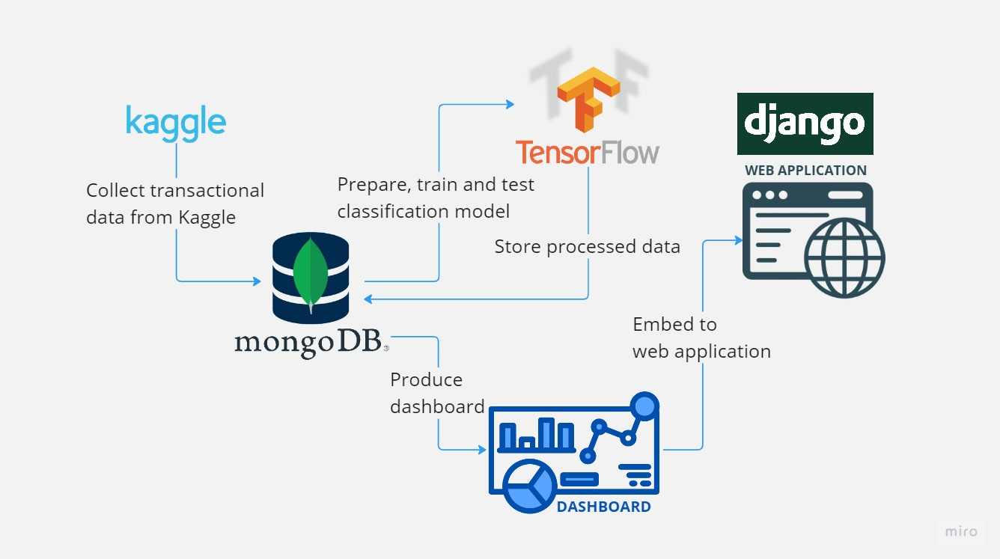

<h1 align='center'> Credit Card Fraud Detection Proposal </h1>

  

## 	:game_die: Table of Contents
- [Executive Summary](#executive-summary)
- [Background](#background)
- [Goals and Objectives](#goals-and-objectives)
- [Scope](#scope)
- [Methodology](#methodology)
- [System Architecture](#system-architecture)
- [Risks and Limitations](#risks-and-limitations)
- [Deliverables and Milestones](#deliverables-and-milestones)
- [Resources](#resources)
- [Technical Specifications](#technical-specifications)
- [Timeline and Deliverables](#timeline-and-deliverables)
- [Conclusion](#conclusion)

## :compass: Executive Summary
The objective of this project is to develop a dashboard via web application for credit card fraud detection. The system will use MongoDB as the database to store and machine learning algorithms will be employed to classify fraudulent and non-fraudulent. Dashboard will be tailored to provide relevant insights based on the management level of the company.

The importance of credit card fraud detection cannot be overstated as it has a significant impact on the financial security and reputation of companies. The consequences of not detecting and preventing fraud can result in significant financial losses and damage to the company's reputation, which can lead to a loss of customer trust. The expected outcome of this project is an effective fraud detection system that can help companies reduce the risk of financial losses due to fraudulent activity and improve their overall financial security.

## :seedling:  Background:
Credit card fraud occurs when a criminal uses someone else's credit card or credit card information to make unauthorized purchases or obtain cash advances. There are several types of credit card fraud such as **stolen cards, skimming, phishing and identity theft**. 

Data science can be used to detect credit card fraud by analyzing large datasets of credit card transactions. One technology that can be used to store and analyze this data is MongoDB. MongoDB is a NoSQL database that can handle large datasets with high speed and scalability. To detect credit card fraud using MongoDB, we can use machine learning algorithms to analyze patterns in credit card transactions. For example, they can look for transactions that are significantly different from a customer's usual spending habits or transactions that occur outside of a customer's normal location or time of day. These anomalies could indicate fraudulent activity.

A fraud detection dashboard typically contains visualizations and metrics that provide an overview of the fraud detection system's performance and enable users to monitor and investigate potential fraudulent activities.  This dashboard will help mitigate the risks associated with financial fraud, protecting businesses and individuals from financial losses and reputational damage.

## :medal_sports: Goals and Objectives:
The system is designed to identify fraudalent transactions by analyzing a vast amount of historical as well as real-time data, looking for patterns and anomalies that indicate fraud and present the data in interactive dashboard for effective decision-making and analysis. The dashboard will provide valuable insights and analytics on fraudulent transactions, allowing for the identification of patterns and trends, as well as the development of strategies to avoid future frauds. The primary objective of this project are to prevent potential financial damages, minimize losses due to the fraudalent transactions and improving customer satisfaction thus providing them more secure and reliable payment platform.

The credit card fraud detection system project aims to solve these problem statements: 
- i. Identify the fraudulent transactions - Prepare a model from historical supervised data and apply to incoming data as quickly as possible to prevent losses from fraud. This can minimize further losses.

- ii. Pattern recognition - Identifying which attributes contribute to the indication of fraudulent which will made the system learn from past incidents and develop strategies to prevent future frauds.

- iii. Real-time monitoring - Dashboard will be updated based on available data from database, hence displaying real-time dashboard and quickly notify if fraudulent happens.

- iv. Dashboard visualization - Provide a meaningful insights and the visualization is in user-friendly format. This will help relevant stakeholders such as fraud management team and customer service team to understand better and faster.

- v. Quality and completeness of data - To ensure the effectiveness of this system, the data must be accurate and complete. Data quality issues needs to be focused to made sure the system is reliable.

- vi. Performance optimization - The system should be capable of handling large volumes of transactions and quickly processing them in order to provide real-time alerts and insights.

## 	:mag: Scope: 
The objective of this system is to discern fraudulent transactions by analyzing a large amount of historal and real-time data which will enable users to gain insight for effective decision-making and analysis. Below contains the project scope statement which will help us achieve said objective.

- i. Data Sources : The data which will be used in this project will be collected from Kaggle dataset, <a href="https://www.kaggle.com/datasets/mlg-ulb/creditcardfraud">Credit Card Fraud Detection</a>.

- ii. Tools and Technologies : The dataset will be connected to MongoDB by using Tensorflow to do data pre-processing, training and testing data. Apart from that, Django will be used for the framework of the website.

- iii. Data Cleaning and Preparation : The dataset will be cleaned and prepared by using Python library such as Pandas and Numpy.

- iv. Reporting : The dataset will be visualised in a form of a dashboard by using MongoDB Charts.

## :open_book: Methodology:
This project will be using various research methods to achieve our main objective which is to build a system to detect fraudulent transactions. The table below presents the specified procedures, strategies, technologies and softwares used in this project. 

| Components | Description |
|--|--|
| Data Collection | Data related to financial transactions or user behavior which includes information such as transaction amount, timestamp and other relevant variables data will be collected from Kaggle dataset.   |
| Data Pre-processing | Data collected from Kaggle will be cleaned, filtered and transformed into a usable format by using Python library such as Numpy and Pandas. |
| Data Analysis | Data will be analysed by identifying patterns of fraudulent behavior by using Tensorflow. |
| Feature Engineering | The relevant features which will be used to detect fraudulent activities will be analysed by using Tensorflow. |
| Fraud Detection| A classification model will be built which will able to predict fraudulent activities based on the features identified.|
| Visualization | Data will be displayed by using MongoDB Charts in a form of a dashboard. |

## :hammer_and_wrench: System Architecture:

The system architecture consists of several components that work together to process and visualize data stored in a MongoDB database:

1. MongoDB Database: This component serves as the primary data storage for the system. The database will contain the original dataset uploaded from Kaggle.

2. TensorFlow: TensorFlow will be used to build and train a machine learning model on the dataset.

3. Python Script: This component will be used to connect to the MongoDB database, prepping data using Pandas and Numpy, build model using TensorFlow, and enter the labeled data back into the database.

4. MongoDB Charts: This component will be used to produce a dashboard that visualizes the data stored in the MongoDB database. The dashboard will display metrics and insights derived from the data.

5. Web Application: This component will be used to embed the MongoDB Charts dashboard and make it available to end-users. The website will provide a user-friendly interface for interacting with the dashboard and exploring the data stored in the MongoDB database.

Overall, this system architecture leverages the power of machine learning and MongoDB to process and visualize data. By using TensorFlow to build machine learning model, the system can generate new insights and metrics that can be used to improve business processes and decision-making. The MongoDB Charts dashboard provides a convenient and user-friendly way to explore this data, making it accessible to a wide range of management levels.

## :pushpin: Risks and Limitations:

There are several risks and limitations that need to be considered when building fraud detection dashboard:

 1. Technical Risks:
	   - Data Quality: May not have access to all the data needed to build an effective fraud detection dashboard. 	For example, some data may be restricted due to        privacy concerns. Incomplete, inconsistent or inaccurate data can lead to false positives or missed fraud cases.
 2. Financial Risks:
	   -  Maintenance Costs: After the initial development dashboard, Ongoing maintenance and updates are required to ensure that the system remains effective. This can result in additional costs, such as software upgrades, data storage, and data processing.
	   - Investment Costs: May require significant upfront investment in infrastructure, software, and personnel. There is a risk that the organization may not see a return on investment if the dashboard does not effectively detect and prevent fraud.
 3. Legal Risks: 
	   - Liability: Organizations may be held liable for fraudulent activities that occur within their systems, even if they are not directly responsible. This could  result in significant legal and financial costs.

 It is important to identify and mitigate these risks when building a fraud detection dashboard to ensure that the dashboard is effective, financially viable, and legally compliant. We can implement appropriate data security and privacy measures, engaging legal experts to review the dashboard's compliance with relevant regulations, and carefully evaluating the financial costs and benefits of the project.

## ⏳ Deliverables and Milestones:
<table border="1" align="center">
  <tr>
    <th>Deliverables and Milestones</th>
    <th>Timeframe</th>
  </tr>
  <tr>
    <td>Project Planning and Data Acquisition</td>
    <td>Week 1-2</td>
  </tr>
  <tr>
    <td>Data Exploration and Cleaning</td>
    <td>Week 3-4</td>
  </tr>
  <tr>
    <td>Feature Engineering</td>
    <td>Week 5-6</td>
  </tr>
  <tr>
    <td>Model Selection and Training</td>
    <td>Week 7-9</td>
  </tr>
  <tr>
    <td>Model Deployment</td>
    <td>Week 10-11</td>
  </tr>
  <tr>
    <td>Model Monitoring and Maintenance</td>
    <td>Week 11-13</td>
  </tr>
  <tr>
    <td>Project Wrap-up and Presentation</td>
    <td>Week 14</td>
  </tr>
</table>

## :triangular_flag_on_post: Resources:
- Staff
1. Data Scientist
2. Data analyst
3. UI/UX designer
4. Software engineer
5. Project manager
6. Database administrator

- Equipment
1. Laptop
2. Computer
3. High performing computing equipment

- Software
1. Microsoft Visual Studio
2. MongoDB
3. TensorFlow
4. Faker
5. Django

- Other expenses
1. Cloud storage
2. Data acquisition and storage
3. Infrastucture : if planning to host on own server

## :card_file_box: Technical Specifications:
 - Data Sources
 - Data Schema
 - Data Transformations
 - Machine Learning Algorithms
    - Logistic regression, decision trees, and random forests. 
    - Train the models using the preprocessed data stored in the MongoDB database.
 - Data Visualization Tools
 -  Programming Languages, Frameworks, and Libraries
 -  Hardware and Software Requirements
 -  Data Security Measures 

## :date: Timeline and Deliverables: 
**Detailed Timeline:**
  
Week 1-2: Project Planning and Data Collection

 - Define the project scope, objectives, and deliverables 
 - Gather necessary resources such as datasets and tools Identify potential fraud types and data sources 
 - Collect, preprocess, and store data in MongoDB

Week 3-4: Data Exploration and Cleaning

 - Perform exploratory data analysis to understand the data and identify potential issues 
 - Clean and transform the data to ensure it is ready for modeling 
 - Create visualizations to better understand the data

Week 5-6: Feature Engineering

 - Define the features to be used for modeling 
 - Develop new features or transform existing ones to better represent patterns in the data 
 - Use MongoDB Aggregation Framework to perform complex transformations

Week 7-9: Model Selection and Training

 - Choose appropriate models to identify patterns and anomalies in the data that indicate fraud 
 - Train and evaluate the models using cross-validation techniques Implement the models in Python and MongoDB

Week 9-10: Model Evaluation and Refinement

 - Test the models' effectiveness and accuracy 
 - Tune hyperparameters to improve the model's performance 
 - Evaluate the models' performance against business metrics such as precision, recall, and F1-score

Week 11-12: Dashboard Development

 - Design and develop a dashboard to display the fraud detection results
 - Use MongoDB Charts to create visualizations and dashboards
 - Incorporate interactivity, such as filtering and drill-down capabilities

Week 13-14: Deployment and Documentation

  * Deploy the dashboard and models into a production environment
  * Document the project and provide instructions for future updates
  * Conduct user testing and gather feedback for improvements

  **Quality Assurance and Testing Procedures:**
  
  * Test the data for accuracy, completeness, and consistency to ensure it is representative of fraud scenarios that are most relevant to the organization.
  * Validate the model's performance on test data to ensure it is reliable and capable of detecting fraud in real-time.
  * Test the security and privacy of the system to ensure sensitive data is protected and the system is not vulnerable to attacks.

## :round_pushpin: Conclusion:

This project proposal outlines a comprehensive plan for developing the fraud detection dashboard, including data collection, preprocessing, analysis, visualization, and reporting. The proposed system architecture leverages MongoDB, Python, and a web-based dashboard to deliver an effective and efficient solution.

In conclusion, our proposed fraud detection dashboard using MongoDB presents a viable solution for businesses to combat fraudulent activities that could lead to significant financial losses. The dashboard will provide **real-time insights into fraudulent patterns, trends, and anomalies,** enabling businesses to take proactive measures and mitigate risks. While there may be challenges and limitations in implementing the project, including data privacy concerns and technical challenges stated above, these can be addressed through appropriate measures and strategies.

Lastly, we propose to develop a fraud detection dashboard using MongoDB that leverages data science techniques to provide actionable insights into fraudulent activities. We believe that this project is brings critical importance to businesses and organizations.
