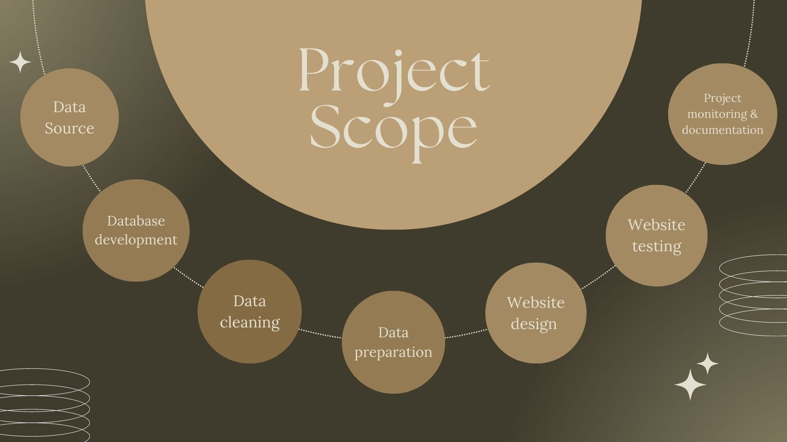
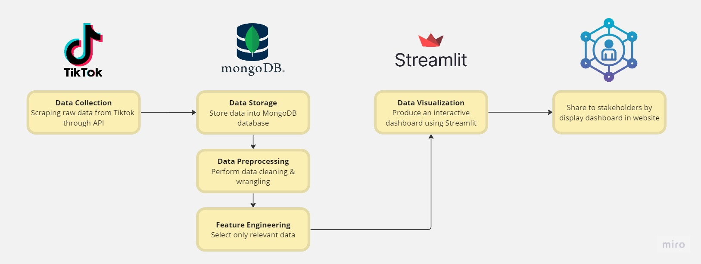

<h1 align='center'> TikTok Insights Dashboard: Analysis Tool </h1>
<p align="center">
  
</p>

## Table of content
* [Executive Summary](#-executive-summary)
* [Background](#-background)
* [Goals and Objectives](#-goals-and-objectives)
* [Scope](#-scope)
* [Methodology](#-methodology)
* [System Architecture](#-system-architecture)
* [Risks and Limitations](#-risks-and-limitations)
* [Deliverables and Milestones](#-deliverables-and-milestones)
* [Resources](#-resources)
* [Technical Specifications](#-technical-specifications)
* [Timeline and Deliverables](#-timeline-and-deliverables)
* [Conclusion](#-conclusion)

## 🧭 Executive Summary
The objective of this project is to develop a dashboard via web application for credit card fraud detection. The system will use MongoDB as the database to store and machine learning algorithms will be employed to classify fraudulent and non-fraudulent. Dashboard will be tailored to provide relevant insights based on the management level of the company.

The importance of credit card fraud detection cannot be overstated as it has a significant impact on the financial security and reputation of companies. The consequences of not detecting and preventing fraud can result in significant financial losses and damage to the company's reputation, which can lead to a loss of customer trust. The expected outcome of this project is an effective fraud detection system that can help companies reduce the risk of financial losses due to fraudulent activity and improve their overall financial security.

## 🌱 Background:

TikTok has become one of the most popular social media platforms for sharing short-form videos. While TikTok's categorization and recommendation algorithm is generally effective at providing relevant and engaging content to users, it can face some challenges due to the vast amount of content on the platform. 

The proposed solution to this problem is to develop a machine learning model that can accurately categorize TikTok videos into relevant categories, such as dance, comedy, music, cooking, sports, and many more. To do this, we will use web scraping to gather data from TikTok and extract features such as video captions, hashtags, and user comments. By using a combination of video and text features, the model can capture the unique characteristics of each video and make more accurate predictions about its category. This can improve the overall user experience on TikTok by providing more personalized and relevant recommendations to users and helping content creators reach their target audience more effectively.

MongoDB can be used as a database to store the data collected through web scraping. MongoDB's flexibility and scalability make it ideal for storing and handling unstructured data, such as the features extracted from TikTok videos. By using MongoDB, we can easily store, query, and manipulate the data as needed to prepare it for machine learning. Lastly, the dashboard may content a video distribution by category, trending categories, top categories by engagement and many more.

This can lead to a more enjoyable and engaging experience on the platform, as users are more likely to discover videos that match their interests and preferences. Furthermore, for TikTok as a platform, it can lead to increased user engagement, retention, and revenue, as users spend more time on the app and engage with more content.


## 🏅 Goals and Objectives:
TikTok Insights Dashboard's primary goal is to provide TikTok creators with a complete picture of their account's performance and audience engagement. This is accomplished through the use of numerous metrics and data points that can assist creators in making informed decisions about their content strategy and understanding how their audience reacts to their material. With the help of informations from TikTok Insights Dashboard content creators, affiliates and marketing team can improvise their content to achieve their target audience and sales. In addition they also can optimize their content strategy, better engage with their audience, and grow their following on the platform. On top of that,

The TikTok insights dashboard project aims to solve these problem statements: 

- i. Limited visibility into performance -
It is tough for creators to tell how their work is performing on TikTok without analytics tools. They may know how many views their videos have, but they may not know how long users are watching them, what their engagement rate is, or how their content affects their following growth.

- ii. Difficulty detecting trends -
TikTok is a fast-paced platform, and keeping up with hot subjects and hashtags can be tough. Creators may miss out on opportunities to develop content that resonates with their audience and capitalises on popular trends if they do not use analytics tools.

- iii. Inability to measure success - 
Without analytics tools, content creators may be unaware of how successful their content is or what modifications they can make to increase interaction. This can lead to a loss of motivation and dissatisfaction for content creators who are attempting to grow their following and develop effective material.

- iv. Quality and completeness of data - 
To ensure the effectiveness of this system, the data must be accurate and complete. Data quality issues needs to be focused to made sure the system is reliable.

- v. Inadequate grasp of audience demographics -
Without data on their audience, creators may not know who is responding to their content or what changes they can make to better target their ideal audience. This can make it tough for them to develop material that will engage and grow their audience.

## 🔍 Scope: 
The objective of this system is to discern fraudulent transactions by analyzing a large amount of historal data which will enable users to gain insight for effective decision-making and analysis. Below contains the project scope statement which will help us achieve said objective.



- i. `Data Source` : The data which will be used in this project will be collected from Kaggle dataset, <a href="https://www.kaggle.com/datasets/mlg-ulb/creditcardfraud">Credit Card Fraud Detection</a>.

- ii. `Database Development` : The dataset will be connected to MongoDB by using Tensorflow.

- iii. `Data Cleaning` : The dataset will be cleaned and prepared by using Python library such as Pandas and Numpy.

- iv. `Data Preparation`: Data pre-processing, training and testing will be done by using Tensorflow and the data will be visualised in a form of a dashboard by using MongoDB Charts.

- v. `Website design` : Django will be used to build and design the framework of the website.

- vi. `Website testing` : The website will be tested multiple times to detect any issues before making them live.

- vii. `Project monitoring and documentation` : The project will continuously be monitored and documented to keep track of the progress of project and to optimize the website performance.


## 📖 Methodology:
This project will be using various research methods to achieve our main objective which is to build a system to detect fraudulent transactions. The table below presents the specified procedures, strategies, technologies and softwares used in this project. 

| Components | Description |
|--|--|
| Data Collection | Data related to financial transactions or user behavior which includes information such as transaction amount, timestamp and other relevant variables data will be collected from Kaggle dataset.   |
| Data Pre-processing | Data collected from Kaggle will be cleaned, filtered and transformed into a usable format by using Python library such as Numpy and Pandas. |
| Data Analysis | Data will be analysed by identifying patterns of fraudulent behavior by using Tensorflow. |
| Feature Engineering | The relevant features which will be used to detect fraudulent activities will be analysed by using Tensorflow. |
| Fraud Detection| A classification model will be built which will able to predict fraudulent activities based on the features identified.|
| Visualization | Data will be displayed by using MongoDB Charts in a form of a dashboard. |
| Web Development | The framework for the website will be designed and built by using Django. |


## 🛠️ System Architecture:

The system architecture consists of several components that work together to process and visualize data stored in a MongoDB database:




1. Data scraping:
Use Tiktok Analytics API to scrape raw data such as username, number of likes and comments from Tiktok.

2. Data storage:
Use MongoDB to store the scraped data in a collection.

3. Data preprocessing and feature engineering:
Use the MongoDB Aggregation Framework to preprocess and transform the data as needed.
Perform feature engineering operations such as scaling, normalization, or polynomial expansion.

4. Visualization:
Use Streamlit to build a Tiktok Trend Dashboard that visualizes the preprocessed and feature-engineered data.
Use MongoDB as the data source for the dashboard.


Overall system architecture:

- Tiktok Analytics API for data scraping
- MongoDB for data storage and preprocessing
- Streamlit for data visualization
- A web server such as Flask or Django to serve the Streamlit dashboard
<!-- - A scheduler such as Cron or Airflow to automate the scraping and preprocessing tasks on a regular basis. -->


## 📌 Risks and Limitations:

There are several risks and limitations that need to be considered when building fraud detection dashboard:

 1. Technical Risks:
	   - Data Quality: May not have access to all the data needed to build an effective fraud detection dashboard. 	For example, some data may be restricted due to        privacy concerns. Incomplete, inconsistent or inaccurate data can lead to false positives or missed fraud cases.
 2. Financial Risks:
	   -  Maintenance Costs: After the initial development dashboard, Ongoing maintenance and updates are required to ensure that the system remains effective. This can result in additional costs, such as software upgrades, data storage, and data processing.
	   - Investment Costs: May require significant upfront investment in infrastructure, software, and personnel. There is a risk that the organization may not see a return on investment if the dashboard does not effectively detect and prevent fraud.
 3. Legal Risks: 
	   - Liability: Organizations may be held liable for fraudulent activities that occur within their systems, even if they are not directly responsible. This could  result in significant legal and financial costs.

 It is important to identify and mitigate these risks when building a fraud detection dashboard to ensure that the dashboard is effective, financially viable, and legally compliant. We can implement appropriate data security and privacy measures, engaging legal experts to review the dashboard's compliance with relevant regulations, and carefully evaluating the financial costs and benefits of the project.

## ⏳ Deliverables and Milestones:
<table border="1" align="center">
  <tr>
    <th>Deliverables and Milestones</th>
    <th>Timeframe</th>
  </tr>
  <tr>
    <td>Project Planning and Data Acquisition</td>
    <td>Week 1-2</td>
  </tr>
  <tr>
    <td>Data Exploration and Cleaning</td>
    <td>Week 3-4</td>
  </tr>
  <tr>
    <td>Feature Engineering</td>
    <td>Week 5-6</td>
  </tr>
  <tr>
    <td>Model Selection and Training</td>
    <td>Week 7-9</td>
  </tr>
  <tr>
    <td>Model Deployment</td>
    <td>Week 10-11</td>
  </tr>
  <tr>
    <td>Model Monitoring and Maintenance</td>
    <td>Week 11-13</td>
  </tr>
  <tr>
    <td>Project Wrap-up and Presentation</td>
    <td>Week 14</td>
  </tr>
</table>


## 🚩 Resources:

**1. Staff**
  * Data Scientist
  * Data analyst
  * UI/UX designer
  * Software engineer
  * Project manager
  * Database administrator

**2. Equipment**

  * Laptop
  * Computer
  * High performing computing equipment

**3. Software**

  * Microsoft Visual Studio
  * MongoDB
  * TensorFlow
  * Faker
  * Django

**4. Other expenses**

  * Cloud storage
  * Data acquisition and storage
  * Infrastucture : if planning to host on own server

 ## 🗃️ Technical Specifications:
<table>
  <tr>
    <th align= "left">Data sources</th>
    <td>Data retrieve Tiktok using web scraping and API </td>
  </tr>
  <tr>
    <th align= "left">Data schema</th>
    <td>Dataset contains data on trendy hashtags, user's followers, profile views</td>
  </tr>
  <tr>
    <th align= "left">Data transformations</th>
    <td>Data from web scraping transformed into tables for relatonal database.</td>
  </tr>
  <tr>
    <th align= "left">Machine learning algorithms</th>
    <td>Classification, Logistic Regression, SMOTE</td>
  </tr>
  <tr>
    <th align= "left">Data visualization tools</th>
    <td>MongoDB charts, Tableau, PowerBI</td>
  </tr>
  <tr>
    <th align= "left">Programming language</th>
    <td>Python, MongoDB Query Language (MQL), CSS, PHP, Javascript</td>
  </tr>
  <tr>
    <th align= "left">Frameworks</th>
    <td>Django, TensorFlow</td>
  </tr>
  <tr>
    <th align= "left">Libraries</th>
    <td>Matplotlib, Seaborn, Scikit learn, Numpy, Djongo</td>
  </tr>
  <tr>
    <th align= "left">Hardware & software requirements</th>
    <td>
      <ul>
        <li>A computer or server with at least 8GB of RAM (recommended 16GB or more)</li>
        <li>Sufficient storage to store the data and environment</li>
        <li> Windows operating system (recomended) installed with all softwares mentioned such as MongoDB and Django</li>
      </ul>
    </td>
  </tr>
  <tr>
    <th align= "left">Data security measures</th>
    <td>
	  <ul>
	    <li>Authentication and authorization : only authorized users can have access to sensitive data and functionalities.</li>
	    <li>Data encryption : to protect sensitive data</li>
	    <li>Regular updates : always update the web application if there is any improvements need to be done.</li>
	  </ul>
	</td>
  </tr>
</table>

## 📅 Timeline and Deliverables: 
**Detailed Timeline:**
  <div class="mermaid">

  ```mermaid
gantt
    title TikTok Insights Dashboard Gantt Chart
    dateFormat  YYYY-MM-DD
    section Planning and Requirements Gatherings
    Requirements Gatherings  :2023-03-19 , 14d
  
    section Data Exploration and Cleaning
    Data Collection            :2023-04-02  , 10d
    Data Cleaning              :2023-04-12 , 6d
    Data Analysis              :2023-04-18 , 5d
  
    section Feature Engineering
    Features identification        :2023-04-23 , 7d
 
    section Model Selection and Training
    Model Selection        :2023-04-30 , 7d
    Model Training     :2023-05-07 , 7d
	
    section Model Evaluation and Refinement
    Model Evaluation        :2023-05-08 , 2d
    Model Refinement        :2023-05-10 , 3d
   
    section Dashboard development
    Dashboard development              :2023-05-14 , 14d
    Testing     :2023-05-28 , 2d
  
    section Deployment and documentation
    Deployment     :2023-05-29  , 15d
    Documentation     :2023-06-13 , 7d
  
  ```
  </div>
Week 1-2: Project Planning and Data Collection

 - Define the project scope, objectives, and deliverables 
 - Gather necessary resources such as datasets and tools Identify potential fraud types and data sources 
 - Collect, preprocess, and store data in MongoDB

Week 3-4: Data Exploration and Cleaning

 - Perform exploratory data analysis to understand the data and identify potential issues 
 - Clean and transform the data to ensure it is ready for modeling 
 - Create visualizations to better understand the data

Week 5-6: Feature Engineering

 - Define the features to be used for modeling 
 - Develop new features or transform existing ones to better represent patterns in the data 
 - Use MongoDB Aggregation Framework to perform complex transformations

Week 7-9: Model Selection and Training

 - Choose appropriate models to identify patterns and anomalies in the data that indicate fraud 
 - Train and evaluate the models using cross-validation techniques Implement the models in Python and MongoDB

Week 9-10: Model Evaluation and Refinement

 - Test the models' effectiveness and accuracy 
 - Tune hyperparameters to improve the model's performance 
 - Evaluate the models' performance against business metrics such as precision, recall, and F1-score

Week 11-12: Dashboard Development

 - Design and develop a dashboard to display the fraud detection results
 - Use MongoDB Charts to create visualizations and dashboards
 - Incorporate interactivity, such as filtering and drill-down capabilities

Week 13-14: Deployment and Documentation

  * Deploy the dashboard and models into a production environment
  * Document the project and provide instructions for future updates
  * Conduct user testing and gather feedback for improvements

  **Quality Assurance and Testing Procedures:**
  
  * Test the data for accuracy, completeness, and consistency to ensure it is representative of fraud scenarios that are most relevant to the organization.
  * Validate the model's performance on test data to ensure it is reliable and capable of detecting fraud in real-time.
  * Test the security and privacy of the system to ensure sensitive data is protected and the system is not vulnerable to attacks.

## 📍 Conclusion:

This project proposal outlines a comprehensive plan for developing the fraud detection dashboard, including data collection, preprocessing, analysis, visualization, and reporting. The proposed system architecture leverages MongoDB, Python, and a web-based dashboard to deliver an effective and efficient solution.

In conclusion, our proposed fraud detection dashboard using MongoDB presents a viable solution for businesses to combat fraudulent activities that could lead to significant financial losses. The dashboard will provide **real-time insights into fraudulent patterns, trends, and anomalies,** enabling businesses to take proactive measures and mitigate risks. While there may be challenges and limitations in implementing the project, including data privacy concerns and technical challenges stated above, these can be addressed through appropriate measures and strategies.

Lastly, we propose to develop a fraud detection dashboard using MongoDB that leverages data science techniques to provide actionable insights into fraudulent activities. We believe that this project is brings critical importance to businesses and organizations.
