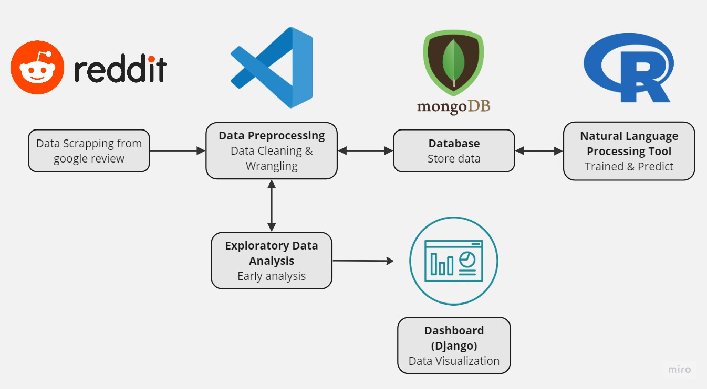

<div>
<h1 align = 'center'><b>New Government:man_in_tuxedo::\n Redditor's View Towards Anwar Ibrahim as Malaysia's 10th Prime Minister.</b></h1>
  </div>

---

## Table of Contents
* [📑 Executive Summary](#-executive-summary)
* [🏚️ Background](#-background)
* [🥅 Goals and Objectives](#-goals-and-objectives)
* [🔭 Scope](#-scope)
* [🍄 Methodology](#-methodology)
* [🧮 System Architecture](#-system-architecture)
* [🍡 Risks and Limitations](#-risks-and-limitations)
* [🪃 Deliverables and Milestones](#-deliverables-and-milestones)
* [🛢️ Resources](#-resources)
* [💻 Technical Specifications](#-technical-specifications)
* [⏳ Timeline and Deliverables](#-timeline-and-deliverables)
* [🎓 Conclusion](#-conclusion)
---

## Key components
The following are the key components of a data science project proposal:

## 📑 Executive Summary:

Anwar Ibrahim has been involved in Malaysia's political scene since more than three decades ago. He also has gone through a lot of challenges during that time. Now that he finally becomes Malaysia's 10th Prime Minister, Malaysians have their says and views towards the newly appointed Prime Minister. In this project, we will perform a sentiment analysis to observe what people on social media, mainly on Reddit thinks about Anwar Ibrahim. Posts and comments from Reddit will be extracted and scrapped as a dataset, so that words thrown can be classified into three sentiments: positive, natural and negative.

---

## 🏚️ Background:
<p align="center">
</img>
</p>
Anwar Ibrahim is a prominent political figure in Malaysia who has served as Deputy Prime Minister and Finance Minister in the past. He is currently the leader of the Pakatan Harapan coalition and is seen as a potential candidate for Prime Minister of Malaysia.

There are varying opinions about Anwar Ibrahim's suitability as a Prime Minister, with some people supporting him and others expressing concerns about his past controversies. Given the polarizing nature of politics in Malaysia, it is essential to conduct a sentiment analysis to gauge public opinion about Anwar Ibrahim as a potential Prime Minister.

Sentiment analysis is a computational technique that involves using natural language processing and machine learning algorithms to analyze large volumes of textual data and determine the sentiment (positive, negative, or neutral) expressed within the text. In the case of Anwar Ibrahim, sentiment analysis can help to identify the prevailing public opinion about his suitability as a Prime Minister, as well as the key factors influencing people's perceptions of him.

To conduct a sentiment analysis about Anwar Ibrahim as a potential Prime Minister, one would need to gather a large dataset of relevant textual data, such as news articles, social media posts, and online comments. This dataset would then need to be processed using natural language processing techniques to extract meaningful features such as sentiment, emotion, and opinion. Finally, machine learning algorithms such as Naive Bayes, Support Vector Machines, or neural networks could be used to train a sentiment classifier model that could accurately classify sentiment in new textual data.

---

## 🥅 Goals and Objectives

Problem Statement:
We talked about Anwar Ibrahim, as a politician and Prime Minister. It is not a secret that he has been through a lot of controversies in the past although he finally made his way back into the political scene. People from anywhere in the world, not just Malaysia, talked so much about Anwar Ibrahim whether it is a compliment or otherwise. He is a well known person around the world. His comeback into politics and becoming the Prime Minister has become a talking point and hot debate amongst people on social media, including Reddit. 

The significance of this project lies in its potential to provide valuable insights of Redditor's view towards Anwar Ibrahim. sentiment analysis can provide valuable insights into the prevailing public opinion about Anwar Ibrahim as a potential Prime Minister, which can inform political decision-making and public discourse. Below are our goals in conducting this project.

- To determine whether the public has positive or negative sentiment on our Prime Minister. 
- To determine the talking point regarding Anwar Ibrahim.
- To analyze the percentage used word based on the words written on social media. 
- To train a model that can successfully identify a positive or negative comment on Reddit.
- To make a prediction on whether or not Anwar Ibrahim can sustain his job as a Prime Minister.

In this project, we aim to observe public's opinion on our Prime Minister using Natural Language Processing (NLP).

---

## 🔭 Scope: 
The aim of this project is to monitor the public’s perception of Anwar Ibrahim as the tenth Prime Minister in Malaysia. To achieve this, we will collect data from Reddit, which will provide access to a large volume of opinions for his rule. To achieve the result in question, here are the project scope statement that we will be using to our aid.

- 1. `Data Sources` Collect Reddit posts and comments of the public regarding Anwar Ibrahim using API.
- 2. `Tools and Technologies` Use API and PRAW library to retrieve the public’s opinion and then utilize Natural Language Processing (NLP) techniques to perform sentiment analysis on the posts and comments
- 3. `Research Objectives` The objective of the research is to monitor public’s opinion through analyzing the sentiment of the Reddit posts and comments, identifying the most commonly mentioned aspects of Anwar Ibrahim’s leadership, and measuring overall public satisfaction.
- 4. `Sampling` Collect opinions of the public and only include the ones that have been posted within Anwar Ibrahim’s time as Prime Minister 
- 5. `Data Cleaning and Preparation` Clean the data by removing any irrelevant or duplicate reviews, correcting any spelling or grammar errors, and standardizing the format of the data.
- 6. `Analysis methods` Analyze the data using descriptive statistics, topic modeling, and sentiment analysis to identify common words and patterns in posts and comments and to measure overall satisfaction levels.
- 7. `Reporting` Present the findings of the analysis in a report that includes charts and graphs to visualize the data, as well as a written summary of the key findings.


---

## 🍄 Methodology:
- Methodology and the techniques that will be used
  1. `Data Collection:` The first step is to collect data on Reddit. This can be done by using the PRAW: The Python Reddit API Wrapper library to extract reviews from Reddit's API.
  2. `Data Cleaning:` Once the data is collected, it needs to be cleaned to remove any irrelevant or duplicate data. This can be done using data cleaning techniques such as removing punctuation, converting text to lowercase, and removing stop words, including filtering symbols.
  3. `Data Analysis:` After the data is cleaned, the next step is to analyze the data using descriptive statistics and exploratory data analysis techniques. This will help to identify patterns and trends in the data.
  4. `Machine Learning Algorithms:` Next, machine learning algorithms can be used to predict the sentiment of Redditors towards Anwar Ibrahim. This can be done by building a model using supervised learning techniques such as regression or classification.
  5. `Data Visualization:` The final step is to present the results of the analysis and machine learning algorithms using data visualization techniques. This can be done using tools such as Tableau or Python libraries such as Matplotlib or Seaborn. The findings will show words count and if those words are negative or positive.

- `Data Collection and Processing:`
  For data collection, the project will utilize API techniques to extract reviews from Reddit's API.  The data will then be cleaned using data cleaning techniques such as removing punctuation, converting text to lowercase, and removing stop words. The cleaned data will then be analyzed and machine learning algorithms will be applied to predict Redditors sentiment on Anwar Ibrahim based on the data collected.
  
- `Software and Hardware Resources:` 
  The software resources required for this project include Python programming language, Reddit API libraries such as Praw, data analysis libraries such as Pandas, machine learning libraries such as Scikit-learn or  any libraries learnt in the previous semester. Data visualization tools such as Tableau or Python libraries such as Matplotlib or Seaborn can be used to present the results. The hardware resources required for this project include a computer with sufficient processing power and memory to handle the data.
---

## 🧮 System Architecture:
<h4>Contain several components that work together to process and produce visual data.</h4>
<p align="center">
</img>
</p>


Components in system architecture:
  1. `Data acquisition:` **API** request from Reddit using visual studio code.
  2. `Data preprocessing:` Process of cleaning and transforming text data using **Pandas and NumPy** such as handling inconsistent data, removing outliers and data normalization. We will be using **VSCode** as the editor.
  3. `Data storage:` The collected data may be structured or unstructured data and the storage should capable on handling a high volume of data. This also will allow a fast retrieval of data. Tools that will be used here is a NoSQL database which is **MongoDB**.
  4. `Data analysis and modeling:` Process of data analysis and model building to extract insights and make predictions. This process may involve machine learning, deep learning, or some other statistical methods. Tools that will be use is **Natural Language Toolkit**.
  5. `Exploratory data analysis (EDA):` Early analysis perform in **VSCode** before making a dashboard.
  6. `Model deployment:` Process of making a trained machine learning model available in a suitable environment for predictions on new data. Tools that will be used is **Django**. Python's Django is a full-stack web framework with support for RESTful APIs, a built-in admin interface, and database connectivity. It is frequently used to create sophisticated web apps with machine learning models.
  7. `Visualization and reporting:` Process of visualizing insights in a suitable format such as dashboards, reports, or interactive visualizations. Some common tools are Tableau and PowerBI.

---

## 🍡 Risks and Limitations:

<p align="center">
</img>
</p>

- Potential Risks and Limitations:
  1. `Technical risks:` The data collected from Google reviews may not be accurate, complete, or up-to-date. Also, the analysis of such data requires expertise in data analytics and statistical techniques. There may be issues with data privacy, such as sensitive customer information being exposed. Moreover, sometimes words cannot fully predict the actual sentiment of a person towards said cafe. For example, a person may make some complaints about what they do not like about the cafe, however they still rate it highly in the rating section.
  2. `Financial risks:` The cost of collecting, processing, and storing data may be higher than anticipated. There may also be unexpected expenses, such as the need for additional hardware or software. For the time being, only free softwares or tools will be used in this project. There are several options to scrap data easily using paid software but we will not go for that route, as for now.
  3. `Legal risks:` These actions may be infringing on intellectual property rights or data privacy laws while collecting and using the data. It is essential to ensure that these actions are compliant with local regulations and that you have obtained the necessary permissions.

- Plan for Mitigating Risks and Limitations:
  1. `Technical:` Mitigate technical risks by ensuring that the data collected is from reliable sources, and validated the data by cross-checking it against other sources. It is best to engage experts in data analytics and statistical techniques to help with the analysis. It would help if you also implemented data privacy measures to protect sensitive customer information.
  2. `Financial:` Mitigate financial risks by setting a realistic budget and having contingency plans for unexpected expenses. Also, explore open-source tools and resources that can help you reduce costs.
  3. `Legal:` Mitigate legal risks by ensuring that these works comply with local regulations and obtain the necessary permissions before collecting and using the data. Working with legal experts to understand any potential legal risks and to develop strategies to mitigate them.


---

## 🪃 Deliverables and Milestones:
<table border="1" align="center">
  <tr>
    <th>Deliverables and Milestones</th>
    <th>Timeframe</th>
  </tr>
  <tr>
    <td>Data Collection</td>
    <td>Week 01</td>
  </tr>
  <tr>
    <td>Data Cleaning and Preprocessing</td>
    <td>Week 02 - 04</td>
  </tr>
  <tr>
    <td>Machine Learning Algorithms</td>
    <td>Week 05 - 06</td>
  </tr>
  <tr>
    <td>Data Visualizations Design</td>
    <td>Week 07 - 08</td>
  </tr>
  <tr>
    <td>User Interface Design</td>
    <td>Week 09 - 12</td>
  </tr>
  <tr>
    <td>Testing & Project Launch</td>
    <td>Week 13 - 14</td>
  </tr>
</table>

---

## 🛢️ Resources:

1. **Staff**
  - `Data Scientists:` In charge of creating and putting into practise data science models, evaluating data, and offering conclusions and suggestions.
  - `Data Analysts:` In charge for data preparation, conduct exploratory data analysis (EDA), and perform visualizations.
  - `Project Management:` In charge on managing the project, team members, and ensureing the project meat the goals and requirements.

2. **Equipment**
  - Well supported hardware
  - Enough data storage size

3. **Software**
  - `Data science:` Python
  - `Data visualization:` Tableau or PowerBI
  - `Data management:` MongoDB
  - `Web apps with machine learning models:` Django
  - `NLP Tool:` Natural Language ToolKit (NLTK)
  - `Project management:` MIRO

4. **Other expenses**
  - Training and development

---

## 💻 Technical Specifications:

- Data Source: Google Review
- Data Visualization Tools: Tableau / PowerBI
- Data Transformation: Python, Pandas, Numpy
- Machine Learning Algorithms: Natural Language Toolkit (NLTK) 
- Programming language that will be used in this project would be Python, PyScript and json based language MongoDB Query Language (MQL). By using Selenium, we can scrap and extract all the reviews from Google and export it into .csv formatted file.

There are few data security measures that will be implemented in this project including;

- Encryption: Data can be encrypted using a secure algorithm to ensure that only authorized parties can access the information. Reviewer's full name will not be displayed for security reasons.
- Access controls: Access controls can limit who has access to certain data, and what they are able to do with that data. Only 5 of our group members can access the data.
- Password policies: Strong password policies can help prevent unauthorized access to data by requiring users to create complex passwords that are changed regularly. 
- Regular software updates: Regular software updates can patch security vulnerabilities that could be exploited by attackers. Ensuring all software used in this project are up to date.

### MongoDB

MongoDB usage steps:
  1. `Design data schema:` Identifying the relationships of data before storing it in MongoDB
  2. `Create databases and collections:` Create databases and collections based on the data scheme design. 
  3. `Data insertion:` A JSON-like formate of data can be inserted into MongoDB using insert() method or mongoimport.
  4. `Retrive and data query:` Queried data using find() method, and operators such as filter, sort, etc.
  5. `Indexing:` Improve data retrieval for fast lookups. The index contains a list of values and pointers to the location of the records
  6. `Aggregation:` Grouping data based on certain criteria. 

MongoDB requirements:
<table border="1" align="center">
  <tr>
    <th>Hardware</th>
    <th>Software</th>
  </tr>
  <tr>
    <td>Multi-core or higher processor with clock speed of 2.6 GHz or higher</td>
    <td>MongoDB server software</td>
  </tr>
   <tr>
      <td>At least 8 GB of RAM</td>
      <td>Operating system that compatible with MOngoDB such as Windows, Linux, or macOS</td>
    </tr>
    <tr>
      <td>At least 10 GB of free disk space</td>
      <td>MongoDB agent must be installed only on 64-bit architectures</td>
    </tr>
  </table>


---

## ⏳ Timeline and Deliverables: 
<div class="mermaid">
  
  ```mermaid
gantt
    title New Government Timeline
    dateFormat  YYYY-MM-DD
    axisFormat %W
  
    section Planning & Information Gathering
    Group Meeting : active, 2023-03-24 , 7d
  
    section Data Collections
    Data Searching   :2023-04-01 , 5d
  
    section Data Cleaning and Preprocessing
    Data Cleaning            :2023-04-6  , 7d
    EDA                      :2023-04-10 , 10d
    Finalizing               :crit, 2023-04-20 , 7d
  
    section NL Toolkit
    Preparing data       :2023-04-27 , 7d
    Model Testing         :2023-05-04 , 7d
  
    section Data Visualization
    Simple data chart            :2023-05-11 , 8d
    ML visualization             :2023-05-16 , 9d
  
    section User Interface Design
    Designing User interface  :2023-05-25 , 11d
    Features add-ons          :2023-06-04 , 8d
    Modul insert              :2023-06-11 , 6d
    Finalizing                :crit, 2023-06-17 , 5d
  
    section Testing & project launch
    Live Testing      :crit, 2023-06-23 , 7d
    Fixing flaws      :2023-06-30 , 7d
  
  ```
  </div>
  
- Data Collection (`Week 1 - Week 2`)

  > Discussing which data source that suit the best for our project objectives and scope. 
  
- Data Collection (`Week 2`)

  > Discussing which data source that suit the best for our project objectives and scope. 
  
- Data Cleaning and Preprocessing (`Week 2 - Week 4`)

  > Data Cleaning and preporcessing the data to be used for more advance processing such as EDA, Data Integration, Aggregation and Visualization. This phase is given 3 weeks to complete since we need to remove noisy data and duplications in order to have a completly clean data. 

- Natural Language Toolkit (`Week 4 - Week 6`)

  > phase where we will be training the data and allow machine learning to use the data to create prediction, classification and clustering. 

- Data Visualizations (`Week 7 - Week 8`)

  > Present all the data collected, data calculated or data trained into graphics such as chart, bar or scales for easier and friendlier interpretations. 
  
- User Interface Design (`Week 9 - Week 12`)

  > A crucial phase as overall project to create a stable and reliable system. Understanding the target audience, developing the interface with their wants and preferences in mind, and taking interactive elements, colour schemes, and typefaces into consideration are just a few of the tasks involved in UI design. For enterprises and organisations, a well-designed user interface may improve the user experience, allow for more effective decision-making, and increase energy efficiency.

- Testing & project launch (`Week 13 - Week 14`)

  > An important phase in this project to test our website/server before launch for several reasons including identifying defects in the system, ensuring all the functions are working and ready to be use, ensuring stability(system is stable and reliable to handle huge amount of user traffic) and Mitigating risk(could reduce the risk of costly downtime)

---

## 🎓 Conclusion:
We believe our data science project is in fact crucial to analyze the performance of our new prime minister. We can then know whether the citizens of Malaysia are satisfied or not with our new government despite the political instability in our country. Some of the potential limitations that might arise are various issues that come out day-by-day. Public sentiment could be changed according to the issue either positive or negatively. However, we believe that the amount of supporters or haters will remain as it is. Lastly, we do not expect the project will sail smoothly as there would be some challenges which we would expect to arise such as the model not working as intended. Fortunately, we could always ask our lecturer for any assistance.
