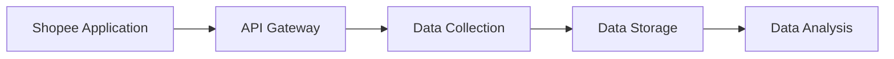

<h1 align='center'> 
  Shopee Supermarket Sales Performance Dashboard 
 </h1>
 <h3 align='center'> 
 Analyze Shopee Supermarket sales to gain insights into market trend and optimize sales strategy
  </h3>
  <br>
<p align='center'>
  
</p>

<br>
  
## 📝 Table of Contents
- [Executive Summary](#executive-summary)
- [Background](#background)
- [Goals and Objectives](#goals-and-objectives)
- [Scope](#scope)
- [Methodology](#methodology)
- [System Architecture](#system-architecture)
- [Risks and Limitations](#risks-and-limitations)
- [Deliverables and Milestones](#deliverables-and-milestones)
- [Resources](#resources)
- [Technical Specifications](#technical-specifications)
- [Timeline and Deliverables](#timeline-and-deliverables)
- [Conclusion](#conclusion)

## 📄Executive Summary

Increasing internet penetration and smarter, more powerful devices have made Malaysia's e-commerce market among the strongest it has ever been. Consumers are increasingly flocking online to purchase products and services. This means Malaysia e-commerce statistics are crucial to the creation of effective content strategies for publishers and affiliate marketers targeting the country. 

Therefore, this project aims to produce an e-commerce analytics dashboard that helps to optimize e-commerce operations and to improve profitability by leveraging the insights provided by Shopee e-commerce data. Sales data will be used to identify which products are selling well and which are not, to understand seasonal trends and to optimize pricing strategies.


## 🌎Background

An ecommerce analytics dashboard is a group of visualizations based on ecommerce store’s data. Most dashboards cover a specific goal or topic, such as traffic or audience behavior. Nowadays, it has become essential since the number of online users have increased dramatically and there is a growing shift from offline to online purchasing. The growth is supported by the rapid adoption of smartphones, growing internet penetration, and the availability of secure online payment systems. This situation causes the difficulty of monitoring online business as there are large amounts of transactions in a day and new strategies are needed to attract customer interest. 

Other than that, the increasing number of competitors is one of the problems with e-commerce. As a common habit, most of the customers will compare the price and quality at different platforms before buying the product. Therefore, it is important for businesses to come up with appropriate pricing strategies. 

By analyzing the sales data from Shopee, we can have greater efficiency because dashboards save time by showing us the most important metrics at a glance. It also allows decision-making faster since we won't have to wait on a report to get the relevant data and it presents all the relevant findings within a single pane. With only the most important data in focus, we will be better equipped to analyze the critical metrics in-depth.

In summary, this project aims to provide a sales analysis dashboard that gives insight about the sales data in order to help e-commerce platforms increase efficiency, enhance business strategy and higher profitability. 
  

## 🎯Goals and Objectives

Around 80% of eCommerce businesses have been failing because of insufficient marketing strategy and selling the wrong product at the wrong price. Therefore, an effective marketing plan is the key success of all businesses. The business owner has to collect sales data and then analyze it himself. Without doing this, the business owner cannot understand the current situation of the marketplace.

However, modern technology can help to solve this problem effectively. Therefore, the owner's time will not be wasted to the maximum extent. The sales performance analysis dashboard of our project target to achieve the following objectives. 

- To determine sales trends.
- To provide real-time information on sales.
- To monitor the most important metrics and KPIs
- To identify which products are selling well and which are not
- To optimize pricing strategies.

This will be significant for online sellers to track their progress and quickly respond to any changes by getting insights and analytics on e-commerce data. 
  

## 🔭Scope

This project will develop an e-commerce analytics dashboard to analyze the sales performance of Shopee in order for businesses to obtain valuable insights and look to optimize their online sales and marketing efforts.
- The data that will be used in this project is collected from <a href="https://shopee.com.my/">Shopee</a> Malaysia. It is an e-commerce platform that sells a variety of categories of products like Home & Living, Health & Beauty and Electronics.
 
- Web scraping tool is used to extract product information from Shopee. The extracted data will be processed and analyzed. 

- MongoDB is important to store and analyze data since it contains a powerful aggregation framework to analyze the sales data. For example, the aggregation pipelines can be used to group the data by product, customer, or time period and calculate metrics such as total sales, average order value, and customer lifetime value.

- Visualization tools like Power BI and Tableau are considered to help business owners to understand the sales data and support data-driven decisions.


  

## 🔍Methodology

1. `Data Collection:` First and foremost is data collection. We will collect data such as price, item sold and profit about products from Shopee Supermarket. All of the data sales can be retrieved by using Shopee Open Platform or Shopee's API

2. `Data Preparation:` This step includes **data cleaning** and **data transforming** process where all retrieved data will be cleaned in order to make sure there are no noisy and dirty data. Hence, the quality of the data increases which later will produce more complete, accurate and consistent result. Then, transform the format of the data if needed.

3. `Data Analysis:` After the data is cleaned, the next step is to analyze the data using descriptive statistics and exploratory data analysis techniques. This will help to identify patterns and trends in the data.

4. `Machine Learning Algorithms:` Next, machine learning algorithms can be used to predict customer satisfaction based on the data collected. This can be done by building a model using supervised learning techniques such as regression or classification.

5. `Data Visualization:` The final step is to present the results of the analysis and machine learning algorithms using data visualization techniques. This can be done using tools such as Tableau or Python libraries such as Matplotlib or Seaborn.


## 🔧System Architecture

- Provide a detailed overview of the proposed system architecture including the tools and technologies that will be used to develop and deploy the system

- Explain how the data will be stored, managed, and analyzed using MongoDB, as well as the hardware and software requirements needed to support the system.

- Discuss the tools and frameworks that will be used for data visualization and analysis.

- Provide a flowchart or block diagram of the system architecture.

<table>
  <tr>
    <th>Data collection</th>
    <td></td>
  </tr>
</table>


  

## 📊Risks and Limitations

Here are some potential risks and limitations associated with Shopee Supermarket sales performance analysis dashboard project:

**1. Technical Risk**

`Data Quality:` Although the data may be accessible, there may be problems with the data's quality. The quality of the outcomes may be impacted by the data's potential for being erroneous, inconsistent, or incomplete.

`Data Availability:` The availability of data is a significant restriction. The suggested project might need data that is hard to get or might not be available. Data may be accessible in some circumstances, but its acquisition may be prohibitively expensive.

`System crashes and downtime:` When a system crashes or experiences a downtime, it will affect the implementation of the project and lead to delays and inaccurate insights.

**2. Financial Risk**

`Cost:` It includes the cost of acquiring and storing data since the larger the amount of data that needs to be stored, the higher the cost of the project. Other than that, it can be costly to develop and maintain a dashboard, it depends on the complexity of the project and the tools used.

`Return on investment (ROI):` The dashboard may not bring enough profit to the business compared to the cost of development and maintenance.

**3. Legal Risk**

`Data privacy and protection:` Shopee contains the privacy and sensitive data of customers and the use of these data may be subject to data protection laws and regulations. Therefore, businesses must ensure compliance with these regulations.

`Intellectual property rights:` It is possible to face legal issues relating to intellectual property rights when using proprietary or copyrighted data or information.

**4. Other Risk**

`Scope Creep:` Another risk is scope creep, where the project's objectives may expand beyond the initial scope. This can lead to additional work and resources being required, which can affect the project's timeline and budget.


These risks and limitations must be taken into consideration before implementing the project. Below are plans for mitigating these risks and limitations:

**1. Technical Risk**
- Collect data from reliable resources and implement the strategies like data cleaning, data validation and data standardization to ensure data accuracy, completeness, and consistency.
- When the required data is not available, simulations or experiments can be used to generate data, or the data can be collected from different sources.
- In the event of a system crash or other technical issue, implement a backup and recovery plan to minimize the downtime and losses of data.

**2. Financial Risk**
- Conduct a cost-benefit analysis and establish a budget for data acquisition, storage, and dashboard development and maintenance.
- Reducing maintenance and development costs can be achieved with open-source dashboard tools.

**3. Legal Risk**
- Make sure that all applicable data protection and intellectual property laws are followed.
- Consult experts to get legal advice to ensure compliance with relevant laws and regulations.

**4. Other Risk**
- Establish clear project goals and objectives and communicate effectively with stakeholders.

Overall, it is important to recognize the risks and limitations of the project and have mitigation strategies that help to minimize risks in order to ensure the success of the project. 

## 🔑Deliverables and Milestones

The key deliverables and milestones: 

**1. Data collection and cleaning**
     
This involves gathering sales data from Shopee Supermarket, such as product name, price and quantity sold by using APIs provided and display data in real time using MongoDB's real-time data ingestion. Following the collection of  data, data pre-processing tasks such as cleaning, filtering, and transforming the data into usable format will be performed.

**2. Data analysis and modeling**

Analyze the sales data by grouping the data and calculating metrics with MongoDB's integration framework. This entails analysing the data using statistical and machine learning techniques and developing models that can be used to make predictions.

**3. Dashboard design and development**

Designing the dashboard's layout and visualisations based on sales analysis results, such as charts or graphs, to identify top-selling products and understand sales trends.

**4. Testing and debugging**

Testing the dashboard to ensure its functionality and debugging any issues that arise.

**5. Deployment and maintenance**

Launching the dashboard and ensuring that it is maintained and updated as necessary.

<table align=center>
  <tr>
    <th>Deliverables and Milestones</th>
    <th>Timeframe</th>
  </tr>
  <tr>
    <td>Data gathering and cleaning</td>
    <td>End of week 5</td>
  </tr>
  <tr>
    <td>Data analysis and modeling</td>
    <td>End of week 8</td>
  </tr>
  <tr>
    <td>Dashboard design and development</td>
    <td>End of week 11</td>
  </tr>
    <tr>
    <td>Testing and debugging</td>
    <td>End of week 13</td>
  </tr>
  <tr>
    <td>Dashboard deployed and presentation</td>
    <td>End of week 14</td>
  </tr>
</table>

## 💡Resources

The resources needs as below:

- Staff

   - Data Scientist: 

   - Data Engineer:

   - Project Manager:

- Equipment
   - Computer/Laptop
 
- Software
   - Shopee API 
   - MongoDB
   - Django/Visual Studio Code
   - Power BI
  
- Other expenses
  - The cost of the software

## 📱Technical Specifications

- Discuss the technical specifications of the proposed data science project, including data sources, data schema, data transformations, machine learning algorithms, data visualization tools, and other technical details.

- Mention the programming languages, frameworks, and libraries that will be used in the project.

- Provide details about the hardware and software requirements for the proposed system.

- Explain the data security measures that will be implemented.

<table>
  <tr>
    <th>Data sources</th>
    <td>Extracted data from Shopee Supermarket Malaysia </td>
  </tr>
  <tr>
    <th>Data schema</th>
    <td>Product data: Product ID, Product Name, Items Sold, Product Category, Price per Product, Total Revenue </td>
  </tr>
  <tr>
    <th>Data transformations</th>
    <td>Python libraries:
      <li>Pandas</li>
      <li>Numpy</li>
    </td>
  </tr>
  <tr>
    <th>ML algorithms</th>
    <td>Scikit-learn</td>
  </tr>
  <tr>
    <th>Data visualization tools</th>
    <td>
      <li>Power BI</li>
      <li> Python visualization libraries: Matplotlib, Seaborn, Plotly
      </li>
    </td>
  </tr>
  <tr>
    <th>Programming Languages</th>
    <td>
      <li>SQL</li>
      <li>Python</li>
    </td>
  </tr>
  <tr>
    <th>Hardware requirements</th>
    <td>
      <li>Memory: 16 GB or more</li>
      <li>Processor: 2 GHz or more</li>
      <li>Storage: 25 GB or more free disk space</li>
      <li>Web browser</li>
      <li>Domain name</li>
      <li>Ethernet connection (LAN) or wireless adapter (Wi-Fi)</li>

    </td>
  </tr>
  <tr>
    <th>Software requirements</th>
    <td>
      <li>Power BI</li>
      <li>MongoDB</li>
      <li>Shopee API</li>
      <li>Visual Studio Code</li>
      <li>Shopee data scraper</li>
      <li>Python 3.8 r higher with included libraries</li>
    </td>
  </tr>
  <tr>
    <th>Data security measures</th>
    <td>
      <li>Perform Encryption</li>
      <li>Conduct regular backups</li>
      <li>Install anti-malware software</li>
      <li>Enable access control on MongoDB</li>
      <li>Use a firewall / security groups (if in cloud)</li>
      <li>Use strong password for authentication and authorization of MongoDB</li>
      <li>Secure servers by lock down to access so that only certain IP addresses are allowed to use it.</li>
      <li>Disable listening to all ethernet interfaces (only bind MongoDB ports to the interfaces that intended to exposed)</li>
    </td>
  </tr>
</table>

## ⌚Timeline and Deliverables

- Provide a detailed timeline for the project, including milestones and deadlines.

- Specify the deliverables that will be provided at each milestone. It should also specify the expected time frame for each deliverable and the resources that will be required to complete the project.

- Explain the quality assurance and testing procedures that will be followed.

<div class="mermaid">
  
  ```mermaid
gantt
    title Shopee Supermarket Sales Performance Dashboard
    dateFormat  YYYY-MM-DD
  
    section Data Gathering and Cleaning
    Data Gathering  :2023-04-02 , 10d
    Data Cleaning  :2023-04-12 , 4d
  
    section Dashboard Analysis and Modeling
    Dashboard Analysis            :2023-04-16  , 5d
    Dashboard Modeling                    :2023-04-30 , 7d
   
  
    section Data Design and Development
    Data Design               :2023-05-07 , 7d
    Data Development       :2023-05-14 , 14d
  
    section Integration with E-Commerce Platform
    Designing User interface            :2023-05-28 , 4d
    Features add-ons             :2023-06-01 , 10d
  
    section Testing and Debugging
    Live Testing                :2023-06-11 , 2d
    Debugging     :2023-06-13 , 5d
  
    section Dashboard deployed and live
    Dashboard deployed      :2023-06-18 , 3d
    Dashboard live      :2023-06-21 , 4d
  
  ```
  </div>

  - WEEK 1 - 4 : `Data Gathering and Cleaning`

  > - Gather product data through web scraping process and store the data in MongoDB.
  > - Clean the data to remove any inconsistencies or anomalies.
  
- WEEK 5 - 6 : `Dashboard Analysis and Modeling`

  > - Analysis
  > - Modeling
  
- WEEK 7 - 10 : ` Data Design and Development`

  > Design.
  
- WEEK 11 : `Integration with E-Commerce Platform`

  > Integration with E-Commerce Platform
  
- WEEK 12 - 14 : `Testing and Debugging`

  > Testing and Debugging.

- WEEK 12 - 14 : `Dashboard deployed and live`

  > Dashboard deployed and live.

## 🎓Conclusion

In conclusion, the proposed Shopee Supermarket Sales Performance Dashboard project is a powerful solution for business since it can provide valuable insights for businesses looking to optimize their sales strategy and increase revenue on Shopee. Other than that, the dashboard enables business owners to monitor sales performance, identify top-performing products and analyze the sales data. From here, this will definitely improve the decision making process of businesses and help them stay competitive in the marketplace.

However, there are some challenges that need to be overcome in building a successful dashboard. For example, technical risks like data quality and availability issues, financial and legal risks should also be considered and develop a comprehensive risk management plan that helps to mitigate these risks to ensure the success of the project. 

We believe by approving this proposal, it will bring the benefit to the business at the end of the completion of the project. Since they will be able to gain profit by using this powerful dashboard. We will also try to deliver a high-quality dashboard to solve the client's problem and help their business succeed on Shopee.

