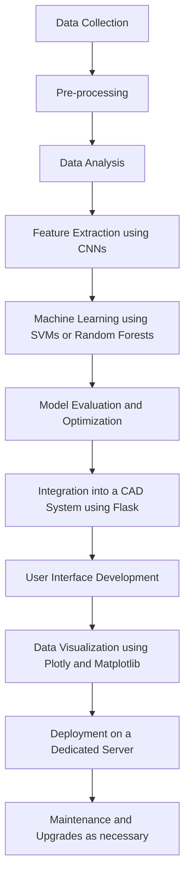

<h1 align='center'><b>Image Analysis for Rotten Fruit Detection 👷‍♂️</b></h1> 

## Table of Contents
* [📜 Executive Summary](#-executive-summary)
* [📝 Background](#-background)
* [🎯 Goals and Objectives](#-goals-and-objectives)
* [🔍 Scope](#-scope)
* [📄 Methodology](#-methodology)
* [⚙️ System Architecture](#-system-architecture)
* [🛑 Risks and Limitations](#-risks-and-limitations)
* [⏳ Deliverables and Milestones](#-deliverables-and-milestones)
* [📚 Resources](#-resources)
* [🧰 Technical Specifications](#-technical-specifications)
* [🏁 Timeline and Deliverables](#-timeline-and-deliverables)
* [📄 Conclusion](#-conclusion)

## 📜 Executive Summary

Rotten fruits can cause significant problems for the fruit industry, leading to economic losses, food waste, and even potential health risks for consumers. Manual inspection for detecting rotten fruits can be time-consuming and often unreliable, making it difficult to ensure consistent fruit quality. However, recent advancements in machine learning algorithms and computer vision have opened up new opportunities for improving the accuracy and efficiency of image analysis for fruit quality control.

This project aims to develop an image analysis system for detecting rotten fruits that utilizes state-of-the-art machine learning techniques. The system will analyze images of fruits and identify which ones are in a state of decay, enabling more efficient and accurate fruit quality control. This will have significant benefits for the fruit industry, as it will allow for improved quality control and reduced waste.

To achieve this goal, the project will collect a diverse dataset of fruit images, including both healthy and rotten fruits, with a range of lighting conditions and camera angles. The dataset will be preprocessed to enhance image quality and extract features relevant to fruit quality. The team will then train and evaluate a deep learning model, such as a convolutional neural network, to accurately classify fruits as healthy or rotten.

The system will have a user-friendly interface, allowing for easy input of fruit images and displaying the results of the analysis. The performance of the system will be validated using a separate test dataset, and its accuracy will be compared to existing methods for fruit quality control.

In summary, this project aims to develop an accurate and reliable system for detecting rotten fruits using image analysis, which will have significant benefits for the fruit industry. By utilizing machine learning algorithms, the system will enable more efficient and consistent fruit quality control, reducing waste and improving the safety of food products.


## 📝 Background:
<p align="center">
</img>
</p>

Rotten fruits are a significant problem in the fruit industry, leading to economic losses, food waste, and even potential health risks for consumers. The detection of rotten fruits is a crucial step in the fruit production chain to ensure that only high-quality fruits reach the market. Manual inspection by human operators is the most common method used for detecting rotten fruits, but it can be time-consuming, labor-intensive, and subject to human error. Automated systems for detecting rotten fruits using image analysis have been proposed as a more efficient and reliable alternative to manual inspection.

Early attempts at automated fruit quality inspection relied on simple image processing techniques such as color and texture analysis. These techniques could only achieve limited accuracy and were sensitive to lighting conditions and camera angles. In recent years, advances in machine learning algorithms and computer vision have enabled more sophisticated approaches for fruit quality inspection. Convolutional neural networks (CNNs) have been shown to be highly effective for image classification tasks, including fruit quality inspection.

Several studies have investigated the use of CNNs for detecting rotten fruits. For example, one study used a deep learning approach to classify apples as healthy or rotten based on images taken from different viewpoints. Another study proposed a method for detecting rot in apples using a combination of texture and color features.

Despite the progress made in automated fruit quality inspection, several challenges still need to be addressed. One major challenge is the development of a robust and diverse image dataset that can capture the variations in lighting, camera angle, and fruit type. Another challenge is the integration of image analysis systems into the fruit production chain, ensuring that the system is scalable, user-friendly, and cost-effective.

In summary, automated systems for detecting rotten fruits using image analysis have the potential to improve the efficiency and accuracy of fruit quality control. Recent advancements in machine learning algorithms and computer vision have enabled more sophisticated approaches for fruit quality inspection. However, several challenges still need to be addressed, including the development of a diverse image dataset and the integration of image analysis systems into the fruit production chain.


## 🎯 Goals and Objectives:

Goals:
The primary goal of this project is to develop an accurate and reliable system for detecting rotten fruits using image analysis. The specific objectives include:

1. Collecting a diverse dataset of fruit images, including both healthy and rotten fruits, with a range of lighting conditions and camera angles.
2. Preprocessing the image dataset to enhance image quality and extract features relevant to fruit quality.
3. Training and evaluating a deep learning model, such as a convolutional neural network, to accurately classify fruits as healthy or rotten.
4. Developing a user-friendly interface for the system, allowing for easy input of fruit images and displaying the results of the analysis.
5. Validating the performance of the system using a separate test dataset and comparing its accuracy to existing methods for fruit quality control.

By achieving these objectives, this project will provide a valuable tool for the fruit industry, allowing for improved quality control and reduced waste.


## 🔍 Scope: 
<p align="center">
</img>
</p>

The scope of this project is to develop an image analysis system for detecting rotten fruits using machine learning algorithms. The system will analyze images of fruits and accurately identify which ones are in a state of decay. The project will involve the following activities:

Collecting a diverse dataset of fruit images, including both healthy and rotten fruits, with a range of lighting conditions and camera angles.
Preprocessing the image dataset to enhance image quality and extract features relevant to fruit quality.
Designing and implementing a deep learning model, such as a convolutional neural network, to accurately classify fruits as healthy or rotten.
Developing a user-friendly interface for the system, allowing for easy input of fruit images and displaying the results of the analysis.
Validating the performance of the system using a separate test dataset and comparing its accuracy to existing methods for fruit quality control.
The project will focus on the detection of rotten fruits in images, and will not include physical inspection of fruits or other aspects of fruit quality control. The project will use existing tools and libraries for machine learning and image analysis, rather than developing new algorithms from scratch. The project will be limited to the detection of rotten fruits in a controlled laboratory environment, and the system's performance may vary in real-world settings.

The project team will consist of machine learning experts, computer vision specialists, and domain experts in the fruit industry. The project will be conducted over a period of six months and will be evaluated based on the accuracy and efficiency of the developed system. The project's deliverables will include a report detailing the methodology, results, and conclusions of the project, as well as a functional prototype of the image analysis system.


## 📄 Methodology:

The proposed data science project for developing a Image Analysis System for Fruit Rotten Detection will be executed using the following methodology:

1. ``Data Collection``
  	<ul>
 		<li>The project will use the Google API to scrape fruit images from the internet. Specifically, the project will utilize Google's Custom Search JSON API to search for fruit images and download them in bulk. The API will be configured to search for a variety of fruits and retrieve both healthy and rotten images. Each image will be labeled as healthy or rotten for training the model.</li>
  	</ul>
2. ``Data Cleaning and Preprocessing``
  	<ul>
  		<li>The collected dataset will be preprocessed to enhance image quality and extract features relevant to fruit quality. Preprocessing steps may include resizing, cropping, normalization, and color correction to ensure consistency across all images. The images will also be converted to grayscale and segmented to extract fruit regions from the background. Feature extraction techniques such as Histogram of Oriented Gradients (HOG) and Local Binary Patterns (LBP) will be applied to extract relevant features from the segmented fruit regions.</li>
  	</ul>
3. ``Model Selection and Training``
  	<ul>
  		<li>A deep learning model, such as a Convolutional Neural Network (CNN), will be trained on the preprocessed dataset to accurately classify fruits as healthy or rotten. The model will be optimized by adjusting hyperparameters, such as learning rate, batch size, and number of epochs. A separate validation dataset will be used to evaluate the model's performance and make any necessary adjustments.</li>
  	</ul>
4. ``Model Evaluation and Comparison``
  	<ul>
  		<li>The accuracy of the developed system will be evaluated using a separate test dataset that was not used during the training or validation process. The performance of the system will be compared to existing methods for fruit quality control, such as manual inspection and traditional image processing techniques.</li>
  	</ul>
5. ``Data Visualization``
  	<ul>
  		<li>The results of the analysis will be displayed in a user-friendly interface, allowing for easy input of fruit images and displaying the results of the analysis. The system may also generate visualizations, such as heatmaps or bar charts, to provide insights into the performance of the model.</li>
  	</ul>


## ⚙️ System Architecture:

The system architecture for rotten fruit detection using image analysis includes several components that work together to perform the task of detecting rotten fruits in images. The proposed system architecture is as follows:


| No. | Components | Description |
| ------------- | ------------- | ------------- |
| 1. | Image Acquisition | The first step in the process is to acquire the images of the fruits. This can be done using web scraping or API. These images will be processed and analyzed to detect the presence of any rotten fruit. |
| 2. | Pre-processing | The acquired images will be pre-processed to remove any noise or artifacts that may interfere with the image analysis process. This may include resizing, cropping, and normalization. |
| 3. | Image Analysis | The pre-processed images will be analyzed to detect the presence of any rotten fruit using image analysis techniques. This may include segmentation, feature extraction, and classification. |
| 4. | Storage and Management | The analyzed images and their corresponding results will be stored in a MongoDB database. MongoDB is a NoSQL database that is highly scalable and flexible, making it a suitable choice for storing large volumes of image data. |
| 5. | Machine Learning | A deep learning model, such as a convolutional neural network, will be trained on the preprocessed image dataset using TensorFlow or Keras. |
| 6. | Data Visualization | Data analysis and visualization tools such as Python and R will be used to analyze the data stored in the MongoDB database. This will enable the identification of trends and patterns in the data that can be used to improve the accuracy of the system. |
| 7. | Software Requirements | <li>Python and R programming languages</li><li>OpenCV, Keras, and TensorFlow frameworks for image processing and machine learning</li><li>MongoDB for database management</li>|

____

The proposed system architecture will employ various tools and frameworks for data visualization and analysis, including:
 | Tools/Frameworks | Description |
 | ------------- | ------------- |
| Matplotlib | Matplotlib is a popular data visualization library for Python. It provides a wide range of functions for creating visualizations such as line charts, bar charts, scatterplots, and histograms. Matplotlib can also be used to create customized visualizations to meet specific requirements. |
| Plotly | Plotly is a web-based data visualization framework that allows for the creation of interactive visualizations. It provides a wide range of chart types, including 3D charts, scatterplots, and heatmaps. Plotly is highly customizable and supports the creation of customized dashboards for data exploration and analysis. |
| Seaborn | Seaborn is a data visualization library that is built on top of Matplotlib. It provides a high-level interface for creating statistical graphics such as heatmaps, regression plots, and distribution plots. Seaborn is highly customizable and supports the creation of complex visualizations with minimal coding. |
| Tableau | Tableau is a data visualization and business intelligence tool that allows for the creation of interactive dashboards and reports. Tableau provides a wide range of chart types, including bar charts, line charts, and scatterplots. It also supports the integration of multiple data sources, allowing for the creation of comprehensive dashboards for data analysis. |
| Scikit-learn | Scikit-learn is a popular machine learning library for Python. It provides a wide range of machine learning algorithms for tasks such as classification, regression, clustering, and dimensionality reduction. Scikit-learn also provides tools for data preprocessing, feature selection, and model evaluation. |
| Pandas | Pandas is a Python library for data manipulation and analysis. It provides data structures for efficiently handling and manipulating large datasets, including time series data. Pandas also supports data visualization using Matplotlib. |
| NumPy | NumPy is a Python library for scientific computing. It provides support for large, multi-dimensional arrays and matrices, along with a wide range of mathematical functions. NumPy is often used in conjunction with other data analysis libraries such as Pandas and Scikit-learn. |

___

Flowchart of the CAD System Architecture::


## 🛑 Risks and Limitations:

Even though analyzing playground images for inspection and maintenance gives a lot of advantages to children and parents, this process also poses several risks and limitations that should be considered. Below are points for technical, financial and legal risks:

<ol>
	<li> Technical Risks: </li>
<ul>
  <li> False positives and false negatives: Predictive maintenance relies on data and algorithms to predict equipment failures. However, the accuracy of the prediction depends on the quality and quantity of the data, as well as the effectiveness of the algorithms. False positives (predicting a failure that does not occur) and false negatives (not predicting a failure that does occur) can result in unnecessary maintenance costs or safety hazards.</li>
  <li> Data quality and availability: Predictive maintenance requires accurate and timely data from the equipment sensors, which may not be available or reliable in some cases. For example, outdoor playground equipment may be subject to weather conditions that affect the sensors' accuracy or even cause sensor failure.</li>
  <li> Sensor placement and maintenance: Sensors must be properly placed and maintained to provide accurate data. Failure to do so may result in false readings, leading to incorrect predictions and increased maintenance costs.</li>
</ul>
	<li> Financial Risks: </li>
<ul>
  <li> Equipment and software costs: Implementing predictive maintenance requires an initial investment in equipment sensors, software, and other hardware. The cost of these components can be significant, depending on the size and complexity of the playground equipment.</li>
  <li> Maintenance costs: Predictive maintenance can help reduce maintenance costs by predicting failures before they occur. However, there is still a cost associated with maintaining the equipment sensors, software, and other hardware components, as well as conducting the necessary repairs and replacements.</li>
</ul>
	<li> Legal Risks: </li>
<ul>
  <li> Liability: Playground equipment is subject to safety regulations and standards, and failure to comply with these regulations can result in legal liabilities. Implementing predictive maintenance can help reduce the risk of safety hazards, but it does not eliminate the need to comply with safety regulations and standards.</li>
  <li> Data privacy: Predictive maintenance requires the collection and analysis of data from the equipment sensors, which may include personal or sensitive information. The misuse or mishandling of this data can result in legal liabilities related to data privacy and security.</li>
</ul>
</ol>

## ⏳ Deliverables and Milestones:

<table border="1" align="center">
  <tr>
    <th>Deliverables and Milestones</th>
    <th>Timeframe</th>
  </tr>
  <tr>
    <td>Planning and Requirements Gathering</td>
    <td>Week 1-2</td>
  </tr>
  <tr>
    <td>Data Exploration and Cleaning</td>
    <td>Week 3-5</td>
  </tr>
  <tr>
    <td>Feature Engineering</td>
    <td>Week 6</td>
  </tr>
  <tr>
    <td>Model Selection and Training</td>
    <td>Week 7-9</td>
  </tr>
  <tr>
    <td>Model Evaluation and Refinement</td>
    <td>Week 10</td>
  </tr>
  <tr>
    <td>Dashboard Development</td>
    <td>Week 11-12</td>
  </tr>
  <tr>
    <td>Deployment and Documentation</td>
    <td>Week 13-14</td>
  </tr>
</table>


## 📚 Resources:

<ol>
		<li>Staff:</li>
	</ol>
	<ul>
		<li>Project Manager: responsible for managing the project timeline, ensuring milestones are met, and overseeing the work of the team.</li>
		<li>Data Scientist(s): responsible for data collection, preprocessing, modeling, and evaluation.</li>
		<li>Data Engineer(s): responsible for setting up the data infrastructure, managing data pipelines, and ensuring data quality.</li>
		<li>UI/UX Designer: responsible for designing the user interface and ensuring a seamless user experience.</li>
		<li>Quality Assurance Engineer: responsible for testing the system, identifying bugs, and ensuring the system is working correctly.</li>
		<li>Subject Matter Expert(s): responsible for providing domain expertise on fruit quality control and advising on dataset collection and annotation.</li>
	</ul>
	<ol start="2">
		<li>Equipment:</li>
	</ol>
	<ul>
		<li>High-performance computing infrastructure: required for training and evaluating deep learning models.</li>
		<li>High-quality cameras: required for capturing high-resolution fruit images.</li>
		<li>Workstations/laptops: required for data preprocessing, modeling, and development.</li>
	</ul>
	<ol start="3">
		<li>Software:</li>
	</ol>
	<ul>
		<li>Python: required for data processing, modeling, and evaluation.</li>
		<li>Deep learning frameworks such as TensorFlow, PyTorch, or Keras: required for developing deep learning models.</li>
		<li>Image processing libraries such as OpenCV: required for preprocessing and analyzing images.</li>
		<li>Version control systems such as Git: required for code management.</li>
		<li>User interface development frameworks such as React or Angular: required for developing a user-friendly interface.</li>
		<li>Cloud services such as Amazon Web Services or Google Cloud Platform: required for hosting the system and running computations.</li>
	</ul>
	<ol start="4">
		<li>Other Expenses:</li>
	</ol>
	<ul>
		<li>Data collection and annotation: expenses related to collecting and annotating the fruit image dataset.</li>
		<li>Licensing fees: expenses related to purchasing licenses for software or datasets.</li>
		<li>Travel expenses: expenses related to attending conferences or meetings related to the project.</li>
		<li>Miscellaneous expenses: expenses related to hardware maintenance, data storage, or other unforeseen costs.</li>
	</ul>


## 🧰 Technical Specifications:

The scope of this project is to develop an image analysis system for detecting rotten fruits using machine learning algorithms. The system will analyze images of fruits and accurately identify which ones are in a state of decay. The project will involve the following activities:

Collecting a diverse dataset of fruit images, including both healthy and rotten fruits, with a range of lighting conditions and camera angles.
Preprocessing the image dataset to enhance image quality and extract features relevant to fruit quality.
Designing and implementing a deep learning model, such as a convolutional neural network, to accurately classify fruits as healthy or rotten.
Developing a user-friendly interface for the system, allowing for easy input of fruit images and displaying the results of the analysis.
Validating the performance of the system using a separate test dataset and comparing its accuracy to existing methods for fruit quality control.
The project will focus on the detection of rotten fruits in images, and will not include physical inspection of fruits or other aspects of fruit quality control. The project will use existing tools and libraries for machine learning and image analysis, rather than developing new algorithms from scratch. The project will be limited to the detection of rotten fruits in a controlled laboratory environment, and the system's performance may vary in real-world settings.

The project team will consist of machine learning experts, computer vision specialists, and domain experts in the fruit industry. The project will be conducted over a period of six months and will be evaluated based on the accuracy and efficiency of the developed system. The project's deliverables will include a report detailing the methodology, results, and conclusions of the project, as well as a functional prototype of the image analysis system.

## 🏁 Timeline and Deliverables: 

<div class="mermaid">

  ```mermaid
gantt
    title Predictive Maintenance for Playground Equipment Gantt Chart
    dateFormat  YYYY-MM-DD
    section Planning and Requirements Gatherings
    Requirements Gatherings  :2023-03-19 , 14d
  
    section Data Exploration and Cleaning
    Data Collection            :2023-04-02  , 10d
    Data Cleaning              :2023-04-12 , 6d
    Data Analysis              :2023-04-18 , 5d
  
    section Feature Engineering
    Features identification        :2023-04-23 , 7d
 
    section Model Selection and Training
    Model Selection        :2023-04-30 , 7d
    Model Training     :2023-05-07 , 7d
	
    section Model Evaluation and Refinement
    Model Evaluation        :2023-05-08 , 2d
    Model Refinement        :2023-05-10 , 3d
   
    section Dashboard development
    Dashboard development              :2023-05-14 , 14d
    Testing     :2023-05-28 , 2d
  
    section Deployment and documentation
    Deployment     :2023-05-29  , 15d
    Documentation     :2023-06-13 , 7d
  
  ```
  </div>

<p>Deliverables and Milestones:</p>
	<ol>
		<li>Planning and Requirements Gathering (Week 1-2):</li>
	</ol>
	<ul>
		<li>Define project objectives and goals</li>
		<li>Identify data sources and collection methods</li>
		<li>Determine hardware and software requirements</li>
		<li>Finalize project plan and timeline</li>
		<li>Deliverable: Project plan and timeline</li>
	</ul>
	<ol start="2">
		<li>Data Exploration and Cleaning (Week 3-5):</li>
	</ol>
	<ul>
		<li>Gather and preprocess a diverse dataset of fruit images, including both healthy and rotten fruits, with a range of lighting conditions and camera angles</li>
		<li>Analyze and visualize the dataset to identify data quality issues and outliers</li>
		<li>Clean and normalize the dataset to prepare it for feature engineering</li>
		<li>Deliverable: Cleaned dataset</li>
	</ul>
	<ol start="3">
		<li>Feature Engineering (Week 6):</li>
	</ol>
	<ul>
		<li>Extract relevant features from the image dataset, such as color and texture</li>
		<li>Preprocess the features to reduce dimensionality and optimize performance</li>
		<li>Deliverable: Feature set</li>
	</ul>
	<ol start="4">
		<li>Model Selection and Training (Week 7-9):</li>
	</ol>
	<ul>
		<li>Research and evaluate different deep learning models, such as convolutional neural networks, for fruit quality classification</li>
		<li>Train the selected model on the feature set using appropriate hyperparameters and optimization techniques</li>
		<li>Monitor and tune model performance as needed</li>
		<li>Deliverable: Trained deep learning model</li>
	</ul>
	<ol start="5">
		<li>Model Evaluation and Refinement (Week 10):</li>
	</ol>
	<ul>
		<li>Evaluate the performance of the trained model using a separate test dataset</li>
		<li>Refine the model as needed to improve accuracy and reduce false positives/negatives</li>
		<li>Deliverable: Optimized deep learning model</li>
	</ul>
	<ol start="6">
		<li>Dashboard Development (Week 11-12):</li>
	</ol>
	<ul>
		<li>Develop a user-friendly interface for the system to allow for easy input of fruit images and displaying the results of the analysis</li>
		<li>Incorporate visualization tools to help users interpret results</li>
		<li>Deliverable: Fruit quality control dashboard</li>
	</ul>
	<ol start="7">
		<li>Deployment and Documentation (Week 13-14):</li>
	</ol>
	<ul>
		<li>Integrate the fruit quality control dashboard into the fruit production chain</li>
		<li>Develop documentation for the system, including user guides and technical manuals</li>
		<li>Conduct final testing and quality assurance checks to ensure the system is scalable, user-friendly, and cost-effective</li>
		<li>Deliverable: Deployed fruit quality control system with documentation</li>
	</ul>
	<p>Quality Assurance and Testing Procedures:
		To ensure the quality and accuracy of the system, the following procedures will be followed:
	</p>
	<ul>
		<li>Regular testing and evaluation of the deep learning model using a separate test dataset</li>
		<li>Continuous monitoring and tuning of model performance to minimize false positives/negatives</li>
		<li>Integration of visualization tools to help users interpret results</li>
		<li>User acceptance testing and feedback to ensure the dashboard is user-friendly and meets industry standards</li>
		<li>Final testing and quality assurance checks before deployment to ensure the system is scalable, reliable, and cost-effective.</li>
	</ul>

</ul>


## 📄 Conclusion:

In conclusion, our proposed solution for automating the diagnosis of pneumonia through machine learning algorithms has the potential to revolutionize the medical field. By leveraging state-of-the-art technology and techniques, we aim to provide a robust and accurate diagnostic tool for medical professionals to assist in making informed decisions about patient care. Our project timeline, deliverables, and technical specifications have been carefully planned to make sure the project is executed efficiently and effectively. We are confident in our ability to deliver high-quality results within the proposed timeframe and budget. However, we recognize that challenges and limitations may arise during the project, such as data quality issues or hardware constraints. We believe that our proposed solution has the potential to make a significant impact in the medical field, and we are excited about the prospect of working on this project.
