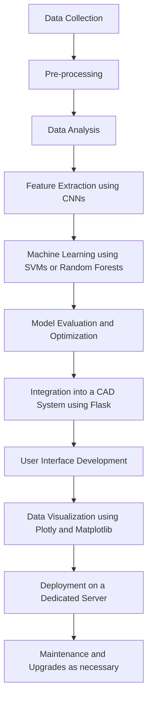

<h1 align='center'><b>Analyzing Medical Images for Disease Diagnosis in Malaysia 👨‍⚕️</b></h1> 

## Table of Contents
* [📜 Executive Summary](#-executive-summary)
* [📝 Background](#-background)
* [🎯 Goals and Objectives](#-goals-and-objectives)
* [🔍 Scope](#-scope)
* [📄 Methodology](#-methodology)
* [⚙️ System Architecture](#-system-architecture)
* [🛑 Risks and Limitations](#-risks-and-limitations)
* [⏳ Deliverables and Milestones](#-deliverables-and-milestones)
* [📚 Resources](#-resources)
* [🧰 Technical Specifications](#-technical-specifications)
* [🏁 Timeline and Deliverables](#-timeline-and-deliverables)
* [📄 Conclusion](#-conclusion)

## 📜 Executive Summary

This project aims to develop a computer-aided diagnostic (CAD) system for analyzing medical images to improve disease diagnosis in Malaysia. The objectives of the project are to train machine learning models on a dataset of medical images, evaluate the performance of the models using various metrics, and integrate the models into a CAD system that can assist medical professionals in making more accurate diagnoses.

The expected outcomes of the project include a dataset of annotated medical images, trained machine learning models that can accurately diagnose diseases, and a CAD system that can be used in clinical practice to aid medical professionals. The project has the potential to improve the accuracy and speed of disease diagnosis, ultimately leading to better patient outcomes in Malaysia.

## 📝 Background:

</img>

Medical imaging plays a crucial role in modern healthcare for the diagnosis and treatment of various diseases. In Malaysia, the demand for medical imaging services has been growing due to an aging population and increasing incidence of chronic diseases. However, the shortage of qualified radiologists, coupled with the increasing complexity of medical images, has led to delays in diagnosis, misdiagnosis, and suboptimal treatment outcomes.

Interpreting medical images is a challenging task that requires expert knowledge and experience. Radiologists are trained to identify subtle differences in images that may indicate a disease or condition, but this process can be time-consuming and subject to human error. Additionally, the growing volume of medical images being generated presents a significant challenge to radiologists, as it increases their workload and reduces the amount of time they can spend on each case.

The proposed data science project aims to address these challenges by developing a computer-aided diagnostic (CAD) system that can assist radiologists in analyzing medical images. By leveraging machine learning algorithms trained on a large dataset of annotated medical images, the system can identify patterns and anomalies in images that may be indicative of a disease or condition. The system can then provide radiologists with a preliminary diagnosis or highlight areas of concern, reducing the time and effort required to analyze images and improving the accuracy of diagnosis.

The potential benefits of the proposed CAD system are significant. By improving the speed and accuracy of diagnosis, the system can reduce the time required for patients to receive treatment, which can be critical in cases where time is of the essence. Additionally, the system can help reduce the workload of radiologists and improve their efficiency, allowing them to spend more time on complex cases that require their expertise. Finally, the system can also help address the shortage of qualified radiologists by enabling healthcare providers to diagnose and treat more patients with existing resources. Overall, the proposed CAD system has the potential to significantly improve healthcare outcomes in Malaysia and enhance the quality of medical imaging services.

## 🎯 Goals and Objectives:

Goals:
The main goal of the proposed project is to develop a computer-aided diagnostic (CAD) system for medical imaging analysis that can improve disease diagnosis in Malaysia. The CAD system will leverage machine learning models trained on a dataset of medical images to assist radiologists in making more accurate diagnoses, reducing the time and effort required to analyze images, and improving the efficiency of diagnosis. The ultimate goal is to improve patient outcomes and enhance the quality of medical imaging services in Malaysia.

Objectives:
1. Collect and annotate a dataset of medical images that covers a range of diseases and conditions relevant to Malaysia.
2. Train machine learning models on the dataset to accurately diagnose diseases and conditions in medical images.
3. Evaluate the performance of the machine learning models using various metrics, such as sensitivity, specificity, and accuracy.
4. Integrate the trained machine learning models into a CAD system that can assist radiologists in analyzing medical images.
5. Test the CAD system on a sample of medical images to ensure its accuracy and efficiency in diagnosing diseases and conditions.
6. Deploy the CAD system in clinical practice and monitor its performance in assisting radiologists in making diagnoses.
7. Evaluate the impact of the CAD system on diagnosis accuracy, diagnosis speed, radiologist workload, and patient outcomes.
8. Refine the CAD system based on feedback from medical professionals and patients to improve its performance and usability.

## 🔍 Scope: 

<ul>
  <li>The scope of this project is to develop an AI system for the analysis of chest X-ray images of pediatric patients.</li>
  <li>The dataset comprises 5,863 high-quality X-Ray images (JPEG) of anterior-posterior view, with 2 categories - Pneumonia and Normal, which are organized into 3 folders (train, test, val) and contain subfolders for each image category (Pneumonia/Normal). The dataset was sourced from Kaggle, with the URL: https://www.kaggle.com/datasets/paultimothymooney/chest-xray-pneumonia.</li>
  <li>The main tool to be employed in this project is 3D Slicer. In addition, various tools and technologies such as machine learning algorithms, deep learning frameworks, image processing libraries, and cloud-based computing resources will be used to develop the AI system.</li>
  <li>The chest X-ray images were selected from retrospective cohorts of pediatric patients of one to five years old from Guangzhou Women and Children’s Medical Center, Guangzhou. The images were initially screened for quality control, and all low-quality or unreadable scans were removed from the dataset. The diagnoses for the images were then graded by two expert physicians, with the evaluation set checked by a third expert to account for any grading errors.</li>
  <li>The successful completion of the project will enable accurate and efficient diagnosis of chest X-ray images in pediatric patients, contributing to improved clinical outcomes and patient care.</li>
</ul>

## 📄 Methodology:

The proposed data science project for developing a computer-aided diagnostic (CAD) system for analyzing medical images will be executed using the following methodology:

<ol>
	<li>Data Collection</li>
  	<ul>
 		<li>Medical images such as X-rays will be collected from various websites. The images will be anonymized and stored in 		a secure database.</li>
  	</ul>
	<li>Data Cleaning and Preprocessing</li>
  	<ul>
  		<li>The collected images will be preprocessed to remove any noise or artifacts, and to standardize the image size and resolution. Image processing 		   techniques such as filtering and normalization will be applied to improve the image quality.</li>
  	</ul>
	<li>Feature Extraction</li>
  	<ul>
  		<li>Image segmentation techniques will be used to identify and extract relevant features from the medical images. These features will be used as inputs 		to the machine learning models.</li>
  	</ul>
	<li>Machine Learning Algorithms</li>
  	<ul>
  		<li>Several machine learning algorithms such as support vector machines (SVM), random forest, and convolutional neural networks (CNN) will be trained 		      on the annotated medical images to classify and diagnose various diseases.</li>
  	</ul>
	<li>Data Visualization</li>
  	<ul>
  		<li>The results generated by the machine learning models will be visualized using data visualization tools such as matplotlib and seaborn. The 			visualizations will be used to communicate the findings to healthcare professionals.</li>
  	</ul>
</ol>

The software and hardware resources required for the project include:

1. Python programming language for developing machine learning models and data visualization tools.
2. Deep learning libraries such as Flask and TensorFlow for developing CNN models.
3. Scikit-learn library for developing SVM and random forest models.
4. MongoDB database for storing and processing the large volumes of medical image data.
5. High-performance computing resources such as GPUs and multi-core processors for training the machine learning models.

## ⚙️ System Architecture:

The CAD system architecture will consist of various components, including data collection, pre-processing, data analysis, feature extraction, machine learning, CAD system integration, and others. MongoDB will be used to store and manage the pre-processed medical image data, and TensorFlow will be used to build and train the machine learning models. The CAD system will be developed using Flask, a Python-based web framework, and will include interactive and static data visualization tools such as Plotly and Matplotlib.

| No. | Components | Description |
| ------------- | ------------- | ------------- |
| 1. | Data Collection | Collect medical images from various sources such as hospitals and medical research institutions. |
| 2. | Pre-processing | Remove noise, artifacts, and irrelevant information from the images. Resize, normalize, and standardize the images to ensure consistency across the dataset. Label the images to indicate the presence or absence of specific medical conditions. |
| 3. | Data Analysis | Conduct exploratory data analysis (EDA) techniques such as data visualization to gain insights into the data and identify potential outliers or anomalies. |
| 4. | Feature Extraction | Extract meaningful features from the pre-processed images using techniques such as convolutional neural networks (CNNs). |
| 5. | Machine Learning | Train a machine learning model such as a support vector machine (SVM) or random forest using the extracted features to predict the presence or absence of specific medical conditions. |
| 6. | Model Evaluation | Evaluate the performance of the machine learning model using various metrics such as accuracy, precision, and recall. |
| 7. | Model Optimization | Optimize the machine learning model using hyperparameter tuning and cross-validation techniques. |
| 8. | CAD System Integration | Integrate the trained and optimized machine learning model into a CAD system that can assist medical professionals in making more accurate diagnoses. |
| 9. | User Interface | Develop a user-friendly interface for the CAD system that includes various data visualization techniques such as interactive and static plots, data tables, and heatmaps. |
| 10. | Deployment | Deploy the CAD system on a server with appropriate hardware and software resources such as a GPU with at least 8 GB of VRAM, a Linux operating system with Python, TensorFlow, Flask, and MongoDB installed, and data visualization and analysis tools such as Plotly and Matplotlib. |
| 11. | Maintenance | Regularly monitor and upgrade the hardware and software resources as necessary to ensure optimal performance of the CAD system. |

___

<ol>
	<li>Data Storage and Management:</li>
 

MongoDB is a NoSQL document-oriented database that is highly suitable for handling large and complex datasets such as medical images. MongoDB stores data in collections of documents, which are JSON-like structures that allow for flexible and efficient data storage and retrieval. In the proposed system architecture, MongoDB will be used to store and manage pre-processed medical image data.

The medical images will be pre-processed to extract features relevant to disease diagnosis, and the resulting features will be stored as documents in MongoDB collections. Each document will represent a single medical image and will include the extracted features, metadata such as patient ID, and other relevant information.

MongoDB provides several features that are beneficial for managing and analyzing large datasets, including:
	<ul>
<li>Scalability: MongoDB is highly scalable and can handle large volumes of data, making it suitable for storing medical image data.</li>

<li>Indexing: MongoDB supports indexing, which allows for fast retrieval of data based on specific criteria. This feature is essential for efficient querying of medical image data.</li>

<li>Aggregation: MongoDB supports powerful aggregation capabilities, which enable complex data analysis and processing.</li>
	</ul>
 
<li>Data Analysis:</li>
 

MongoDB provides several features that facilitate data analysis, including indexing, aggregation, and real-time querying capabilities. The data analysis will be performed using Python-based data analysis libraries such as NumPy, Pandas, and Scikit-learn, which provide a wide range of data analysis tools, including data cleaning, preprocessing, feature selection, and feature extraction. These libraries will be used to manipulate and analyze the data stored in MongoDB, enabling the extraction of meaningful insights and patterns from the data. Data visualization tools such as Matplotlib and Plotly will be used to visualize the results of the data analysis.

 
<li>Hardware and Software Requirements:</li>
 

To support the use of MongoDB in the proposed system architecture, the following hardware and software requirements will be needed:

	<ul>
<li>A dedicated server: MongoDB requires a dedicated server with sufficient storage capacity and processing power to handle large volumes of medical image data. The server should have at least 16 GB of RAM, a multi-core CPU, and sufficient disk space to store the data.</li>

<li>MongoDB database: The MongoDB database will need to be installed and configured on the dedicated server. MongoDB can be installed on Windows, macOS, and Linux operating systems.</li>

<li>Python: The system will require a Python installation with the appropriate libraries and packages for interacting with the MongoDB database. The recommended package for this is PyMongo, which provides a Python API for interacting with MongoDB.</li>

<li>Data pre-processing software: Before storing the medical images in MongoDB, they will need to be pre-processed to extract relevant features. This will require the use of software tools such as OpenCV or TensorFlow, depending on the specific feature extraction technique being used.</li>
	</ul>
</ol>

___

The proposed system architecture will employ various tools and frameworks for data visualization and analysis, including:
 | Tools/Frameworks | Description |
 | ------------- | ------------- |
| Matplotlib | Matplotlib is a popular data visualization library for Python. It provides a wide range of functions for creating visualizations such as line charts, bar charts, scatterplots, and histograms. Matplotlib can also be used to create customized visualizations to meet specific requirements. |
| Plotly | Plotly is a web-based data visualization framework that allows for the creation of interactive visualizations. It provides a wide range of chart types, including 3D charts, scatterplots, and heatmaps. Plotly is highly customizable and supports the creation of customized dashboards for data exploration and analysis. |
| Seaborn | Seaborn is a data visualization library that is built on top of Matplotlib. It provides a high-level interface for creating statistical graphics such as heatmaps, regression plots, and distribution plots. Seaborn is highly customizable and supports the creation of complex visualizations with minimal coding. |
| Tableau | Tableau is a data visualization and business intelligence tool that allows for the creation of interactive dashboards and reports. Tableau provides a wide range of chart types, including bar charts, line charts, and scatterplots. It also supports the integration of multiple data sources, allowing for the creation of comprehensive dashboards for data analysis. |
| Scikit-learn | Scikit-learn is a popular machine learning library for Python. It provides a wide range of machine learning algorithms for tasks such as classification, regression, clustering, and dimensionality reduction. Scikit-learn also provides tools for data preprocessing, feature selection, and model evaluation. |
| Pandas | Pandas is a Python library for data manipulation and analysis. It provides data structures for efficiently handling and manipulating large datasets, including time series data. Pandas also supports data visualization using Matplotlib. |
| NumPy | NumPy is a Python library for scientific computing. It provides support for large, multi-dimensional arrays and matrices, along with a wide range of mathematical functions. NumPy is often used in conjunction with other data analysis libraries such as Pandas and Scikit-learn. |

___

Flowchart of the CAD System Architecture::

## 🛑 Risks and Limitations:

Even though analyzing medical images for disease diagnosis gives a lot of advantages both to doctors and patients, this process also poses several risks and limitations that should be considered. Below are points for technical, financial and legal risks:

<ol>
	<li> Technical Risks: </li>
<ul>
  <li> Accuracy of the analysis: Analyzing medical images needs for specialized equipment in terms of technology, specifically AI. Nevertheless, the accuracy of the analysis is based on the image quality, the radiologist or specialist's experience and expertise, and the technology's quality. Improper treatments or delayed diagnosis are the possible outcomes of wrong diagnosis.</li>
  <li> Security and privacy: The most private aspects of a person are their health information. Medical images contain sensitive patient information, including personal health information. Unauthorized disclosure may result in several discrimination and a breach of basic rights. Certain kinds of data processing may result in the infringement of personal rights and interests. As the context of their processing may pose serious threats to basic rights and freedoms, personal data, which are by their very nature highly sensitive in connection to those rights and freedoms, warrant special protection.</li>
</ul>
	<li> Financial Risks: </li>
<ul>
  <li> Cost: Medical image analysis may be costly, especially for cutting-edge technology like MRI or PET scans. The price of the software, maintenance, and hardware may be costly, which may have an impact on how much people must pay for healthcare.</li>
  <li> Return on investment: For certain patients or medical professionals, the expense of medical image analysis could exceed the advantages. Alternative diagnostic techniques occasionally may be less expensive and yield comparable or superior outcomes.</li>
</ul>
	<li> Legal Risks: </li>
<ul>
  <li> Liability: Medical image analysis is a crucial procedure with important patient consequences. Healthcare professionals or radiologists who diagnose ailments incorrectly or fail to spot problems run the danger of being held accountable.</li>
  <li> Regulatory compliance: Medical image analysis is subject to regulation by healthcare authorities, such as the Malaysian Medical Council. Providers must ensure that they are complying with regulations related to medical image analysis and patient privacy.</li>
</ul>
</ol>

## ⏳ Deliverables and Milestones:

<table border="1" align="center">
  <tr>
    <th>Deliverables and Milestones</th>
    <th>Timeframe</th>
  </tr>
  <tr>
    <td>Data Gathering</td>
    <td>Week 1-2</td>
  </tr>
  <tr>
    <td>Data Cleaning and Preprocessing</td>
    <td>Week 3-4</td>
  </tr>
  <tr>
    <td>EDA</td>
    <td>Week 5-7</td>
  </tr>
  <tr>
    <td>Build Model</td>
    <td>Week 8-10</td>
  </tr>
  <tr>
    <td>Evaluate Model</td>
    <td>Week 11-12</td>
  </tr>
  <tr>
    <td>Deploy Model</td>
    <td>Week 13-14</td>
  </tr>
</table>

## 📚 Resources:

<ol>
  <li>
    
Staff:

    <ul>
      <li>Project Manager</li>
      <li>Data Scientist</li>
      <li>Machine Learning Engineer</li>
      <li>Radiologist (to provide domain expertise)</li>
      <li>Annotators for the medical images</li>
    </ul>
  </li>
  <li>
    
Equipment:

    <ul>
      <li>High-performance computing equipment (e.g., GPU-enabled workstations or cloud computing resources) to train machine learning models on the medical image dataset</li>
      <li>Computers for the staff to work on</li>
    </ul>
  </li>
  <li>
    
Software:

    <ul>
      <li>3D Slicer, a medical imaging software for visualization and analysis of medical images</li>
      <li>Machine learning algorithms, such as supervised learning (e.g., convolutional neural networks, decision trees) and unsupervised learning (e.g., clustering)</li>
      <li>Deep learning frameworks, such as TensorFlow or PyTorch</li>
      <li>Image processing libraries, such as OpenCV</li>
      <li>Annotation software for labeling medical images</li>
      <li>Collaboration and project management tools, such as Jira, Trello, and GitHub</li>
    </ul>
  </li>
  <li>
    
Other expenses:

    <ul>
      <li>Data acquisition and storage</li>
      <li>Annotation costs</li>
      <li>Cloud computing costs (if using cloud-based resources)</li>
      <li>Travel and accommodation costs for the project team to meet and work together, if necessary.</li>
    </ul>
  </li>
</ol>

## 🧰 Technical Specifications:

<ol>
<li>Data Schema:</li>
<ul>
	<li>The dataset consists of 5,863 X-Ray images (JPEG) of anterior-posterior view, with 2 categories - Pneumonia and Normal.</li>
	<li>The dataset is organized into 3 folders (train, test, val) and contains subfolders for each image category (Pneumonia/Normal).</li>
</ul>
<li>Data Transformations:</li>
<ul>
	<li>Data pre-processing will be performed to normalize and standardize the image data.</li>
	<li>Data augmentation techniques such as rotation, zooming, and flipping will be used to increase the diversity of the dataset and improve model performance.</li>
</ul>
<li>Machine Learning Algorithms:</li>
<ul>
	<li>Convolutional Neural Networks (CNN) will be used for image classification tasks.</li>
	<li>Transfer learning techniques will be used to leverage pre-trained models and improve the efficiency of the model training process.</li>
</ul>
<li>Data Visualization Tools:</li>
<ul>
	<li>Matplotlib and Seaborn will be used for data visualization tasks.</li>
	<li>Tableau.</li>
</ul>
<li>Programming Languages, Frameworks, and Libraries:</li>
<ul>
	<li>Python will be used as the primary programming language.</li>
	<li>Tensorflow will be used as the deep learning frameworks.</li>
	<li>Scikit-learn will be used for machine learning algorithms.</li>
	<li>OpenCV will be used for image processing tasks.</li>
	<li>Numpy and Pandas will be used for data manipulation and analysis.</li>
</ul>
<li>Hardware and Software Requirements:</li>
<ul>
	<li>A machine with a minimum of 8GB RAM and a dedicated GPU (e.g. Nvidia GTX 1080) is recommended for training the deep learning models.</li>
	<li>The software requirements include Python 3.6+, Tensorflow, Scikit-learn, OpenCV, Numpy, and Pandas.</li>
</ul>
<li>Data Security Measures:</li>
<ul>
	<li>The dataset will be stored securely on a password-protected machine.</li>
	<li>Access to the dataset will be restricted to authorized personnel only.</li>
	<li>Any data backups will also be stored securely with proper encryption.</li>
</ul>
</ol>

## 🏁 Timeline and Deliverables: 
<ol>
	<li>Detailed Timeline:</li>
</ol>
<ul>
	<li>Week 1-2: Data Collection</li>
	<li>Week 3-5: Data Cleaning and Preprocessing</li>
	<li>Week 6-8: Feature Extraction</li>
	<li>Week 9-10: Machine Learning Algorithms</li>
	<li>Week 11-12: Data Visualizations</li>
	<li>Week 13-14: Report</li>
</ul>
<ol start="2">
	<li>Deliverables and Resources:</li>
</ol>
<ul>
	<li>Data Collection: Deliverable: Complete dataset; Resources: Data acquisition and storage</li>
	<li>Data Cleaning and Preprocessing: Deliverable: Cleaned and standardized dataset; Resources: Computers for staff, image processing libraries</li>
	<li>Feature Extraction: Deliverable: Extracted features from dataset; Resources: High-performance computing equipment, deep learning frameworks</li>
	<li>Machine Learning Algorithms: Deliverable: Trained machine learning models; Resources: High-performance computing equipment, supervised and unsupervised learning algorithms</li>
	<li>Data Visualizations: Deliverable: Visualizations of dataset and model performance; Resources: Matplotlib, Seaborn, Tableau</li>
	<li>Report: Deliverable: Final report on the project; Resources: Collaboration and project management tools</li>
</ul>
<ol start="3">
	<li>Quality Assurance and Testing Procedures:</li>
</ol>
<ul>
	<li>Cross-validation will be used to assess model performance and prevent overfitting.</li>
	<li>The dataset will be split into training, validation, and test sets.</li>
	<li>Hyperparameter tuning will be performed to optimize model performance.</li>
	<li>A radiologist will provide domain expertise to ensure the accuracy of the image annotations.</li>
	<li>The final report will include a discussion of limitations and potential areas for improvement.</li>
</ul>

## 📄 Conclusion:

In conclusion, our proposed solution for automating the diagnosis of pneumonia through machine learning algorithms has the potential to revolutionize the medical field. By leveraging state-of-the-art technology and techniques, we aim to provide a robust and accurate diagnostic tool for medical professionals to assist in making informed decisions about patient care. Our project timeline, deliverables, and technical specifications have been carefully planned to make sure the project is executed efficiently and effectively. We are confident in our ability to deliver high-quality results within the proposed timeframe and budget. However, we recognize that challenges and limitations may arise during the project, such as data quality issues or hardware constraints. We believe that our proposed solution has the potential to make a significant impact in the medical field, and we are excited about the prospect of working on this project.
