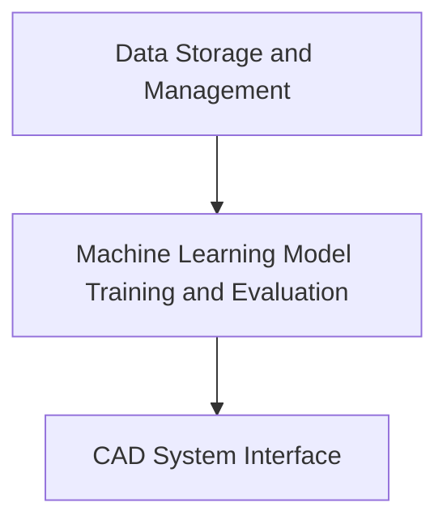

<h1 align='center'><b>Analyzing Medical Images for Disease Diagnosis in Malaysia 👨‍⚕️</b></h1> 

## 1. 📜 Executive Summary

This project aims to develop a computer-aided diagnostic (CAD) system for analyzing medical images to improve disease diagnosis in Malaysia. The objectives of the project are to train machine learning models on a dataset of medical images, evaluate the performance of the models using various metrics, and integrate the models into a CAD system that can assist medical professionals in making more accurate diagnoses.

The expected outcomes of the project include a dataset of annotated medical images, trained machine learning models that can accurately diagnose diseases, and a CAD system that can be used in clinical practice to aid medical professionals. The project has the potential to improve the accuracy and speed of disease diagnosis, ultimately leading to better patient outcomes in Malaysia.

## 2. 📝 Background:

</img>

Medical imaging plays a crucial role in modern healthcare for the diagnosis and treatment of various diseases. In Malaysia, the demand for medical imaging services has been growing due to an aging population and increasing incidence of chronic diseases. However, the shortage of qualified radiologists, coupled with the increasing complexity of medical images, has led to delays in diagnosis, misdiagnosis, and suboptimal treatment outcomes.

Interpreting medical images is a challenging task that requires expert knowledge and experience. Radiologists are trained to identify subtle differences in images that may indicate a disease or condition, but this process can be time-consuming and subject to human error. Additionally, the growing volume of medical images being generated presents a significant challenge to radiologists, as it increases their workload and reduces the amount of time they can spend on each case.

The proposed data science project aims to address these challenges by developing a computer-aided diagnostic (CAD) system that can assist radiologists in analyzing medical images. By leveraging machine learning algorithms trained on a large dataset of annotated medical images, the system can identify patterns and anomalies in images that may be indicative of a disease or condition. The system can then provide radiologists with a preliminary diagnosis or highlight areas of concern, reducing the time and effort required to analyze images and improving the accuracy of diagnosis.

The potential benefits of the proposed CAD system are significant. By improving the speed and accuracy of diagnosis, the system can reduce the time required for patients to receive treatment, which can be critical in cases where time is of the essence. Additionally, the system can help reduce the workload of radiologists and improve their efficiency, allowing them to spend more time on complex cases that require their expertise. Finally, the system can also help address the shortage of qualified radiologists by enabling healthcare providers to diagnose and treat more patients with existing resources. Overall, the proposed CAD system has the potential to significantly improve healthcare outcomes in Malaysia and enhance the quality of medical imaging services.

## 3. 🎯 Goals and Objectives:

Goals:
The main goal of the proposed project is to develop a computer-aided diagnostic (CAD) system for medical imaging analysis that can improve disease diagnosis in Malaysia. The CAD system will leverage machine learning models trained on a dataset of medical images to assist radiologists in making more accurate diagnoses, reducing the time and effort required to analyze images, and improving the efficiency of diagnosis. The ultimate goal is to improve patient outcomes and enhance the quality of medical imaging services in Malaysia.

Objectives:
1. Collect and annotate a dataset of medical images that covers a range of diseases and conditions relevant to Malaysia.
2. Train machine learning models on the dataset to accurately diagnose diseases and conditions in medical images.
3. Evaluate the performance of the machine learning models using various metrics, such as sensitivity, specificity, and accuracy.
4. Integrate the trained machine learning models into a CAD system that can assist radiologists in analyzing medical images.
5. Test the CAD system on a sample of medical images to ensure its accuracy and efficiency in diagnosing diseases and conditions.
6. Deploy the CAD system in clinical practice and monitor its performance in assisting radiologists in making diagnoses.
7. Evaluate the impact of the CAD system on diagnosis accuracy, diagnosis speed, radiologist workload, and patient outcomes.
8. Refine the CAD system based on feedback from medical professionals and patients to improve its performance and usability.

## 4. 🔍 Scope: 

<ul>
  <li>The scope of this project is to develop an AI system for the analysis of chest X-ray images of pediatric patients.</li>
  <li>The dataset comprises 5,863 high-quality X-Ray images (JPEG) of anterior-posterior view, with 2 categories - Pneumonia and Normal, which are organized into 3 folders (train, test, val) and contain subfolders for each image category (Pneumonia/Normal). The dataset was sourced from Kaggle, with the URL: https://www.kaggle.com/datasets/paultimothymooney/chest-xray-pneumonia.</li>
  <li>The main tool to be employed in this project is 3D Slicer. In addition, various tools and technologies such as machine learning algorithms, deep learning frameworks, image processing libraries, and cloud-based computing resources will be used to develop the AI system.</li>
  <li>The chest X-ray images were selected from retrospective cohorts of pediatric patients of one to five years old from Guangzhou Women and Children’s Medical Center, Guangzhou. The images were initially screened for quality control, and all low-quality or unreadable scans were removed from the dataset. The diagnoses for the images were then graded by two expert physicians, with the evaluation set checked by a third expert to account for any grading errors.</li>
  <li>The successful completion of the project will enable accurate and efficient diagnosis of chest X-ray images in pediatric patients, contributing to improved clinical outcomes and patient care.</li>
</ul>

## 5. 📄 Methodology:

The proposed data science project for developing a computer-aided diagnostic (CAD) system for analyzing medical images will be executed using the following methodology:

<ol>
	<li>Data Collection</li>
  	<ul>
 		<li>Medical images such as X-rays will be collected from various hospitals and medical centers in Malaysia. The images will be anonymized and stored in 		a secure database.</li>
  	</ul>
	<li>Data Cleaning and Preprocessing</li>
  	<ul>
  		<li>The collected images will be preprocessed to remove any noise or artifacts, and to standardize the image size and resolution. Image processing 		   techniques such as filtering and normalization will be applied to improve the image quality.</li>
  	</ul>
	<li>Feature Extraction</li>
  	<ul>
  		<li>Image segmentation techniques will be used to identify and extract relevant features from the medical images. These features will be used as inputs 		to the machine learning models.</li>
  	</ul>
	<li>Machine Learning Algorithms</li>
  	<ul>
  		<li>Several machine learning algorithms such as support vector machines (SVM), random forest, and convolutional neural networks (CNN) will be trained 		      on the annotated medical images to classify and diagnose various diseases.</li>
  	</ul>
	<li>Data Visualization</li>
  	<ul>
  		<li>The results generated by the machine learning models will be visualized using data visualization tools such as matplotlib and seaborn. The 			visualizations will be used to communicate the findings to healthcare professionals.</li>
  	</ul>
</ol>

The software and hardware resources required for the project include:

1. Python programming language for developing machine learning models and data visualization tools.
2. Deep learning libraries such as Flask and TensorFlow for developing CNN models.
3. Scikit-learn library for developing SVM and random forest models.
4. MongoDB database for storing and processing the large volumes of medical image data.
5. High-performance computing resources such as GPUs and multi-core processors for training the machine learning models.

## 6. ⚙️ System Architecture:

The proposed system architecture for the computer-aided diagnostic (CAD) system for analyzing medical images consists of three main components: data storage and management, machine learning model training and evaluation, and the CAD system interface. The system architecture will be implemented using various tools and technologies, including MongoDB, Python, TensorFlow, Flask, and React.

| Components | Description |
| ------------- | ------------- |
| Data Storage and Management  | The medical image dataset will be stored in MongoDB, a document-based NoSQL database that provides scalability and flexibility. MongoDB allows for efficient storage, retrieval, and querying of large datasets. The dataset will be annotated with labels that indicate the presence or absence of specific medical conditions.  |
| Machine Learning Model Training and Evaluation  | Python will be used for machine learning model training and evaluation. The TensorFlow library will be used to develop and train machine learning models on the annotated medical image dataset. The performance of the trained models will be evaluated using various metrics such as accuracy, precision, recall, and F1 score. The best-performing models will be selected and integrated into the CAD system.  |
| CAD System Interface | The CAD system interface will be developed using Flask, a Python-based web framework, and React, a JavaScript library for building user interfaces. The CAD system interface will provide medical professionals with a user-friendly interface to upload medical images, analyze the images using the 		  trained machine learning models, and receive diagnostic results. The CAD system interface will also include data visualization and analysis tools to enable medical professionals to explore and interpret the results of the machine learning models. |

The suggested system architecture calls for a server with at least 16 GB of RAM and a multi-core CPU in terms of hardware and software requirements. For the purpose of accelerating the training of machine learning models, the server should also include a GPU with at least 8 GB of VRAM. Python, TensorFlow, Flask, MongoDB, and a Linux operating system should all be installed on the server.

For data visualisation and analysis, the CAD system interface will make use of a variety of programmes and frameworks, such as Plotly and Matplotlib for dynamic and static plots, respectively. Medical professionals will be able to investigate and examine the diagnostic outcomes of the trained machine learning models using the interface's data tables, which will also be included.

Below are the flowchart for the system architecture:

## 7. 🛑 Risks and Limitations:

Even though analyzing medical images for disease diagnosis gives a lot of advantages both to doctors and patients, this process also poses several risks and limitations that should be considered. Below are points for technical, financial and legal risks:

<ol>
	<li> Technical Risks: </li>
<ul>
  <li> Accuracy of the analysis: Analyzing medical images needs for specialized equipment in terms of technology, specifically AI. Nevertheless, the accuracy of the analysis is based on the image quality, the radiologist or specialist's experience and expertise, and the technology's quality. Improper treatments or delayed diagnosis are the possible outcomes of wrong diagnosis.</li>
  <li> Security and privacy: The most private aspects of a person are their health information. Medical images contain sensitive patient information, including personal health information. Unauthorized disclosure may result in several discrimination and a breach of basic rights. Certain kinds of data processing may result in the infringement of personal rights and interests. As the context of their processing may pose serious threats to basic rights and freedoms, personal data, which are by their very nature highly sensitive in connection to those rights and freedoms, warrant special protection.</li>
</ul>
	<li> Financial Risks: </li>
<ul>
  <li> Cost: Medical image analysis may be costly, especially for cutting-edge technology like MRI or PET scans. The price of the software, maintenance, and hardware may be costly, which may have an impact on how much people must pay for healthcare.</li>
  <li> Return on investment: For certain patients or medical professionals, the expense of medical image analysis could exceed the advantages. Alternative diagnostic techniques occasionally may be less expensive and yield comparable or superior outcomes.</li>
</ul>
	<li> Legal Risks: </li>
<ul>
  <li> Liability: Medical image analysis is a crucial procedure with important patient consequences. Healthcare professionals or radiologists who diagnose ailments incorrectly or fail to spot problems run the danger of being held accountable.</li>
  <li> Regulatory compliance: Medical image analysis is subject to regulation by healthcare authorities, such as the Malaysian Medical Council. Providers must ensure that they are complying with regulations related to medical image analysis and patient privacy.</li>
</ul>
</ol>

## 8. ⏳ Deliverables and Milestones:

<table border="1" align="center">
  <tr>
    <th>Deliverables and Milestones</th>
    <th>Timeframe</th>
  </tr>
  <tr>
    <td>Data Collection</td>
    <td>Week 1-2</td>
  </tr>
  <tr>
    <td>Data Cleaning and Preprocessing</td>
    <td>Week 3-5</td>
  </tr>
  <tr>
    <td>Feature Extraction</td>
    <td>Week 6-8</td>
  </tr>
  <tr>
    <td>Machine Learning Algorithms</td>
    <td>Week 9-10</td>
  </tr>
  <tr>
    <td>Data Visualizations</td>
    <td>Week 11-12</td>
  </tr>
  <tr>
    <td>Report</td>
    <td>Week 13-14</td>
  </tr>
</table>

## 9. 📚 Resources:

- Provide a detailed breakdown of the resources required for the proposed data science project, including staff, equipment, software, and other expenses.

## 10. 🧰 Technical Specifications:

<ol>
<li>Data Schema:</li>
<ul>
	<li>The dataset consists of 5,863 X-Ray images (JPEG) of anterior-posterior view, with 2 categories - Pneumonia and Normal.</li>
	<li>The dataset is organized into 3 folders (train, test, val) and contains subfolders for each image category (Pneumonia/Normal).</li>
</ul>
<li>Data Transformations:</li>
<ul>
	<li>Data pre-processing will be performed to normalize and standardize the image data.</li>
	<li>Data augmentation techniques such as rotation, zooming, and flipping will be used to increase the diversity of the dataset and improve model performance.</li>
</ul>
<li>Machine Learning Algorithms:</li>
<ul>
	<li>Convolutional Neural Networks (CNN) will be used for image classification tasks.</li>
	<li>Transfer learning techniques will be used to leverage pre-trained models and improve the efficiency of the model training process.</li>
</ul>
<li>Data Visualization Tools:</li>
<ul>
	<li>Matplotlib and Seaborn will be used for data visualization tasks.</li>
	<li>Tableau.</li>
</ul>
<li>Programming Languages, Frameworks, and Libraries:</li>
<ul>
	<li>Python will be used as the primary programming language.</li>
	<li>Tensorflow will be used as the deep learning frameworks.</li>
	<li>Scikit-learn will be used for machine learning algorithms.</li>
	<li>OpenCV will be used for image processing tasks.</li>
	<li>Numpy and Pandas will be used for data manipulation and analysis.</li>
</ul>
<li>Hardware and Software Requirements:</li>
<ul>
	<li>A machine with a minimum of 8GB RAM and a dedicated GPU (e.g. Nvidia GTX 1080) is recommended for training the deep learning models.</li>
	<li>The software requirements include Python 3.6+, Tensorflow, Scikit-learn, OpenCV, Numpy, and Pandas.</li>
</ul>
<li>Data Security Measures:</li>
<ul>
	<li>The dataset will be stored securely on a password-protected machine.</li>
	<li>Access to the dataset will be restricted to authorized personnel only.</li>
	<li>Any data backups will also be stored securely with proper encryption.</li>
</ul>
</ol>

## 11. 🏁 Timeline and Deliverables: 

- Provide a detailed timeline for the project, including milestones and deadlines.

- Specify the deliverables that will be provided at each milestone. It should also specify the expected time frame for each deliverable and the resources that will be required to complete the project.

- Explain the quality assurance and testing procedures that will be followed.

## 12. 📄 Conclusion:

- Conclude your proposal with a call to action, highlighting the benefits of your proposed solution and urging the decision-makers to take action.

- Summarize the proposal and reiterate the importance of the project.

- Mention any potential limitations or challenges that may arise during the project.

- Provide a call to action for the client to approve the proposal and proceed with the project.
