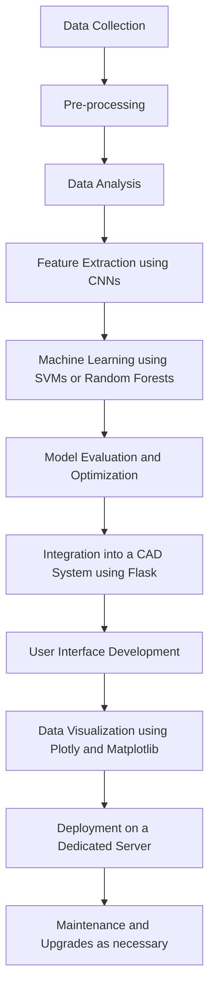

<h1 align='center'><b>Predictive Maintenance for Playground Equipment Inspection and Maintenance 👷‍♂️</b></h1> 

## Table of Contents
* [📜 Executive Summary](#-executive-summary)
* [📝 Background](#-background)
* [🎯 Goals and Objectives](#-goals-and-objectives)
* [🔍 Scope](#-scope)
* [📄 Methodology](#-methodology)
* [⚙️ System Architecture](#-system-architecture)
* [🛑 Risks and Limitations](#-risks-and-limitations)
* [⏳ Deliverables and Milestones](#-deliverables-and-milestones)
* [📚 Resources](#-resources)
* [🧰 Technical Specifications](#-technical-specifications)
* [🏁 Timeline and Deliverables](#-timeline-and-deliverables)
* [📄 Conclusion](#-conclusion)

## 📜 Executive Summary

Playgrounds are an essential part of any community, providing children with an outlet for physical activity, socialization, and play. As such, it is crucial to ensure that these playgrounds are safe and in good condition. This project aims to develop a predictive maintenance system for playground equipment inspection and maintenance. By leveraging data collected from playground surveillance footage, the system will be able to identify potential maintenance issues and predict when maintenance will be required, allowing for more efficient and effective playground upkeep.


## 📝 Background:
<p align="center">
</img>
</p>

Playgrounds are often the focal point of outdoor play for children in communities across the world. As such, it is crucial that playground equipment is maintained in good working order to prevent injuries and ensure the equipment's longevity. However, traditional maintenance practices for playground equipment can be reactive, relying on periodic inspections and repairs after issues arise. This approach can be time-consuming, costly, and may not prevent equipment failures or hazards.

Moreover, environmental factors such as exposure to the sun, wind, rain, and snow can cause significant wear and tear on playground equipment. Other factors such as heavy usage, vandalism, and equipment age can also contribute to the degradation of equipment. Furthermore, these factors may vary from one location to another, making it challenging to predict when and where maintenance will be required.

Predictive maintenance for playground equipment inspection and maintenance involves the use of  and data analytics to identify potential maintenance issues before they become critical problems. This approach enables maintenance personnel to schedule proactive maintenance tasks that can prevent equipment failures and injuries. Moreover, it can help reduce maintenance costs by prioritizing maintenance activities based on need rather than a rigid schedule.

The implementation of a predictive maintenance system for playground equipment inspection and maintenance requires the collection of data from surveillance footage from CCTV's placed around the playground. From the footage, physical damages should be visible and easily detected. The data collected can then be analyzed using machine learning algorithms to identify patterns and predict when maintenance will be required. The system can then alert maintenance personnel of potential maintenance needs before critical issues arise.

In summary, predictive maintenance for playground equipment inspection and maintenance can provide several benefits over traditional reactive maintenance practices. It can help reduce maintenance costs, increase equipment lifespan, and improve overall safety. By using the images captured from the footage and data analytics to predict maintenance needs, playground equipment can be proactively maintained, and potential hazards can be prevented.


## 🎯 Goals and Objectives:

Goals:
The primary objective of this project is to develop a predictive maintenance system for playground equipment inspection and maintenance. This system will be able to collect visual data from the surveillance footage captured from the CCTV's around the playground. The data collected will then be analyzed using machine learning algorithms to identify patterns and predict when maintenance will be required. The goals of this project are as follows:

1. Identify the key parameters that impact the health and safety of playground equipment.
2. Develop a data collection system using images captured by CCTV's in the playgrounds vicinity.
3. Develop machine learning algorithms to analyze the images and predict maintenance needs based on the physical condition.
4. Build a dashboard that displays the status of the equipment and alerts maintenance personnel when maintenance is required.
5. Test and validate the predictive maintenance system in real-world playground settings.

In summary, this project aims to develop a predictive maintenance system that leverages data analytics and machine learning algorithms to identify potential maintenance needs for playground equipment. By doing so, we hope to improve the safety, efficiency, and effectiveness of playground maintenance.


## 🔍 Scope: 

The scope of this project is to develop a predictive maintenance system for playground equipment inspection and maintenance. The system will use surveillance footage to collect images of the playground equipment and machine learning algorithms to analyze this images to predict when maintenance will be required. The system will also provide alerts to maintenance personnel when maintenance is needed.

The project's primary focus is on developing the technology required for predictive maintenance of playground equipment. The system will use the surveillance footage and images captured by the CCTV's that are focused at the playground equipment to collect data, which will be analyzed using machine learning algorithms to identify patterns and predict maintenance needs. A dashboard will be developed to display the status of the equipment and alert maintenance personnel when maintenance is required.

The project will also involve testing and validating the predictive maintenance system in real-world playground settings. The validation will include comparing the predicted maintenance needs to actual maintenance requirements and assessing the system's effectiveness in reducing maintenance costs, increasing equipment lifespan, and improving overall safety.

The project's scope does not include any physical modifications or repairs to the playground equipment itself. The predictive maintenance system will only provide alerts for maintenance needs, and it will be up to the maintenance personnel to address these needs.

Overall, the project's scope is to develop a predictive maintenance system for playground equipment inspection and maintenance that can help reduce maintenance costs, increase equipment lifespan, and improve overall safety.


## 📄 Methodology:

The proposed data science project for developing a computer-aided diagnostic (CAD) system for analyzing medical images will be executed using the following methodology:

<ol>
	<li>Data Collection</li>
  	<ul>
 		<li>Medical images such as X-rays will be collected from various websites. The images will be anonymized and stored in 		a secure database.</li>
  	</ul>
	<li>Data Cleaning and Preprocessing</li>
  	<ul>
  		<li>The collected images will be preprocessed to remove any noise or artifacts, and to standardize the image size and resolution. Image processing 		   techniques such as filtering and normalization will be applied to improve the image quality.</li>
  	</ul>
	<li>Feature Extraction</li>
  	<ul>
  		<li>Image segmentation techniques will be used to identify and extract relevant features from the medical images. These features will be used as inputs 		to the machine learning models.</li>
  	</ul>
	<li>Machine Learning Algorithms</li>
  	<ul>
  		<li>Several machine learning algorithms such as support vector machines (SVM), random forest, and convolutional neural networks (CNN) will be trained 		      on the annotated medical images to classify and diagnose various diseases.</li>
  	</ul>
	<li>Data Visualization</li>
  	<ul>
  		<li>The results generated by the machine learning models will be visualized using data visualization tools such as matplotlib and seaborn. The 			visualizations will be used to communicate the findings to healthcare professionals.</li>
  	</ul>
</ol>

The software and hardware resources required for the project include:

1. Python programming language for developing machine learning models and data visualization tools.
2. Deep learning libraries such as Flask and TensorFlow for developing CNN models.
3. Scikit-learn library for developing SVM and random forest models.
4. MongoDB database for storing and processing the large volumes of medical image data.
5. High-performance computing resources such as GPUs and multi-core processors for training the machine learning models.


## ⚙️ System Architecture:

The CAD system architecture will consist of various components, including data collection, pre-processing, data analysis, feature extraction, machine learning, CAD system integration, and others. MongoDB will be used to store and manage the pre-processed medical image data, and TensorFlow will be used to build and train the machine learning models. The CAD system will be developed using Flask, a Python-based web framework, and will include interactive and static data visualization tools such as Plotly and Matplotlib.


| No. | Components | Description |
| ------------- | ------------- | ------------- |
| 1. | Data Collection | Collect medical images from various sources such as hospitals and medical research institutions. |
| 2. | Pre-processing | Remove noise, artifacts, and irrelevant information from the images. Resize, normalize, and standardize the images to ensure consistency across the dataset. Label the images to indicate the presence or absence of specific medical conditions. |
| 3. | Data Analysis | Conduct exploratory data analysis (EDA) techniques such as data visualization to gain insights into the data and identify potential outliers or anomalies. |
| 4. | Feature Extraction | Extract meaningful features from the pre-processed images using techniques such as convolutional neural networks (CNNs). |
| 5. | Machine Learning | Train a machine learning model such as a support vector machine (SVM) or random forest using the extracted features to predict the presence or absence of specific medical conditions. |
| 6. | Model Evaluation | Evaluate the performance of the machine learning model using various metrics such as accuracy, precision, and recall. |
| 7. | Model Optimization | Optimize the machine learning model using hyperparameter tuning and cross-validation techniques. |
| 8. | CAD System Integration | Integrate the trained and optimized machine learning model into a CAD system that can assist medical professionals in making more accurate diagnoses. |
| 9. | User Interface | Develop a user-friendly interface for the CAD system that includes various data visualization techniques such as interactive and static plots, data tables, and heatmaps. |
| 10. | Deployment | Deploy the CAD system on a server with appropriate hardware and software resources such as a GPU with at least 8 GB of VRAM, a Linux operating system with Python, TensorFlow, Flask, and MongoDB installed, and data visualization and analysis tools such as Plotly and Matplotlib. |
| 11. | Maintenance | Regularly monitor and upgrade the hardware and software resources as necessary to ensure optimal performance of the CAD system. |

___

<ol>
	<li>Data Storage and Management:</li>
<br>
<p>MongoDB is a NoSQL document-oriented database that is highly suitable for handling large and complex datasets such as medical images. MongoDB stores data in collections of documents, which are JSON-like structures that allow for flexible and efficient data storage and retrieval. In the proposed system architecture, MongoDB will be used to store and manage pre-processed medical image data.</p>

<p>The medical images will be pre-processed to extract features relevant to disease diagnosis, and the resulting features will be stored as documents in MongoDB collections. Each document will represent a single medical image and will include the extracted features, metadata such as patient ID, and other relevant information.</p>

MongoDB provides several features that are beneficial for managing and analyzing large datasets, including:
	<ul>
<li>Scalability: MongoDB is highly scalable and can handle large volumes of data, making it suitable for storing medical image data.</li>

<li>Indexing: MongoDB supports indexing, which allows for fast retrieval of data based on specific criteria. This feature is essential for efficient querying of medical image data.</li>

<li>Aggregation: MongoDB supports powerful aggregation capabilities, which enable complex data analysis and processing.</li>
	</ul>
<br>
<li>Data Analysis:</li>
<br>
<p>MongoDB provides several features that facilitate data analysis, including indexing, aggregation, and real-time querying capabilities. The data analysis will be performed using Python-based data analysis libraries such as NumPy, Pandas, and Scikit-learn, which provide a wide range of data analysis tools, including data cleaning, preprocessing, feature selection, and feature extraction. These libraries will be used to manipulate and analyze the data stored in MongoDB, enabling the extraction of meaningful insights and patterns from the data. Data visualization tools such as Matplotlib and Plotly will be used to visualize the results of the data analysis.</p>
<br>
<li>Hardware and Software Requirements:</li>
<br>
<p>To support the use of MongoDB in the proposed system architecture, the following hardware and software requirements will be needed:</p>
	<ul>
<li>A dedicated server: MongoDB requires a dedicated server with sufficient storage capacity and processing power to handle large volumes of medical image data. The server should have at least 16 GB of RAM, a multi-core CPU, and sufficient disk space to store the data.</li>

<li>MongoDB database: The MongoDB database will need to be installed and configured on the dedicated server. MongoDB can be installed on Windows, macOS, and Linux operating systems.</li>

<li>Python: The system will require a Python installation with the appropriate libraries and packages for interacting with the MongoDB database. The recommended package for this is PyMongo, which provides a Python API for interacting with MongoDB.</li>

<li>Data pre-processing software: Before storing the medical images in MongoDB, they will need to be pre-processed to extract relevant features. This will require the use of software tools such as OpenCV or TensorFlow, depending on the specific feature extraction technique being used.</li>
	</ul>
</ol>

___

The proposed system architecture will employ various tools and frameworks for data visualization and analysis, including:
 | Tools/Frameworks | Description |
 | ------------- | ------------- |
| Matplotlib | Matplotlib is a popular data visualization library for Python. It provides a wide range of functions for creating visualizations such as line charts, bar charts, scatterplots, and histograms. Matplotlib can also be used to create customized visualizations to meet specific requirements. |
| Plotly | Plotly is a web-based data visualization framework that allows for the creation of interactive visualizations. It provides a wide range of chart types, including 3D charts, scatterplots, and heatmaps. Plotly is highly customizable and supports the creation of customized dashboards for data exploration and analysis. |
| Seaborn | Seaborn is a data visualization library that is built on top of Matplotlib. It provides a high-level interface for creating statistical graphics such as heatmaps, regression plots, and distribution plots. Seaborn is highly customizable and supports the creation of complex visualizations with minimal coding. |
| Tableau | Tableau is a data visualization and business intelligence tool that allows for the creation of interactive dashboards and reports. Tableau provides a wide range of chart types, including bar charts, line charts, and scatterplots. It also supports the integration of multiple data sources, allowing for the creation of comprehensive dashboards for data analysis. |
| Scikit-learn | Scikit-learn is a popular machine learning library for Python. It provides a wide range of machine learning algorithms for tasks such as classification, regression, clustering, and dimensionality reduction. Scikit-learn also provides tools for data preprocessing, feature selection, and model evaluation. |
| Pandas | Pandas is a Python library for data manipulation and analysis. It provides data structures for efficiently handling and manipulating large datasets, including time series data. Pandas also supports data visualization using Matplotlib. |
| NumPy | NumPy is a Python library for scientific computing. It provides support for large, multi-dimensional arrays and matrices, along with a wide range of mathematical functions. NumPy is often used in conjunction with other data analysis libraries such as Pandas and Scikit-learn. |

___

Flowchart of the CAD System Architecture::


## 🛑 Risks and Limitations:

Even though analyzing medical images for disease diagnosis gives a lot of advantages both to doctors and patients, this process also poses several risks and limitations that should be considered. Below are points for technical, financial and legal risks:

<ol>
	<li> Technical Risks: </li>
<ul>
  <li> False positives and false negatives: Predictive maintenance relies on data and algorithms to predict equipment failures. However, the accuracy of the prediction depends on the quality and quantity of the data, as well as the effectiveness of the algorithms. False positives (predicting a failure that does not occur) and false negatives (not predicting a failure that does occur) can result in unnecessary maintenance costs or safety hazards.</li>
  <li> Data quality and availability: Predictive maintenance requires accurate and timely data from the equipment sensors, which may not be available or reliable in some cases. For example, outdoor playground equipment may be subject to weather conditions that affect the sensors' accuracy or even cause sensor failure.</li>
  <li> Sensor placement and maintenance: Sensors must be properly placed and maintained to provide accurate data. Failure to do so may result in false readings, leading to incorrect predictions and increased maintenance costs.</li>
</ul>
	<li> Financial Risks: </li>
<ul>
  <li> Equipment and software costs: Implementing predictive maintenance requires an initial investment in equipment sensors, software, and other hardware. The cost of these components can be significant, depending on the size and complexity of the playground equipment.</li>
  <li> Maintenance costs: Predictive maintenance can help reduce maintenance costs by predicting failures before they occur. However, there is still a cost associated with maintaining the equipment sensors, software, and other hardware components, as well as conducting the necessary repairs and replacements.</li>
</ul>
	<li> Legal Risks: </li>
<ul>
  <li> Liability: Playground equipment is subject to safety regulations and standards, and failure to comply with these regulations can result in legal liabilities. Implementing predictive maintenance can help reduce the risk of safety hazards, but it does not eliminate the need to comply with safety regulations and standards.</li>
  <li> Data privacy: Predictive maintenance requires the collection and analysis of data from the equipment sensors, which may include personal or sensitive information. The misuse or mishandling of this data can result in legal liabilities related to data privacy and security.</li>
</ul>
</ol>

## ⏳ Deliverables and Milestones:

<table border="1" align="center">
  <tr>
    <th>Deliverables and Milestones</th>
    <th>Timeframe</th>
  </tr>
  <tr>
    <td>Planning and Requirements Gathering</td>
    <td>Week 1-2</td>
  </tr>
  <tr>
    <td>Data Exploration and Cleaning</td>
    <td>Week 3-5</td>
  </tr>
  <tr>
    <td>Feature Engineering</td>
    <td>Week 6</td>
  </tr>
  <tr>
    <td>Model Selection and Training</td>
    <td>Week 7-9</td>
  </tr>
  <tr>
    <td>Model Evaluation and Refinement</td>
    <td>Week 10</td>
  </tr>
  <tr>
    <td>Dashboard Development</td>
    <td>Week 11-12</td>
  </tr>
  <tr>
    <td>Deployment and Documentation</td>
    <td>Week 13-14</td>
  </tr>
</table>


## 📚 Resources:

<ol>
  <li>
    <p>Staff:</p>
    <ul>
      <li>Project Manager</li>
      <li>Data Scientist</li>
      <li>Machine Learning Engineer</li>
      <li>Radiologist (to provide domain expertise)</li>
      <li>Annotators for the medical images</li>
    </ul>
  </li>
  <li>
    <p>Equipment:</p>
    <ul>
      <li>High-performance computing equipment (e.g., GPU-enabled workstations or cloud computing resources) to train machine learning models on the medical image dataset</li>
      <li>Computers for the staff to work on</li>
    </ul>
  </li>
  <li>
    <p>Software:</p>
    <ul>
      <li>3D Slicer, a medical imaging software for visualization and analysis of medical images</li>
      <li>Machine learning algorithms, such as supervised learning (e.g., convolutional neural networks, decision trees) and unsupervised learning (e.g., clustering)</li>
      <li>Deep learning frameworks, such as TensorFlow or PyTorch</li>
      <li>Image processing libraries, such as OpenCV</li>
      <li>Annotation software for labeling medical images</li>
      <li>Collaboration and project management tools, such as Jira, Trello, and GitHub</li>
    </ul>
  </li>
  <li>
    <p>Other expenses:</p>
    <ul>
      <li>Data acquisition and storage</li>
      <li>Annotation costs</li>
      <li>Cloud computing costs (if using cloud-based resources)</li>
      <li>Travel and accommodation costs for the project team to meet and work together, if necessary.</li>
    </ul>
  </li>
</ol>


## 🧰 Technical Specifications:

<ol>
<li>Data Schema:</li>
<ul>
	<li>The dataset consists of 5,863 X-Ray images (JPEG) of anterior-posterior view, with 2 categories - Pneumonia and Normal.</li>
	<li>The dataset is organized into 3 folders (train, test, val) and contains subfolders for each image category (Pneumonia/Normal).</li>
</ul>
<li>Data Transformations:</li>
<ul>
	<li>Data pre-processing will be performed to normalize and standardize the image data.</li>
	<li>Data augmentation techniques such as rotation, zooming, and flipping will be used to increase the diversity of the dataset and improve model performance.</li>
</ul>
<li>Machine Learning Algorithms:</li>
<ul>
	<li>Convolutional Neural Networks (CNN) will be used for image classification tasks.</li>
	<li>Transfer learning techniques will be used to leverage pre-trained models and improve the efficiency of the model training process.</li>
</ul>
<li>Data Visualization Tools:</li>
<ul>
	<li>Matplotlib and Seaborn will be used for data visualization tasks.</li>
	<li>Tableau.</li>
</ul>
<li>Programming Languages, Frameworks, and Libraries:</li>
<ul>
	<li>Python will be used as the primary programming language.</li>
	<li>Tensorflow will be used as the deep learning frameworks.</li>
	<li>Scikit-learn will be used for machine learning algorithms.</li>
	<li>OpenCV will be used for image processing tasks.</li>
	<li>Numpy and Pandas will be used for data manipulation and analysis.</li>
</ul>
<li>Hardware and Software Requirements:</li>
<ul>
	<li>A machine with a minimum of 8GB RAM and a dedicated GPU (e.g. Nvidia GTX 1080) is recommended for training the deep learning models.</li>
	<li>The software requirements include Python 3.6+, Tensorflow, Scikit-learn, OpenCV, Numpy, and Pandas.</li>
</ul>
<li>Data Security Measures:</li>
<ul>
	<li>The dataset will be stored securely on a password-protected machine.</li>
	<li>Access to the dataset will be restricted to authorized personnel only.</li>
	<li>Any data backups will also be stored securely with proper encryption.</li>
</ul>
</ol>

## 🏁 Timeline and Deliverables: 

<div class="mermaid">

  ```mermaid
gantt
    title Predictive Maintenance for Playground Equipment Gantt Chart
    dateFormat  YYYY-MM-DD
    section Planning and Requirements Gatherings
    Requirements Gatherings  :2023-03-19 , 14d
  
    section Data Exploration and Cleaning
    Data Collection            :2023-04-02  , 10d
    Data Cleaning              :2023-04-12 , 6d
    Data Analysis              :2023-04-18 , 5d
  
    section Feature Engineering
    Features identification        :2023-04-23 , 7d
 
    section Model Selection and Training
    Model Selection        :2023-04-30 , 7d
    Model Training     :2023-05-07 , 7d
	
    section Model Evaluation and Refinement
    Model Evaluation        :2023-05-08 , 2d
    Model Refinement        :2023-05-10 , 3d
   
    section Dashboard development
    Dashboard development              :2023-05-14 , 14d
    Testing     :2023-05-28 , 2d
  
    section Deployment and documentation
    Deployment     :2023-05-29  , 15d
    Documentation     :2023-06-13 , 7d
  
  ```
  </div>


<ol start="2">
	<li>Deliverables and Resources:</li>
</ol>
<ul>
	<li>
		Data Collection:<br>
		Deliverable: Complete dataset;<br> 
		Resources: Data acquisition and storage
	</li>
	<li>
		Data Cleaning and Preprocessing: <br>
		Deliverable: Cleaned and standardized dataset; <br>
		Resources: Computers for staff, image processing libraries
	</li>
	<li>
		Feature Extraction: <br>
		Deliverable: Extracted features from dataset; <br>
		Resources: High-performance computing equipment, deep learning frameworks</li>
	<li>
		Machine Learning Algorithms: <br>
		Deliverable: Trained machine learning models; <br>
		Resources: High-performance computing equipment, supervised and unsupervised learning algorithms</li>
	<li>
		Data Visualizations: <br>
		Deliverable: Visualizations of dataset and model performance; <br>
		Resources: Matplotlib, Seaborn, Tableau</li>
	<li>
		Report: <br>
		Deliverable: Final report on the project; <br>
		Resources: Collaboration and project management tools
	</li>
</ul>
<ol start="3">
	<li>Quality Assurance and Testing Procedures:</li>
</ol>
<ul>
	<li>Cross-validation will be used to assess model performance and prevent overfitting.</li>
	<li>The dataset will be split into training, validation, and test sets.</li>
	<li>Hyperparameter tuning will be performed to optimize model performance.</li>
	<li>A radiologist will provide domain expertise to ensure the accuracy of the image annotations.</li>
	<li>The final report will include a discussion of limitations and potential areas for improvement.</li>
</ul>


## 📄 Conclusion:

In conclusion, our proposed solution for automating the diagnosis of pneumonia through machine learning algorithms has the potential to revolutionize the medical field. By leveraging state-of-the-art technology and techniques, we aim to provide a robust and accurate diagnostic tool for medical professionals to assist in making informed decisions about patient care. Our project timeline, deliverables, and technical specifications have been carefully planned to make sure the project is executed efficiently and effectively. We are confident in our ability to deliver high-quality results within the proposed timeframe and budget. However, we recognize that challenges and limitations may arise during the project, such as data quality issues or hardware constraints. We believe that our proposed solution has the potential to make a significant impact in the medical field, and we are excited about the prospect of working on this project.
