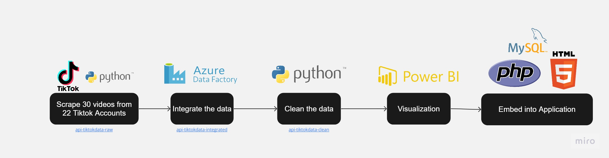

<h1 align='center'> 
 Food Influencer Tiktok Analytics Dashboard
 </h1>

  

 
</strong>

 

<h2 align=center>Group Members</h2>
<table align=center>
  <tr>
    <th>Name</th>
    <th>Matric No.</th>
  </tr>
  <tr>
    <td>MYZA NAZIFA BINTI NAZRY</td>
    <td>A20EC0219</td>
  </tr>
  <tr>
    <td>NUR IZZAH MARDHIAH BINTI RASHIDI</td>
    <td>A20EC0116</td>
  </tr>
    <tr>
    <td>AMIRAH RAIHANAH BINTI ABDUL RAHIM</td>
    <td>A20EC0182</td>
  </tr>
    <tr>
    <td>RADIN DAFINA BINTI RADIN ZULKAR NAIN</td>
    <td>A20EC0135</td>
  </tr>
</table>
<h3>Introduction</h3>
Welcome to our TikTok Analysis Dashboard! In the ever-evolving world of social media, TikTok has emerged as one of the most popular platforms for sharing short-form videos. With millions of active users worldwide, it has become a goldmine for creators, influencers, and businesses looking to engage with their target audience.

Our TikTok Analysis Dashboard is designed to provide you with valuable insights and metrics to help you understand and optimize your TikTok performance. Whether you're an individual content creator, a brand, or a marketer, this dashboard will empower you to make data-driven decisions and enhance your TikTok strategy.

Through our comprehensive analytics, you'll gain a deep understanding of your TikTok account's growth, engagement, and audience demographics. You'll be able to track key metrics such as followers, likes, comments, shares, and video views. These insights will enable you to identify which types of content resonate most with your audience and guide you in producing high-quality and engaging videos.

Additionally, our TikTok Analysis Dashboard provides competitive analysis features. You can benchmark your performance against other TikTok accounts in your niche or industry, identify emerging trends, and gain inspiration from successful creators. By keeping a close eye on your competitors, you can stay ahead of the curve and adapt your content strategy accordingly.

Ultimately, our TikTok Analysis Dashboard is a powerful tool that equips you with the necessary insights to optimize your TikTok presence and achieve your goals. So, let's dive in, harness the power of data, and unlock your TikTok potential like never before!

### 📂Content:
* 📑 [Report](https://github.com/drshahizan/special-topic-data-engineering/blob/main/project/submission/DataAce/report.md)
* 📖 [Web Development file](https://github.com/drshahizan/special-topic-data-engineering/tree/main/project/submission/DataAce/tiktokanalysis)
* 📖 [Data Clening](https://github.com/drshahizan/special-topic-data-engineering/blob/main/project/submission/DataAce/datacleaning_tiktok.ipynb)
* 📖 [API Scraping Python](https://github.com/drshahizan/special-topic-data-engineering/tree/main/project/submission/DataAce/apiscraping-tiktokpy) 
* 📖 [Data Integration Log from Azure Data Factory file](https://github.com/drshahizan/special-topic-data-engineering/tree/main/project/submission/DataAce/data-integration)
* 📖 [Raw Data from API scraping](https://github.com/drshahizan/special-topic-data-engineering/tree/main/project/submission/DataAce/api-tiktokdata-raw)
* 📖 [Raw Data integrated using ADF file](https://github.com/drshahizan/special-topic-data-engineering/tree/main/project/submission/DataAce/api-tiktokdata-integrated) 
* 📖 [Cleaned and Transformed Data](https://github.com/drshahizan/special-topic-data-engineering/tree/main/project/submission/DataAce/api-tiktokdata-clean) 

