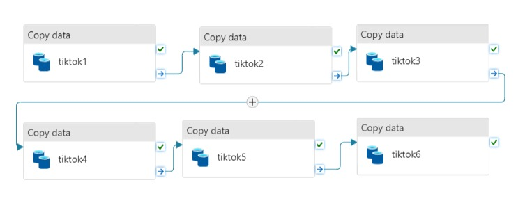
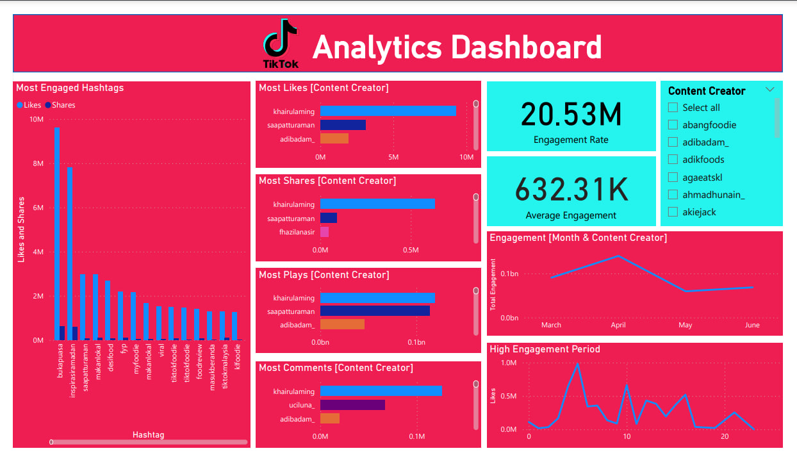
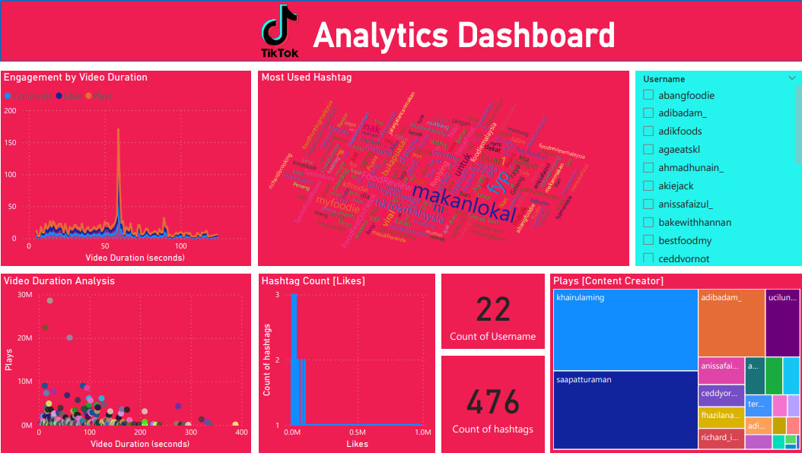
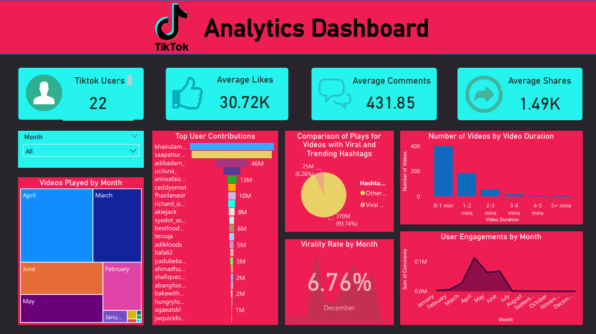
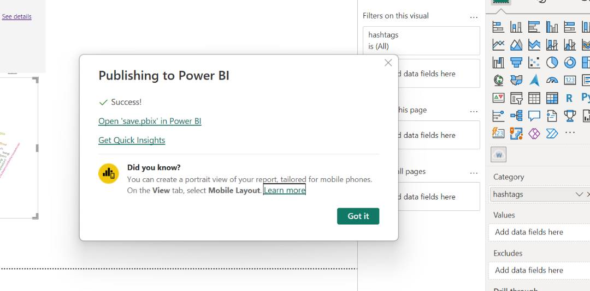

<h1 align="center">Food Influencer Tiktok Analytics Dashboard <br></br<a href="#" target="_blank" rel="noreferrer">  </a> </h1>
<div align="center">
  
</div>

<table align=center>
  <tr>
    <th>Name</th>
    <th>Matric No.</th>
  </tr>
  <tr>
    <td>MYZA NAZIFA BINTI NAZRY</td>
    <td>A20EC0219</td>
  </tr>
  <tr>
    <td>NUR IZZAH MARDHIAH BINTI RASHIDI</td>
    <td>A20EC0116</td>
  </tr>
    <tr>
    <td>AMIRAH RAIHANAH BINTI ABDUL RAHIM</td>
    <td>A20EC0182</td>
  </tr>
    <tr>
    <td>RADIN DAFINA BINTI RADIN ZULKAR NAIN</td>
    <td>A20EC0135</td>
  </tr>
</table>

# Table of Content
* [Introduction](#-introduction)
* [Background](#️-background)
* [Objectives](#-objectives)
* [Methodology](#️-methodology)
* [Data Analysis](#️-data-analysis)
* [Fodler Structure](#️-folder-structure)
* [Visualization](#️-visualization)
* [Insights](#️-insights)
* [Conclusion](#️-conclusion)

## Introduction
In today's dynamic digital landscape, social media platforms have become influential stages for creators and influencers to captivate audiences and make a mark in their respective industries. Among these platforms, TikTok has emerged as a powerhouse, offering a vibrant space for food influencers to showcase their culinary prowess and engage with millions of viewers.

The purpose of this report is to provide a comprehensive analysis of the performance and impact of Top 22 Food Influencer on TikTok. By leveraging data-driven insights and analytics, we aim to gain a deeper understanding of Food Influencer's audience demographics, engagement metrics, content trends, and overall growth. Through this report, we seek to provide valuable information to help Food Influencer optimize their content strategy and enhance their influence in the realm of food-centric TikTok content.
## Background

In recent years, TikTok has emerged as a global phenomenon, attracting millions of users who create and engage with short video content. One of the most popular categories on TikTok is food-related content, where influencers showcase their culinary skills, share recipes, and offer unique dining experiences. This trend has given rise to a new breed of content creators known as food influencers.

Inspired by the growing popularity of food influencers on TikTok, our project aims to develop a Food Influencer TikTok Analytics Dashboard. This dashboard will provide a comprehensive analysis of the performance and impact of the top 22 food influencers in Malaysia. By analyzing various metrics and data points, we seek to uncover valuable insights into the success factors, audience engagement, and content trends of these influencers.

The motivation behind this project stems from our curiosity to understand the dynamics of the food influencer landscape in Malaysia. With the surge in popularity of food-related content on TikTok, we wanted to explore the factors that contribute to the success of these influencers. By delving into their content strategies, engagement levels, and viral trends, we aim to gain a deeper understanding of what resonates with TikTok users in the food niche.

By developing the Food Influencer TikTok Analytics Dashboard, we believe it will not only provide valuable insights for marketing professionals and brands interested in collaborating with food influencers but also serve as a source of inspiration for aspiring content creators. Furthermore, this project allows us to apply our data analysis and visualization skills in a real-world context, combining our passion for food and interest in social media trends. By uncovering key patterns and insights, we aim to provide actionable information that can benefit both influencers and brands in their pursuit of effective content creation and audience engagement.

## Objective
* Caption Analysis: By analyzing Food Influencer's caption usage, we aim to evaluate the effectiveness of their content narratives and storytelling techniques. This includes examining factors such as caption length, tone, language style, and call-to-action elements. Understanding the impact of captions will enable Food Influencer's to craft engaging and compelling narratives that resonate with their audience.

* Hashtag Evaluation: Assessing Food Influencer's hashtag usage is crucial in optimizing content discoverability and increasing reach. We will analyze the types of hashtags utilized, their relevance to the content, and their popularity among TikTok users. This analysis will help Food Influencer's identify effective hashtag strategies and ensure their content is reaching the intended target audience.

* Engagement and Reach: By correlating caption and hashtag usage with engagement metrics such as likes, comments, shares, and video views, we can evaluate the impact of captions and hashtags on audience engagement and content reach. This analysis will uncover patterns and trends that contribute to higher engagement rates, enabling Food Influencer's to refine their approach and maximize the impact of their content.
## Methodology
<h3>1. Data Scraping using TiktokPy API</h3>
Firstly, to gather the data for our Data Science project we use TiktokPy API to get live data from Tiktok. Data retrieved includes Username, Caption, Video Duration, Upload Date, Comment, Plays, Shares, Likes and Hashtags. API used is from 📂[TiktokPy](https://my-tailwind-nextjs-starter-blog.vercel.app/blog/how-to-use-tiktokpy-for-beginner-programmers-indepth-guide).

#### Steps
a) Open Visual Studio and create quicklogin.py.
   
<div align = "center"> </div>

<br>
b) Create quickstart.py that contains attributes to be fetch from TikTok.
 
<div align = "center">   </div>
<br>
c) In terminal run this command.

<div align = "center">   </div>
<br>
d) The command will redirect to TikTok page and sign in required.
   
<div align = "center">   </div>

<br>
e) Next, run this command.

<div align = "center">   </div>

<br>
f) Then, it will retrieve the data like below and save it to CSV file.
<div align = "center">   </div>

<br>
g) Data scraping using TiktokPy API done.

<h3>2. Data Integration using Azure Data Factory</h3>
Next, since the API scraping require multiple times of scraping so the data are saved into different CSV files. Hence, integration of files need to be done for further analysis on the data. We used Azure Data Factory to integrate our CSV files.
<div align = "center"> </div>

<h3>3. Data Cleaning and Transformation</h3>
After data integration, now the data need to be clean and transformed to gain better analytics from it. We used Python to clean the data and Google Collab as our text editor.
<br>
a)  Open Google Collab

b) Upload the CSV file of the data into Google Drive.

c) Import the file into Google Collab as below.


d) Transform the data into python dataframe.


e) Begin the cleaning by checking duplicates, null values, remove emojis, drop null values and remove undefined characters.
* Check null and remove duplicates.


* Drop null values.


* Remove emoji.


* Remove undefined characters.


f) Change datatype of Upload Date from seconds to datetime format.


g) Extract hashtags from captions to another column.


h) Export clean data to CSV files.


By following these steps, we successfully retrieved data from TikTok using the TiktokPy API, integrated the data using Azure Data Factory, and performed data cleaning and transformation using Python and Google Colab. This prepared the data for further analysis and insights in our Data Science project.

<h3>4. Data Visualization</h3>
Importing Data into Power BI:

a)  Open Power BI Desktop.
   - Click on "Get Data" and choose the appropriate data source (e.g., Excel, CSV, or a database).
   - Connect to the dataset that contains the scraped attributes of the food influencers.
   - Perform any required data transformations using the Power Query Editor.

b) Designing Visualizations

* Choose the appropriate visualizations to represent the data (e.g., bar charts, line charts, pie charts, etc.).
* Create visualizations to showcase engagement metrics by username, video duration, upload date, or other relevant attributes.
* Customize the appearance, labels, and formatting of the visualizations to enhance clarity and aesthetics.

c) Create a Dashboard for each users (Content Creator, Marketing Agency, Administrator):

* Add the visualizations to a new or existing dashboard.
* Arrange the visualizations to create an intuitive and visually appealing layout.
* Add any additional elements, such as titles, text boxes, or images, to provide context or branding.

<h4 align = "center">Content Creator Dashboard</h4>
<div align = "center"> </div>

<h4 align = "center">Marketing Agency Dashboard</h4>
<div align = "center"> </div>

<h4 align = "center">Admin Dashboard</h4>
<div align = "center"> </div>

d) Publish the Dashboard to Power BI Service

* Click on "Publish" in Power BI Desktop.
* Sign in to Power BI account using @live.utm email.
<div align = "center"> </div>

<h3>5. Embed the Dashboard into Website</h3>

* Open the Power BI service and navigate to the workspace where you published the dashboard.
* Click on the ellipsis (...) next to the dashboard and select "Embed".
* Configure the embed options, such as the size, filtering options, and interaction settings.
* Generate the embed code.
* Copy the generated embed code and paste it into the appropriate section of our website's HTML code.

<h3>6. Website Development</h3>

a) First, we make a new folder called 'tiktokanalysis' and put it in the htdocs folder.

b) Then, we insert a template which we have downloaded from a website.

c) Next, we created a new database in phpmyadmin named 'tiktokanalysis' and created 3 tables as shown below:
   
  <div align="center"></div>

d) Once we have created the database, we will need to set up the database connection for our system.To do so, we will create a php file named 'dbconnect.php'.
   
```
<?php
// Set db parameters
$servername = "localhost";
$username = "root";
$password = "";
$dbname = "tiktokanalysis";
      
// Create connection
$conn = mysqli_connect($servername, $username, $password, $dbname);
      
// Check the connection
if (!$conn) {
  die("Connection failed: " . mysqli_connect_error());
}
?>
```

e) Then we will make a registration page and the processes to store the data into the database.

  - Register process
       
    ```
    <?php
    include 'dbconnect.php';
    
    $username = $_POST['username'];
    $name = $_POST['name'];
    $password = $_POST['password'];
    $role = $_POST['role'];
    
    // Hash the password
    $hashedPassword = password_hash($password, PASSWORD_DEFAULT);
    
    // SQL query to insert the user data into the database
    $sql = "INSERT INTO tb_user (username, name, password, role) VALUES ('$username', '$name', '$hashedPassword', '$role')";
    
    if (mysqli_query($conn, $sql)) {
        // Registration successful
        $registrationSuccess = true;
    } else {
        echo "Error: " . $sql . "<br>" . mysqli_error($conn);
    }
    
    if ($_POST) {
        $insert = array(
            'username' => $_POST['username'],
            'name' => $_POST['name'],
            'password' => $hashedPassword, // Store the hashed password in the array
            'role' => $_POST['role']
        );
    } else {
        echo "No data to store";
    }
    ?>
    
    <!-- HTML code for your registration form -->
    
    <?php
    // Check if registration was successful and display success banner
    if ($registrationSuccess) {
        echo '<div class="success-banner">Registration successful!</div>';
        // Redirect to the login page after a delay
        header("Refresh: 1; URL=login.php");
        exit();
    }
    ?>
    ```

f) Once done, we will make a login page and the processes to verify the user. We also implemented sessions which will ensure only entitled users can access the website.

  - Login process
      
       
    ```
    <?php
    session_start();
    include 'dbconnect.php';
    
    if ($_POST) {
        $username = $_POST['username'];
        $password = $_POST['password'];
    
        // Retrieve the hashed password from the database for the given username
        $userQuery = "SELECT * FROM tb_user WHERE username = '$username'";
        $userResult = mysqli_query($conn, $userQuery);
        $user = mysqli_fetch_assoc($userResult);
    
        if ($user) {
            $hashedPassword = $user['password'];
            // Verify the entered password against the hashed password
            if (password_verify($password, $hashedPassword)) {
                
                $_SESSION['username'] = $user['username'];
                $_SESSION['name'] = $user['name'];
                $_SESSION['role'] = $user['role'];
    
                if ($_SESSION['role'] == 1) // Admin
                {
                    header('Location: admin.php');
                    exit();
                } 
                else if ($_SESSION['role'] == 2) // Content Creator
                {
                    header('Location: contentcreator.php');
                    exit();
                }   
                else {
                    header('Location: marketing.php');
                    exit();
                }
            } else {
                // Password is incorrect
                echo '<script>alert("Incorrect password")</script>';
                header("Location: tiktok-datatable.php");
                exit();
            }
        } else {
            // User does not exist
            echo '<script>alert("User does not exist")</script>';
            header("Location: login.php");
            exit();
        }
    } else {
        // No data submitted
        header("Location: login.php");
        exit();
    }
    ?>
    ```
    
  - Session
       
    ```
    <?php
    
    if(!session_id())
    {
    	session_start();
    }
    
    if(isset($_SESSION['username']) != session_id())
    {
    	header('Location:mainlogin.php');
    }
    
    ?>
    ```
  - Session Admin
       
    ```
    <?php
    session_start();
    if (!isset($_SESSION['username']) || !isset($_SESSION['role']) || $_SESSION['role'] != 1) {
        header("Location: login.php");
        exit();
    }
    ?>
    ```
  - Session Marketing
       
    ```
    <?php
    if(!session_id())
    {
    	session_start();
    }
    
    if(isset($_SESSION['username']) != session_id() || $_SESSION['role'] != 3)
    {
    	echo '<script>history.back()</script>';
    }
    ?>
    ```
  - Session Content Creator
       
    ```
    <?php
    if(!session_id())
    {
    	session_start();
    }
    
    if(isset($_SESSION['username']) != session_id() || $_SESSION['role'] != 2)
    {
    	echo '<script>history.back()</script>';
        exit;
    }
    ?>
    ```

g) Lastly, we made 3 different files to display the dashboard for each users. Below is the code we made for Admin dashboard.

  - Admin Dashboard
       
    ```
    <?php 

    if (!session_id())
    {
        session_start();
    }
    
    include 'session.php'; 
    include 'admin-header.php'; 
    include 'dbconnect.php';
       
    ?>
    
    <!DOCTYPE html>
    <html>
    <head>
        <title>Dashboard</title>
        <style>
            .form-center {
                margin: 0 auto;
                max-width: 700px;
            }
            .iframe-container {
      display: flex;
      justify-content: center;
      align-items: center;
    }
        </style>
    </head>
    
    <main id="main" class="main">
    
      <div class="pagetitle">
        
        <nav>
          <ol class="breadcrumb">
            <li class="breadcrumb-item"><a href="index.html">Home</a></li>
          </ol>
        </nav>
      </div>
    
      <div class="card">
      <div class="card-body">
        <h5 class="card-title text-center">Tiktok Dashboard for Admin</h5>
    
        <div class="iframe-container text-center">
          <iframe title="dashboard_admin" width="100%" height="870" 
            src="https://app.powerbi.com/view?r=eyJrIjoiMDFlZDQ1NmYtNzExOC00MDA4LWFlYTctZWVlYzEyNzFiN2Y1IiwidCI6IjBlMGRiMmFkLWM0MTYtNDdjNy04OGVjLWNlYWM0ZWU3Njc2NyIsImMiOjEwfQ%3D%3D" 
            frameborder="0" allowFullScreen="true"></iframe>
        </div>
      </div>
    </div>
    
    
    <?php include 'footer.php'; ?>
    ```

## Folder Structures

For the Tiktok Dashboard Analysis system, the folder structure looks like below:

```
📁tiktokanalysis
├── 📁assets
│   ├── 📁css
│   │   ├── 📄style.css
│   ├── 📁img
│   ├── 📁js
│   │   ├── 📄main.js
│   ├── 📁scss
│   ├── 📁vendor
├── 📁forms
│   ├── 📄contact.php
│   ├── 📄Readme.txt
├── 📁vendor
├── 📄admin.php
├── 📄admin-header.php
├── 📄composer.json
├── 📄composer.lock
├── 📄contentcreator.php
├── 📄contentcreator-header.php
├── 📄dashboard-admin.php
├── 📄dashboard-cc.php
├── 📄dashboard-mkt.php
├── 📄dbconnect.php
├── 📄footer.php
├── 📄forgot-password.php
├── 📄header.php
├── 📄index.php
├── 📄login.php
├── 📄login-check.php
├── 📄login-header.php
├── 📄loginprocess.php
├── 📄logout.php
├── 📄logoutprocess.php
├── 📄marketing.php
├── 📄marketing-header.php
├── 📄profile.php
├── 📄profile-edit.php
├── 📄Readme.txt
├── 📄register.php
├── 📄registerbyadmin.php
├── 📄registerbyadminpost.php
├── 📄registerpost.php
├── 📄session.php
├── 📄session-admin.php
├── 📄session-cc.php
├── 📄session-mkt.php
├── 📄tiktok-datatable.php
├── 📄users.php
```

## Visualization

1. Login Page
   
  <div align="center"></div>

2. Registration Page
   
  <div align="center"></div>

3. Profile Page
   
  <div align="center"></div>

4. Tiktok Datatable Page
   
  <div align="center"></div>
  
5. Manage User
   
  <div align="center"></div>

6. Dashboard Page
   - Admin
   
  <div align="center"></div>

   - Marketing Manager
   
  <div align="center"></div>

   - Content Creator
   
  <div align="center"></div>


## Insights

Overall, the analysis of the Top 22 Food Influencers on TikTok has provided valuable insights into their performance and impact in the realm of food-centric content. The project aimed to understand audience demographics, engagement metrics, content trends, and overall growth of these influencers. By leveraging data-driven insights and analytics, we have gained a deeper understanding of their strategies and identified areas for improvement.

  1. The analysis of caption usage has revealed that concise and attention-grabbing captions are more effective in engaging viewers. By employing a conversational tone and using relatable language, Food Influencers can connect better with their audience and elicit higher engagement. Crafting              compelling narratives through captions enables influencers to effectively communicate their ideas, cooking techniques, and stories, resulting in a stronger connection with their followers.

  2. The evaluation of hashtag usage has shed light on the significance of selecting relevant and trending hashtags. By employing a combination of niche-specific and popular hashtags, Food Influencers can optimize content discoverability and increase their reach. This strategy ensures that their          content reaches the intended target audience and has a higher chance of being discovered by users interested in food-related content.

  3. Correlating caption and hashtag usage with engagement metrics has provided valuable insights into the impact of these elements on audience engagement and content reach. The analysis has identified patterns and trends that contribute to higher engagement rates, such as clear call-to-action            elements within captions. By constantly monitoring these metrics, Food Influencers can refine their approach and adapt their content strategy to maximize audience engagement and reach.

## Conclusion

Overall, refining the use of hashtags based on data-driven insights is crucial for optimizing content discoverability and expanding the reach of Food Influencers' videos. Through continuous monitoring and analysis, influencers can identify which hashtags generate the highest levels of engagement and align with their target audience's interests. This allows them to refine their hashtag strategies and increase the visibility of their content to a broader audience. This project also emphasizes the importance of data-driven insights and analytics in optimizing content strategies on TikTok. By leveraging these insights, Food Influencers can enhance their storytelling techniques, refine their use of hashtags, and drive higher engagement rates. Continuously monitoring and adapting their content strategies based on these insights will enable Food Influencers to maintain relevance, grow their influence, and establish themselves as influential figures within the food-centric TikTok community.With the ever-evolving digital landscape, this analysis serves as a foundation for continuous improvement and growth. By leveraging the insights gained from this project, Food Influencers can stay ahead of trends, adapt to changing audience preferences, and solidify their position as successful creators on TikTok.


