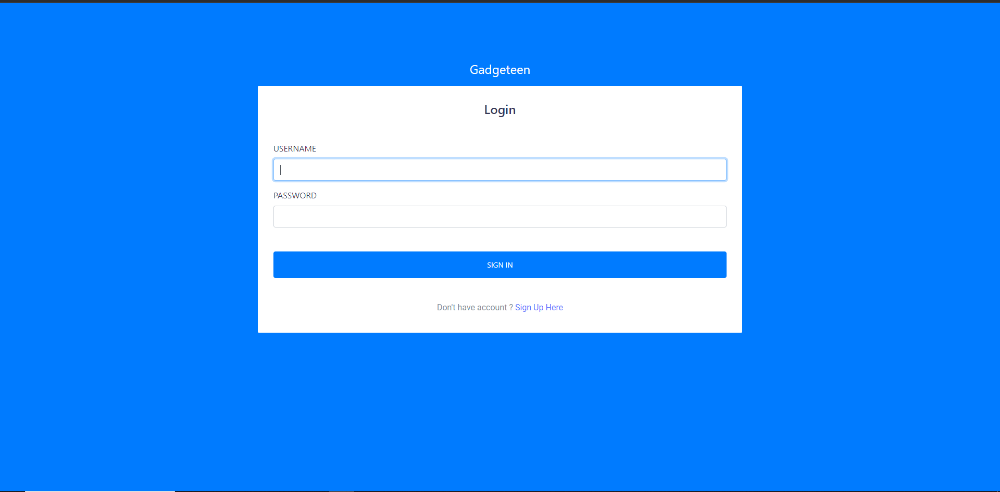
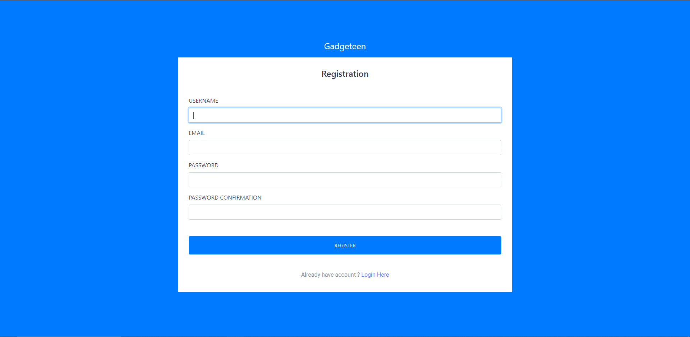

<h1>ChatGPT Sentiment Analysis</h1>


# 📝Table of Content
- [Introduction](#introduction)
- [Background](#background)
- [Objectives](#objectives)
- [Scope](#scope)
- [Methodology](#methodology)
- [Project Structure](#project-structure)
- [Interface](#interface)
  - [Admin](#admin)
  - [Public User](#public-user)
- [Insight](#insight)
- [Conclusion](#conclusion)
- [Quick Start](#quick-start)


## Introduction

Social media's introduction has fundamentally changed how people express their opinions, share their experiences, and participate in discussions about a range of subjects. For businesses and individuals looking to enhance their goods and services, understanding public sentiment and opinion on particular issues is essential. In this report, we present a web application created to track and examine social media data from Reddit with a particular emphasis on real-time sentiment and public opinion towards ChatGPT.

To achieve our goal, we leverage the power of natural language processing (NLP) techniques, sentiment analysis, and topic modeling. By analyzing the vast amount of text data generated by Reddit users, we can identify prevailing sentiments towards ChatGPT, explore emerging trends and topics, and gain valuable insights into user preferences and experiences.

In the subsequent sections of this report, we will provide an overview of our methodology, discuss the technical implementation of our web application, present the results of sentiment analysis and topic modeling, and offer actionable recommendations based on the insights gained. Together, these findings aim to provide valuable guidance for the improvement and evolution of ChatGPT in alignment with user expectations and preferences.

## Background
<p align="center">
</img>
</p>
&ensp;&ensp; ChatGPT is an artificial intelligence language model developed by OpenAI that is designed to generate human-like text in response to natural language inputs. As ChatGPT hits the market, it becomes crucial for us to understand public opinion and sentiment towards the platform. However, analyzing this data manually is time-consuming and often impractical. Therefore, there is a need for a platform that can monitor and analyze social media data in real-time to understand public opinion and sentiment on ChatGPT in Malaysia.
<br><br>
<b>Current Situation and Problems Faced:</b><br><br>
&ensp;&ensp; Currently, there is no platform dedicated to monitoring and analyzing social media data on ChatGPT in Malaysia. This makes it challenging to understand user behavior, preferences, and sentiment towards the platform. Manual analysis of social media data is time-consuming and often subject to biases and errors.
<br><br>
<b>Potential Benefits of the Proposed Solution:</b><br><br>
&ensp;&ensp; By developing a web application that can collect, process, and analyze social media data in real-time, the project will provide areas for improvement and potential new features for ChatGPT. This project will help to automate the process of analyzing social media data, saving time and reducing the risk of biases and errors associated with manual analysis. Overall, the proposed solution has the potential to provide valuable insights that can help improve ChatGPT's popularity and usage in Malaysia.

## Objectives
&ensp;&ensp; The primary goal of this project is to develop a web application that can monitor and analyze social media data in real-time to understand public opinion and sentiment on ChatGPT in Malaysia.

We have established these objectives in order to achieve this goal:


- Develop a web application that can collect from social media using APIs and process those data.
- Perform sentiment analysis and topic modeling to understand public opinion and sentiment towards ChatGPT in Malaysia. 
- Develop visualizations and dashboards to present the results of the analysis.
- Provide recommendations for further development of ChatGPT based on the insights gained from the analysis.

## Scope
&ensp; The project will focus specifically on Reddit data, as Reddit is a popular social media platform for discussing technology and current events. By analyzing Reddit data in real-time, the project aims to provide valuable insights into the public's perception of ChatGPT

<b>Data Sources:</b>

&ensp;&ensp; The primary data source for this project will be Reddit's API, which will provide us with real-time access to tweets related to "ChatGpt." We will use Reddit's streaming API to collect tweets in real-time, using specific keywords and hashtags related to ChatGpt.

<b>Tools and Technologies:</b>

&ensp;&ensp; We will use Python as the main programming language for this project, along with several open-source libraries such as Reddit API, Pandas, and MongoDB:

&ensp;&ensp;I.	**Reddit API**: Use to connect to Reddit's API.

&ensp;&ensp;II.	**Pandas**: Use for data manipulation and preprocessing. 

&ensp;&ensp;III. **MongoDB**:  To store the collected data which allow us to store and query the data efficiently.

&ensp;&ensp;IV.	**NLTK (Natural Language Toolkit)**: Use for sentiment analysis

&ensp;&ensp;V.	**PowerBI**: To visualize and explore the data.

&ensp;&ensp;VI.	**Django**: To develop website.

<b>Other Relevant Information:</b>

&ensp;&ensp; To ensure data privacy and security, we will comply with Reddit's API Terms of Service and any applicable laws and regulations related to data privacy and security. We will also use appropriate measures to secure the data, such as encrypting the database and using secure protocols for data transfer.


## Methodology
The project will follow the Agile methodology, with sprints of 10-12 weeks, and regular demos and retrospectives to review progress and plan the next steps.

1. **Data Collection**: The project will collect Reddit data using the Reddit API, which provides access to a sample of the real-time Reddit stream. The collected data will include tweets that mention "ChatGpt" and related hashtags, keywords, and phrases.

2. **Data Pre-processing**: The collected data will be pre-processed to remove noise, such as irrelevant tweets and spam, and to extract relevant information, such as the user's sentiment towards ChatGpt. The pre-processing steps will include:

 &ensp;&ensp;&ensp;&ensp; -	Removing duplicate tweets
  
 &ensp;&ensp;&ensp;&ensp; -	Removing retweets
  
 &ensp;&ensp;&ensp;&ensp; -	Removing tweets that are not in English
  
 &ensp;&ensp;&ensp;&ensp; -	Tokenizing the text and removing stop words
  
 &ensp;&ensp;&ensp;&ensp; -	Applying stemming or lemmatization to reduce the text to its base form
  
 &ensp;&ensp;&ensp;&ensp; -	Applying part-of-speech tagging to identify noun phrases and named entities
  
 &ensp;&ensp;&ensp;&ensp; -	Filtering the text to remove mentions, URLs, and other irrelevant information
  
 &ensp;&ensp;&ensp;&ensp; -	Applying sentiment analysis to determine the polarity of the tweets

3. **Sentiment Analysis**: The project will perform sentiment analysis on the pre-processed data to determine the polarity of the tweets, i.e., positive, negative, or neutral sentiment. The sentiment analysis will be performed using a machine learning model, such as a Naive Bayes or Support Vector Machine (SVM) classifier, trained on a labelled dataset of tweets.

4. **Data Visualization**: The project will use data visualization techniques to display the sentiment analysis results in a meaningful and informative way, such as bar charts, pie charts, and word clouds. The visualization will provide an easy-to-understand summary of the sentiment distribution and the most common topics and phrases associated with ChatGpt.

5. **Real-time Analysis**: The project will perform real-time analysis of Reddit data to provide up-to-date insights into public opinion and sentiment about ChatGpt on the deployed website. The real-time analysis will involve continuously collecting and pre-processing Reddit data, performing sentiment analysis, and updating the visualization.

&ensp;&ensp; All in all, the methodology of the project is to collect and pre-process Reddit data, perform sentiment analysis, and visualize the results in real-time, using natural language processing and machine learning techniques. The methodology will provide valuable insights into public opinion and sentiment about ChatGpt, and help OpenAI to make data-driven decisions and improve its products and services.

## Project Structure

```bash
< PROJECT ROOT >
   |
   |-- core/                            
   |    |-- settings.py                  # Project Configuration  
   |    |-- urls.py                      # Project Routing
   |
   |-- gadgeteen/
   |    |-- views.py                     # APP Views 
   |    |-- urls.py                      # APP Routing
   |    |-- models.py                    # APP Models 
   |    |-- tests.py                     # Tests  
   |    |-- templates/                   # Theme Customisation 
   |         |-- registration            # Account Folder
   |              |-- register.html        
   |              |-- login.html 
   |              |-- logged_out.html                    
   |         |-- post                    # Website Pages Folder         
   |              |-- list.html
   |              |-- reddit_scrape.html
   |     
   |-- requirements.txt                  # Project Dependencies
   |
   |-- env.sample                        # ENV Configuration (default values)
   |-- manage.py                         # Start the app - Django default start script
   |
   |-- ************************************************************************
```

## Interface
1. Login Page

Users must log in with their username and password to access the page. If they do not have an account, they can create one by clicking the "register" button. Once logged in, you should be able to view all the content on the page. <br>


2. Register Page

Users have the option to register themselves to gain access to the system. <br>

   
3. Admin Dashboard Overview


4. User Dashboard Overview


## Conclusion


## Quick Start
[How To Run This Project](https://github.com/drshahizan/special-topic-data-engineering/blob/main/project/submission/Gadgeteen/step.md)
