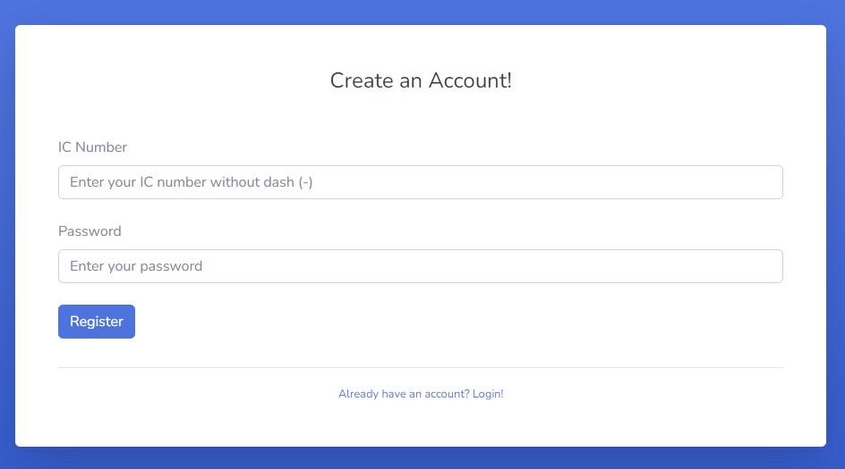
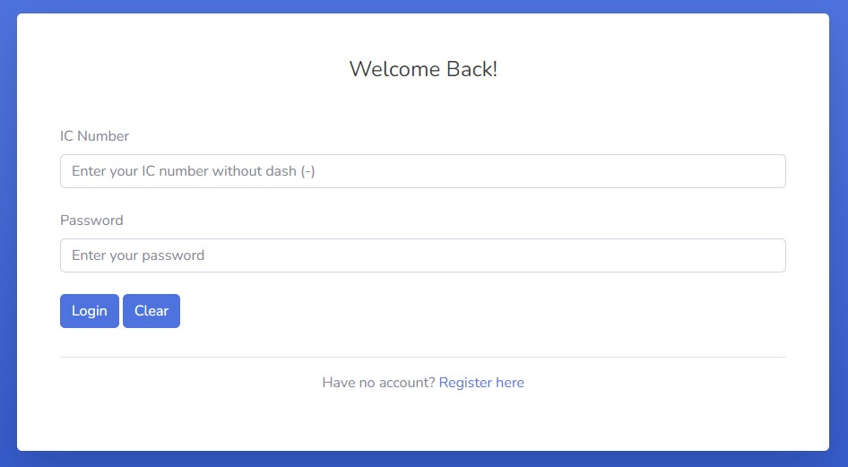
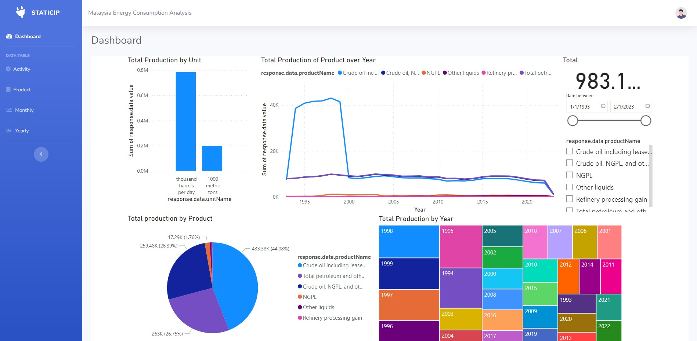
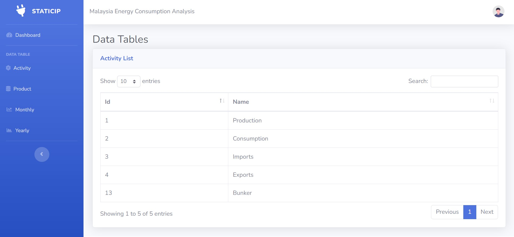
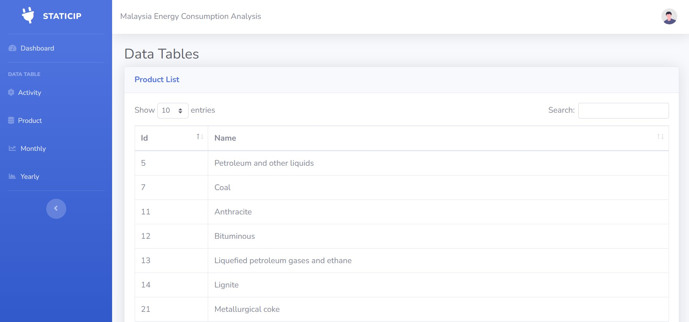
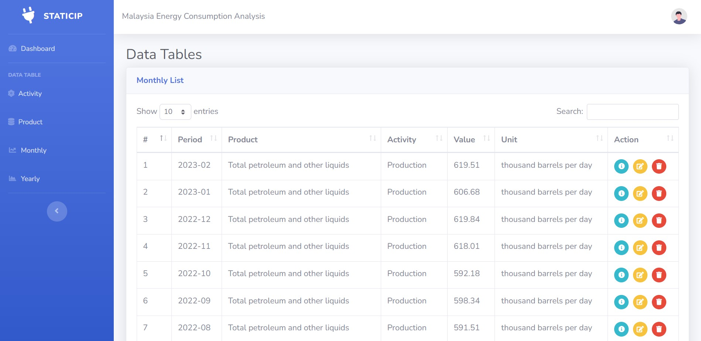
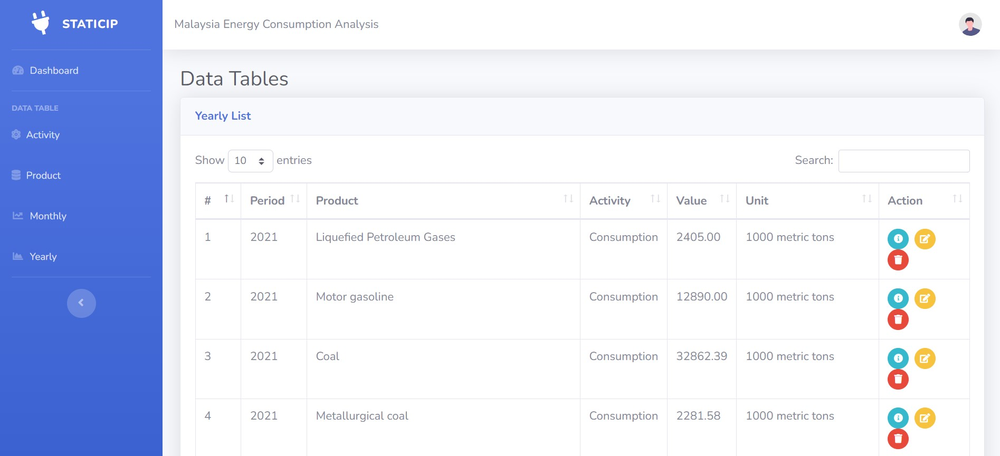

<h1 align="center">💡Malaysia Energy Consumption Analysis Dashboard💡<br></br<a href="#" target="_blank" rel="noreferrer">  </a> </h1>

# Table of Content
* [Introduction](#-introduction)
* [Background](#-background)
* [Objectives](#-objectives)
* [Methodology](#-methodology)
* [Folder Structure](#-folder-structure)
* [Interface](#-interface)
* [Insights](#-insights)
* [Conclusion](#-conclusion)

## 📒 Introduction
Energy usage analysis is a technique for quantitatively analyzing energy use in order to better understand and manage energy use. This research can focus on any kind of energy, including power, natural gas, gasoline, coal, and others. Energy usage research is crucial for developing and implementing energy reduction strategies. It can help businesses and organizations identify which operations use the most energy, which equipment uses the most energy, and which energy-saving measures are most effective. This knowledge can be used to set goals, develop energy-saving strategies, and take the required steps in order to decrease energy loss and costs while increasing energy efficiency.

Businesses and organisations are continuously looking for ways to boost their energy efficiency as Malaysians become more aware of their energy consumption and its effects on the environment. Therefore, energy consumption analysis is one of the most effective ways to accomplish this. However, this process can be complicated, time-consuming, and challenging to monitor. This project aims to develop an energy consumption analysis dashboard that will streamline the process and provide real-time insights on energy consumption where the expected outcomes enable businesses and organizations to take informed decisions and wise choices to improve their energy efficiency.

In this report, we will discuss about the backgorund of the project, its objectives, methodology implemented, folder structure, system interfaces, insights and conclusion

## 🧱 Background
Energy consumption analysis is the process of analyzing energy usage patterns to quantify the energy required by different systems in an organizations. By analyzing the energy usage, we can identify the energy consumption inefficiencies, thus provide alternative solutions to this problem. While conducting the analysis, data sources related to energy consumption of the organization is collected and analyzed to identify the specific period of high energy consumption. Strategies to reduce energy usage are proposed based on the analysis.

However, traditional methods of energy consumption analysis are problematic and inefficient as it does not provide real-time information causing workload increament and time-consuming. We may need to update the analysis manually once there is any update on the data. Traditional energy consumption analysis is also can be difficult to track and monitor because users are unable to interact with it. Users cannot see the previous version of the analysis. Besides, the way of presentation of the analysis is complicated and hard to study.

By implementing energy consumption analysis dashboard, an organization can save up the energy consumed because the dashboard provides a real-time energy consumption analysis. There is no longer the need of updating the data manually. Furthermore, dashboard is a good tool to get an overview of energy consumption of the organization. It offers clear and readable data so that users can understand the analysis easily at a glance improving the user experience.

## 🔬 Objectives

The following objectives are the focus of our energy consumption analysis dashboard:
- Provide a comprehensive overview of energy consumption in Malaysia using different ways of visualization.
- Analyze energy consumption data to identify the highest energy consumed in production by product of a specific period.
- Provide interactive dashboard to offer dynamic and customizable user experience.
- Keep track of energy usage by utilities in Malaysia easily.

## 🔖 Methodology

The project is using the API from the U.S. Energy Information Administration (EIA) to obtain the energy data for Malaysia. The API provides various data sets such as total energy production, consumption, imports, exports, and carbon dioxide emissions for Malaysia from 1980 to 2019. The API also provides metadata such as units, definitions, and sources for the data sets.

The project uses PHP file_get_contents function to fetch the data from the API and save it into JSON files. The JSON files are stored in a folder named “data” in the project directory. The JSON files are named according to the data set they contain, such as “total_energy_production.json”, “total_energy_consumption.json”, etc.

The JSON files are then imported into Power BI, a data visualization and analysis tool, to create interactive dashboards and reports. The dashboards and reports show the trends, patterns, and comparisons of the energy data for Malaysia over time and across different categories. The dashboards and reports also allow users to filter and drill down the data according to their needs and interests. For example, users can select a specific year, month, or energy source to view the corresponding data. The dashboards and reports are designed to be user-friendly, informative, and visually appealing.

## 🗂 Folder Structure
```
📁StaticIP_dashboard
├── 📁chart
│   ├── Consumption_barchart.svg
│   ├── Exports_barchart.svg
│   ├── Imports_barchart.svg
│   ├── Production_barchart.svg
│   ├── Production_line_chart.svg
│   ├── Productionline_chart.svg
├── 📁css
│   ├── sb-admin-2.css
│   ├── sb-admin-2.min.css
├── 📁global
│   ├── cdn.php
│   ├── nav_bar.php
├── 📁img
│   ├── undraw_posting_photo.svg
│   ├── undraw_profile.svg
│   ├── undraw_profile_1.svg
│   ├── undraw_profile_2.svg
│   ├── undraw_profile_3.svg
│   ├── undraw_rocket.svg
├── 📁js
│   ├── dash_chart.js
│   ├── ex.js
├── 📁scss
├── 📁static
├── 📁vendor
│   ├── 📁bootstrap
│   ├── 📁chart.js
│   ├── 📁datatables
│   ├── 📁fontawesome-free
│   ├── 📁jquery
│   ├── 📁jquery-easing
├── 📄activity.php
├── 📄cbsession.php
├── 📄dbconnect.php
├── 📄index.html
├── 📄login.php
├── 📄loginprocess.php
├── 📄m_delete.php
├── 📄m_edit.php
├── 📄m_editprocess.php
├── 📄m_view.php
├── 📄month.php
├── 📄product.php
├── 📄register.php
├── 📄registerprocess.php
├── 📄y_delete.php
├── 📄y_edit.php
├── 📄y_editprocess.php
├── 📄y_view.php
├── 📄year.php
```

## 🧿 Interface
Below are the user interface for all users:
- Register 
</img>

- Login 
</img>

- Dashboard
</img>

- Activity List
</img>

- Product List
</img>

### Admin
Admins are able to view, edit and delete data in both monthly and yearly data tables. 
- Monthly List 
</img>

- Yearly List 
</img>

### Public User
Public Users are only allowed to view the dashboard, actovity list and product list.
- Dashboard
</img>

- Activity List
</img>

- Product List
</img>


## 🔍 Insights
There are various insights that can be gained from the dashboard based on the types of pruducts and date. At first, the total consumption of the crude oil, NGPL and  other liquids has the highest total consumption among the products over the years. From the year 1993 to 2000, the crude oil including lease condensate increased rapidly and the total consumption dropped to 8280 in 2000. This is because crude oil and NGPL are mainly used for transportation. 

To provide the usage of crude oil, NGPL and other liquids for transportation use and other purposes, the total productions of crude oil including lease condensate have the highest percentages which are 44.08% followed by total petroleum and other liquids (26.75%) and then crude oil, NGPL and other liquids (26.39%). The total producction of NGPL, refinery processing gain are all less than 10%.

Based on the year, the tree map diagram in the dashboard shows that the highest total production is in the yaer of 1998 which has the 63996.30 of total consumption and production. The top three year that have the highest total production is 1998, 1999, 1997. As the practice of car pooling and taking transportation is being promoted in Malaysia, we can see that the total production of the crude oil, petroleum, NGPL and other liquids has the lowest total consumption during the year 2021, 2022 and 2023.  

## 📑 Conclusion

In summary, the development of an energy consumption analysis dashboard delivers noteworthy advantages for businesses and organizations in Malaysia. Currently employed methods for analyzing electricity usage lack efficiency and prove time-consuming, posing challenges towards adequately monitoring and tracking such usage levels by users. By integrating an energy consumption analysis dashboard into operations, organizations gain immediate insights into their own patterns concerning electricity utilization. With this information at hand, they become better equipped at identifying specific periods characterized by excessive power consumptions or ineffective operations - ultimately paving the way towards formulating effective strategies aimed at power reduction initiatives. Moreover, this comprehensive analytical platform provides users with a comprehensive overview of energy usage through various visually engaging formats, ultimately making data comprehension and analysis significantly easier.
